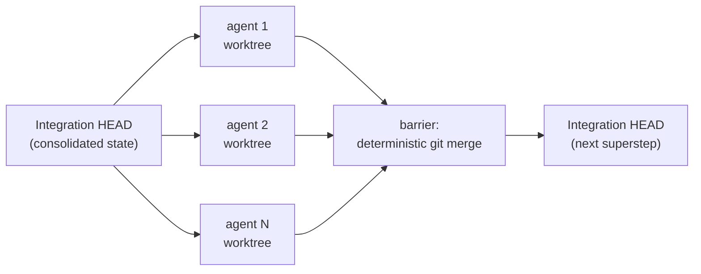

  <strong>MANIFESTO</strong> · <strong>English</strong> · <a href="MANIFESTO.md">Português (BR)</a>

# Deterministic in method, not in result

> The `huu` manifesto — why multi-agent orchestration needs less
> autonomy and more engineering.

---

## What huu is

`huu` runs LLM-agent pipelines in isolated git worktrees. A pipeline is
a JSON file written by a human: an ordered list of steps, each with a
prompt, a scope (`project` or `per-file`) and — since v2 — decision
nodes (`check`) with explicit routes. Each step fans out into parallel
agents; at the end of every stage, all branches are deterministically
merged into an integration worktree **before** the next stage starts.
Everything inside Docker, without your shell credentials.

The design fits in one sentence: **the human underwrites the scope;
the AI executes inside it.**

## The thesis

The industry treats "agent" as a synonym for autonomy: hand the model a
goal, let it plan, observe, replan. It works in demos and degrades in
production, because every *process* decision delegated to the LLM is a
fresh source of variance — and process variance isn't audited, it's
suffered.

`huu` bets on the inverse split:

- **The method is deterministic.** The pipeline topology, each step's
  scope, the files each agent may touch, the merge points, the routes
  of every `check` — all of it is human authorship, fixed in
  versionable JSON, identical on every run. No LLM planner decides at
  runtime what step 3 should do.
- **The result is non-deterministic.** Inside each node, the model has
  full freedom: how to write the test, how to resolve the conflict,
  what to record in the knowledge file. Two runs of the same pipeline
  produce different diffs — and that is desirable; it's where the
  model's creativity pays for its own cost.

The practical consequence: a badly designed pipeline fails in a
**predictable, auditable** way — the wrong step, with the wrong prompt,
on the wrong file. Never *surprisingly* wrong. You fix the JSON; you
don't chase emergent behavior.

## BSP over git

There is a name from 1990 for this shape: **Bulk Synchronous Parallel**
([Valiant](https://en.wikipedia.org/wiki/Bulk_synchronous_parallel)).
Computation in *supersteps*: isolated parallel work → synchronization
barrier → the next superstep starts from consolidated state.

`huu` instantiates BSP on top of git:

- The **isolation** is filesystem-level (one worktree per agent), not
  prompt-level — parallel agents *cannot* step on each other, by
  construction, not by instruction.
- The **barrier** is `git merge --no-ff`, a twenty-year-old algorithm,
  not a coordinating LLM. Genuine conflicts fall to a side integration
  agent — the only AI role in the control plane, invoked only when
  determinism runs out.
- The **consolidated state** between stages is a commit. Auditable with
  `git log`, bisectable, revertible. The integration worktree never
  rewinds; loops re-execute on top of the current HEAD, accumulating
  commits.

Between supersteps, knowledge flows through **files, not context**:
stage 1 writes a contract (`huu-tests.md`, an atlas, a findings JSON),
later stages read it before acting and append what they learned. Shared
memory with the durability of a commit — the `huu Agent Knowledge`
pipeline pushes this to its limit, compiling the run's accumulated
knowledge into Agent Skills that any future agent loads.

## Where this thesis is NOT novel (the honest counterpoint)

It would be comfortable to claim nobody thought of this. It isn't true,
and pretending otherwise weakens the argument:

- Anthropic's [Building Effective Agents](https://www.anthropic.com/engineering/building-effective-agents)
  (Dec 2024) already separates **workflows** — "systems where LLMs and
  tools are orchestrated through predefined code paths" — from
  **agents**, and recommends workflows for predictable tasks. In that
  taxonomy, `huu` is a workflow runner. The category exists and has a
  name.
- [LangGraph](https://github.com/langchain-ai/langgraph) and the DAG
  orchestrators have offered deterministic graphs with LLM nodes for
  years.
- [MetaGPT](https://github.com/FoundationAgents/MetaGPT) encoded SOPs —
  fixed operating procedures — over stochastic agents back in 2023.
  "Fixed method, stochastic execution" is literally in the paper.
- Git worktrees for parallel agents became common practice
  ([Claude Squad](https://github.com/smtg-ai/claude-squad), the
  [2025-2026 playbooks](https://developer.upsun.com/posts/ai/git-worktrees-for-parallel-ai-coding-agents)),
  and orchestrators like Bernstein do deterministic scheduling in
  plain code, with no LLM in the decision loop.

No single piece of `huu` is an invention. Anyone claiming otherwise is
selling something.

## What is genuinely distinctive

The synthesis — and one refusal:

1. **The merge barrier is git, per stage.** LangGraph synchronizes
   state in memory; the worktree playbooks parallelize *sessions* and
   leave the merge to the human; CI runs pipelines but doesn't fuse N
   concurrent diffs between stages. `huu` makes the deterministic
   merge the **end of every stage** — BSP where the barrier is a
   commit, not a mutex.
2. **Zero LLM planner at runtime.** MetaGPT and Bernstein keep a
   planner generating the task graph. In `huu`, the graph is the JSON
   you wrote. The only control decision delegated to AI is a `check`
   verdict — and even that has enumerated routes, an iteration cap,
   and a `default` outcome for when the judge fails.
3. **The pipeline is a portable artifact.** Not code against an SDK;
   plain JSON, versionable, shareable as a gist. The know-how of *how
   to decompose a class of task* becomes a file that outlives any
   model provider.
4. **Per-file fan-out with an identical prompt.** N agents, the same
   prompt, only `$file` changes. No context degradation between agent
   1 and agent 40, no scope drift — data parallelism, not opinion
   parallelism.
5. **Progressive knowledge as a file convention.** No vector store, no
   RAG, no proprietary memory: committed JSON and markdown, readable
   by humans and by any agent.

"Deterministic in method, not in result" is not an idea nobody had —
it is an idea almost nobody **carries to its conclusion**, because
autonomy sells better than engineering. `huu`'s bet is that the future
of multi-agent orchestration belongs to whoever treats agents the way
industry learned to treat processes: isolated by construction,
synchronized by barriers, audited through artifacts. The model gets
smarter every release; the process around it is what decides whether
that intelligence compounds or diverges.

## What huu is not

- **Not an autonomous agent.** It never decides *what* to do — it only
  executes what the pipeline underwrote.
- **Not a framework.** You don't program against it; you write a JSON
  and it obeys.
- **Not an arbitrary DAG.** It is deliberately more constrained: a
  sequence of stages with internal fan-out and explicit loops via
  `check`. The constraint is the product.

## The invitation

A well-designed pipeline is distilled engineering knowledge — *how one
decomposes a 40-file migration, a security audit, a test suite*. That
knowledge shouldn't die in the chat history of whoever had it. Write
it, version it, share it. The format is stable; the cookbook is open.

---

*See the [README](README.en.md) for the full tour, or
[`docs/pipeline-json-guide.md`](docs/pipeline-json-guide.md) to write
your first pipeline.*
