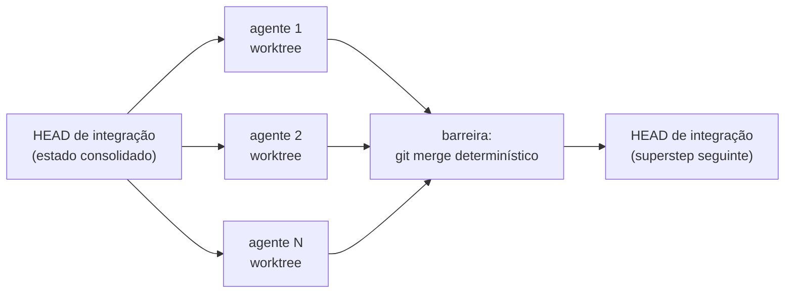

  <strong>MANIFESTO</strong> · <a href="MANIFESTO.en.md">English</a> · <strong>Português (BR)</strong>

# Determinístico no método, não no resultado

> O manifesto do `huu` — por que orquestração multi-agêntica precisa de
> menos autonomia e mais engenharia.

---

## O que é o huu

O `huu` roda pipelines de agentes LLM em worktrees git isolados. Um
pipeline é um arquivo JSON escrito por um humano: uma lista ordenada de
passos, cada um com um prompt, um escopo (`project` ou `per-file`) e —
desde a v2 — nós de decisão (`check`) com rotas explícitas. Cada passo
vira um fan-out de agentes paralelos; ao fim de cada etapa, todos os
branches são mesclados deterministicamente num worktree de integração
**antes** da etapa seguinte começar. Tudo dentro de Docker, sem as
credenciais do seu shell.

Esse desenho cabe numa frase: **o humano subscreve o escopo; a IA
executa dentro dele.**

E ele delimita o território do `huu`: **fazer agentes que pensam
seguirem um processo determinístico** — auditorias, geração de testes,
extração de conhecimento, migrações mecânicas, qualquer esteira com
previsibilidade real de valor. O `huu` não é uma ferramenta para
desenvolver features novas: quando cada passo exige decisões abertas de
design, o lugar é um coding agent interativo; quando o método é
conhecido e o valor está em executá-lo com disciplina sobre N arquivos,
o lugar é um pipeline.

## A tese

A indústria trata "agente" como sinônimo de autonomia: dê uma meta ao
modelo, deixe-o planejar, observar, replanejar. Funciona em demos e
degrada em produção, porque cada decisão de *processo* delegada ao LLM
é uma fonte nova de variância — e variância de processo não se audita,
se sofre.

O `huu` aposta na divisão inversa:

- **O método é determinístico.** A topologia do pipeline, o escopo de
  cada passo, os arquivos que cada agente pode tocar, os pontos de
  merge, as rotas de cada `check` — tudo isso é autoria humana, fixada
  em JSON versionável, idêntica em toda execução. Nenhum planner LLM
  decide em runtime o que o passo 3 deve fazer.
- **O resultado é não-determinístico.** Dentro de cada nó, o modelo tem
  liberdade total: como escrever o teste, como resolver o conflito,
  o que anotar no arquivo de conhecimento. Duas execuções do mesmo
  pipeline produzem diffs diferentes — e isso é desejável, é onde a
  criatividade do modelo paga o custo dela.

A consequência prática: se um pipeline for mal projetado, ele falha de
forma **previsível e auditável** — o passo errado, com o prompt errado,
no arquivo errado. Nunca *surpreendentemente* errado. Você corrige o
JSON, não caça um comportamento emergente.

## BSP sobre git

Existe um nome de 1990 para esse formato: **Bulk Synchronous Parallel**
([Valiant](https://en.wikipedia.org/wiki/Bulk_synchronous_parallel)).
Computação em *supersteps*: trabalho paralelo isolado → barreira de
sincronização → próximo superstep parte do estado consolidado.

O `huu` instancia BSP sobre o git:

- O **isolamento** é de filesystem (um worktree por agente), não de
  prompt — agentes paralelos *não podem* pisar um no outro, por
  construção, não por instrução.
- A **barreira** é `git merge --no-ff`, um algoritmo de 20 anos, não um
  LLM coordenador. Conflito real cai num agente de integração lateral
  — o único papel de IA no plano de controle, acionado apenas quando o
  determinismo esgota.
- O **estado consolidado** entre etapas é um commit. Auditável com
  `git log`, bisecável, revertível. O worktree de integração nunca
  rebobina; loops re-executam sobre o HEAD atual, acumulando commits.

Entre os supersteps, o conhecimento flui por **arquivos, não por
contexto**: a etapa 1 escreve um contrato (`huu-tests.md`, um atlas,
um findings JSON), as etapas seguintes leem antes de agir e anexam o
que aprenderam. Memória compartilhada com a durabilidade de um commit.
O scope `memory` torna isso executável: uma etapa escreve a lista de
arquivos (com um hint por entrada) e a próxima fan-outa um agente por
path — o pipeline decide o próprio trabalho. A pipeline
`huu Knowledge System` leva tudo ao limite, compilando o conhecimento
acumulado da run em Agent Skills que qualquer agente futuro carrega.

## Onde essa tese NÃO é inédita (o contraponto honesto)

Seria confortável dizer que ninguém pensou nisso. Não é verdade, e
fingir que é enfraquece o argumento:

- A Anthropic, em [Building Effective Agents](https://www.anthropic.com/engineering/building-effective-agents)
  (dez/2024), já separa **workflows** — "sistemas onde LLMs e
  ferramentas são orquestrados por caminhos de código predefinidos" —
  de **agents**, e recomenda workflows para tarefas previsíveis. O
  `huu` é, nessa taxonomia, um runner de workflows. A categoria existe
  e tem nome.
- [LangGraph](https://github.com/langchain-ai/langgraph) e os
  orquestradores DAG dão grafos determinísticos com nós LLM há anos.
- [MetaGPT](https://github.com/FoundationAgents/MetaGPT) codificou
  SOPs — procedimentos operacionais fixos — sobre agentes estocásticos
  em 2023. "Método fixo, execução estocástica" está literalmente no
  paper.
- Worktrees git para agentes paralelos viraram prática comum
  ([Claude Squad](https://github.com/smtg-ai/claude-squad), os
  [playbooks de 2025-2026](https://developer.upsun.com/posts/ai/git-worktrees-for-parallel-ai-coding-agents)),
  e orquestradores como o Bernstein fazem scheduling determinístico
  em código, sem LLM no loop de decisão.

Nenhuma peça isolada do `huu` é invenção. Quem disser o contrário está
vendendo.

## O que é genuinamente distintivo

A síntese — e uma recusa:

1. **A barreira de merge é git, por etapa.** LangGraph sincroniza
   estado em memória; os guias de worktree paralelizam *sessões* e
   deixam o merge para o humano; CI roda pipelines mas não funde N
   diffs concorrentes entre estágios. O `huu` faz do merge
   determinístico o **fim de toda etapa** — BSP onde a barreira é um
   commit, não um mutex.
2. **Zero planner LLM em runtime.** MetaGPT e Bernstein mantêm um
   planejador gerando o grafo de tarefas. No `huu`, o grafo é o JSON
   que você escreveu. A única decisão de controle delegada à IA é o
   veredito de um `check` — e mesmo ele tem rotas enumeradas, cap de
   iterações e um outcome `default` para quando o juiz falha.
3. **O pipeline é um artefato portátil.** Não é código contra um SDK;
   é JSON puro, versionável, compartilhável como gist. O know-how de
   *como decompor uma classe de tarefa* vira um arquivo que sobrevive
   a qualquer provider de modelo.
4. **Fan-out per-file com prompt idêntico.** N agentes, o mesmo prompt,
   só `$file` muda. Sem degradação de contexto entre o agente 1 e o
   agente 40, sem drift de escopo — paralelismo de dados, não de
   opiniões.
5. **Conhecimento progressivo como convenção de arquivos.** Sem
   vector store, sem RAG, sem memória proprietária: JSON e markdown
   commitados, legíveis por humanos e por qualquer agente.

"Determinístico no método, não no resultado" não é uma ideia que
ninguém teve — é uma ideia que quase ninguém **leva às últimas
consequências**, porque autonomia vende melhor que engenharia. A aposta
do `huu` é que o futuro da orquestração multi-agêntica pertence a quem
tratar agentes como a indústria aprendeu a tratar processos: isolados
por construção, sincronizados por barreiras, auditáveis por artefatos.
O modelo fica mais esperto a cada release; o processo que o cerca é que
decide se essa esperteza compõe ou diverge.

## O que o huu não é

- **Não é um agente autônomo.** Ele nunca decide *o que* fazer — só
  executa o que o pipeline subscreveu.
- **Não é um framework.** Você não programa contra ele; você escreve
  um JSON e ele obedece.
- **Não é um DAG arbitrário.** É deliberadamente mais restrito:
  sequência de etapas com fan-out interno e loops explícitos via
  `check`. A restrição é o produto.

## O convite

Um pipeline bem projetado é conhecimento de engenharia destilado —
*como se decompõe uma migração de 40 arquivos, uma auditoria de
segurança, uma suíte de testes*. Esse conhecimento não deveria morrer
no histórico de chat de quem o teve. Escreva, versione, compartilhe.
O formato é estável; o cookbook é aberto.

---

*Veja o [README](README.md) para o tour completo, ou
[`docs/pipeline-json-guide.md`](docs/pipeline-json-guide.md) para
escrever seu primeiro pipeline.*
