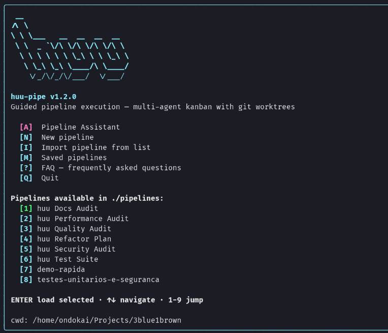
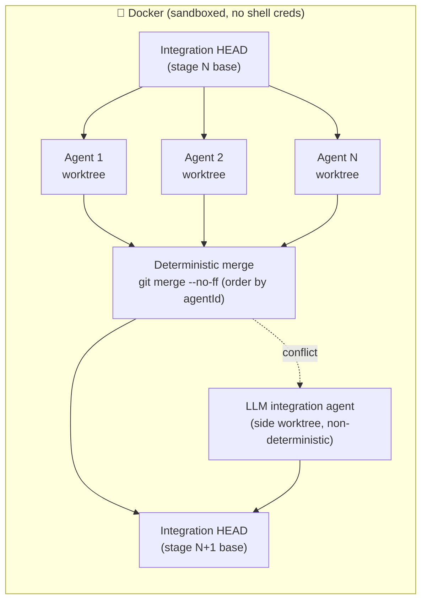
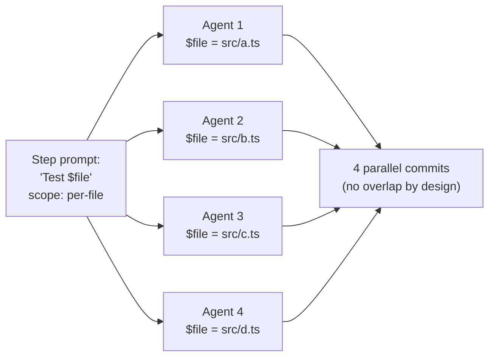
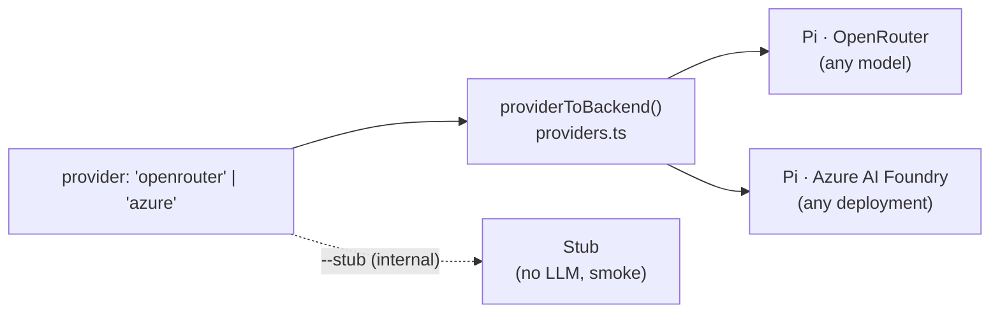

<p align="center">
  
</p>

<p align="center">
  <em>55 minutes of <code>huu</code> generating a unit-test suite — sped up to 10 seconds.
  A real example run (100% <strong>line</strong> coverage on this one), <strong>not</strong> a guaranteed
  outcome — see the coverage caveat in the <a href="#showcase-huu-test-suite">showcase</a>.</em>
</p>

<h1 align="center">huu</h1>

<p align="center">
  <strong><code>huu</code> — <em>Humans Underwrite Undertakings</em>.</strong>
</p>

<p align="center">
  <em>The agent orchestrator where the <strong>method is yours</strong> and the <strong>intelligence is the model's</strong>.</em>
</p>

<p align="center">
  A JSON pipeline becomes parallel agents — <strong>one per file</strong> — in isolated git worktrees,
  merged at every stage <strong>deterministically in method and merge order</strong>
  (<a href="MANIFESTO.en.md">not in result</a>), with your credentials sandboxed in Docker.
</p>

<p align="center">
  <a href="MANIFESTO.en.md">Manifesto</a> · <strong>English</strong> · <a href="README.md">Português (BR)</a>
</p>

<p align="center">
  <a href="https://www.npmjs.com/package/huu-pipe"></a>
  <a href="#license"></a>
  <a href="https://www.repostatus.org/#active"></a>
  
  
  
  <a href="docs/README.md"></a>
</p>

<p align="center">
  <sub>Young project, essentially single-author, with heavily AI-assisted development —
  read <a href="#status--maturity">Status &amp; maturity</a> before taking it to critical production.</sub>
</p>

---

## The four orchestration primitives

| | Primitive | What it does |
|---|---|---|
| 🗺️ | **Map** — `per-file`/`memory` fan-out | the same prompt becomes N parallel agents, one per file (`$file` + `$hint`), each in its own git worktree |
| 🔀 | **Switch** — check steps | an LLM judge with shell access emits a JSON verdict and the cursor follows the outcome (safe `default` + `maxRuns`) |
| ◇ | **Parallel + Join** — [`dependsOn`](docs/pipeline-json-guide.md) | heterogeneous branches run together in **deterministic waves**; the **order** of the waves and merges is the same on every run (the *content* of each node is the model's — and a conflicting merge falls to an LLM resolver) |
| 🧠 | **Memory** — [`produces` → `filesFrom`](docs/memory-scope.md) | one step **discovers** the work and the next fans out over it — zero human file-picking; huu injects the format contract |

They compose freely: *discover → memory fan-out → parallel branches →
judged join → cascading rework* — all visible on the kanban, all
reproducible **in topology**. Something broke? Every fatal error ships
with **cause + next step** ([troubleshooting](docs/troubleshooting.md)).

## What huu is

**huu designs pipelines that make thinking agents follow a
deterministic process.** It is not a tool for building new features:
the focus is audits, test generation, and knowledge extraction — the
method is fixed and the agent brings the intelligence, not the scope.

**A pipeline is a file of orders that the AI obeys.** You write a
`huu-pipeline-v1.json` listing the steps and the files each step
touches. The orchestrator turns each step into a fan-out of parallel
agents — one agent per file when you ask for it — runs them in
isolated git worktrees, and merges them back into a single integration
branch **between every stage**. The whole run is sandboxed in Docker
so the agent never sees your shell credentials.

That sentence has a few claims worth unpacking:

- **The human underwrites the scope.** No LLM planner decides what
  step 3 should do or which files it should touch. If a step is
  misdesigned, the result is predictably and auditably wrong — not
  surprisingly wrong.
- **Deterministic in method and merge order, not in result.** The
  pipeline topology, the scopes, the merge points and the order
  (`git merge --no-ff`, branches ascending by agentId) are identical on
  every run. What the model writes *inside* each node is free — and when
  a merge conflicts, resolution falls to an **LLM integration agent**
  (non-deterministic, by construction). Two runs of the same pipeline
  produce different diffs; that's where the model's creativity earns its
  cost. The [MANIFESTO](MANIFESTO.en.md) develops this thesis.
- **In `per-file` mode, one agent gets one file.** The prompt is
  identical across the N agents — only `$file` is substituted. No
  context degradation between agents, no scope drift. The Pi coding
  agent (default backend) runs with `thinking=medium` on every model
  that supports it, so the model trades latency for quality on its
  single mission.
- **Pipelines are portable, not provider-locked.** A
  `huu-pipeline-v1.json` is a versioned artifact — commit it, share
  it as a gist, contribute it to the cookbook. The know-how of *how
  to decompose this class of task* lives in plain JSON.

---

## Who huu is for (and what it is NOT)

Decide in 30 seconds whether this is for you:

- ✅ **It fits** if your method fits an ordered list of steps and the
  value is in running it with **discipline and reproducibility over N
  files**: audits, test generation, knowledge extraction, mechanical
  mass migration. You write the scope once; 30 agents obey in parallel.
- ❌ **It doesn't fit** for "fix this bug" or "build this feature."
  Open-ended, one-off work with no repeatable method calls for an
  interactive agent (Claude Code, Cursor) or an autonomous one
  (OpenHands). Writing a pipeline for that is overhead — and "build app
  X" is not a pipeline, it's a bet.

The rule of thumb: **when every step demands an open-ended design
decision, it's not huu's job. When the method is known and only rigorous
execution is left, it's exactly huu's job.**

---

## Quick start

**Prerequisites:** Node.js ≥ 20, `git`, and Docker (recommended). For
the default backend, export an `OPENROUTER_API_KEY`
([openrouter.ai/keys](https://openrouter.ai/keys)).

### Docker (recommended)

```bash
git clone https://github.com/frederico-kluser/huu
cd huu
docker build -t huu:local .
export OPENROUTER_API_KEY=sk-or-...
HUU_IMAGE=huu:local huu run pipelines/huu-test-suite.pipeline.json
```

> Open **http://localhost:4888** in your browser — the **web UI is the
> default**. Inside Docker the server runs in the container and the port
> is published to the host automatically. Prefer the terminal? `huu --cli`.

> huu writes the bundled default pipelines into `./pipelines/` on first
> launch — pick one in the UI or pass its path.

Pre-built images at `ghcr.io/frederico-kluser/huu:latest` — the wrapper
pulls automatically when no `HUU_IMAGE` is set. VPN-aware MTU, secret
mounting, signal forwarding, and orphan cleanup are all handled by
the wrapper.

### Native

```bash
npm install -g huu-pipe        # Node 20+ and a working `git`
huu --yolo                     # opens the web UI natively (no Docker)
huu --yolo --cli               # or the terminal TUI, no Docker
```

Native runs expose your shell credentials to the LLM agent. Prefer
Docker for anything real on your laptop. (`--no-docker` is the
neutral-spelling alias of `--yolo`, meant for CI runners — see below.)
Full install matrix (macOS / Windows / Linux, OrbStack notes, WSL2
caveats): [`docs/onboarding.md#install`](docs/onboarding.md#install).

The UI (web by default, or the TUI with `--cli`) opens on a dashboard:
start from `huu Test Suite` (the default pipeline, already materialized)
or build your own **without hand-writing JSON** — see the next section.

---

## Web UI (default)

Running `huu` opens a **browser interface** — Apple-inspired (Liquid
Glass, light/dark), real-time, no delay. It drives the same Orchestrator
as the TUI; only the face changes. The **`--cli`** flag brings the
terminal TUI back.

- **Default, no friction.** `huu` → web. `huu --cli` → terminal.
  `huu --yolo` → web **without Docker** (native). Every combination is
  valid: the front-end (web/CLI) is orthogonal to the runtime
  (Docker/native).
- **Works with and without Docker.** In the container the server runs
  inside and the port is published to the host (`-p`); native binds
  directly.
- **On your network.** Binds `0.0.0.0` by default — reach it from your
  phone or another machine at `http://<your-machine-ip>:4888`. Real-time
  over Server-Sent Events (auto-reconnecting), zero new dependencies
  (just `node:http`).
- **Close the tab, the run keeps going.** `huu` opens on the **home** screen,
  or jumps straight to the live **kanban** when a pipeline is already running.
  The run lives in the huu process, not the browser — close the tab and reopen
  any time to re-sync; only the **Stop** button or quitting `huu` (Ctrl+C) ends
  a run.
- **Everything is clickable.** A kanban of cards (agents, merges, judges)
  flowing TODO → DOING → DONE — when a card changes column it **glides to the
  first slot of the new one** (GPU-composited, `transform`-only, jank-free),
  and each column **scrolls** once it fills up instead of squashing the cards
  flat. Click a card for **per-agent tokens, cost, branch, files and live
  logs**. Global log console, concurrency control (Auto · Manual · MAX) and a
  stop button up top.
- **Project queue, in parallel.** Select **several projects** — each with its
  own config (directory, provider, model, concurrency) — and run them
  **concurrently** under one shared RAM/concurrency budget. Earlier projects
  have priority; later ones **backfill** the idle slots of the earlier ones
  (e.g. while one is merging) and yield the capacity back when it's needed — and
  under memory pressure the lowest-priority project's newest agent is killed
  first. A **project selector** in the header (a dropdown showing
  **project · pipeline**) lets you switch between the live boards. If one fails,
  the rest keep going. Every execution is archived to the
  browser **history** (IndexedDB) with all cards, per-card costs and the
  per-project total — **exportable as JSON** in one click.
- **Truly live log.** The text the agent generates lands in the log **as it
  streams** — not just at tool boundaries. And **everything pi returns**
  (reply + reasoning) is mirrored in real time to the **browser console**
  (DevTools → Console), each line tagged with its agent id; silence it with
  `window.HUU_LOG_STREAM = false`.
- **Your key, in the browser.** Paste your `OPENROUTER_API_KEY` in the
  launch form — it's **validated against the provider on the spot** and
  kept only in the browser tab (`sessionStorage`), sent with each run and
  **never written to disk**. A stray shell `OPENROUTER_API_KEY` can't
  shadow it.
- **Searchable model picker — the entire OpenRouter catalog.** The **Model**
  field is a type-to-filter combobox over the **full live OpenRouter catalog**
  (every model — 339 today) — no more two-item dropdown. OpenRouter's `/models`
  endpoint is **public**, so the list loads **with or without a key**, the
  moment you open the picker. Models are **badged** (`reasoning`, plus a soft
  `no tools` warning) instead of hidden, and you can **type any model id** —
  even one not in the list — to run it verbatim. The short recommended list is
  only a fallback for when OpenRouter is unreachable.

> **Today the web runs existing pipelines** (list, pick, queue and run in
> parallel, tune concurrency, stop). The **guided builders** (Pipeline
> Assistant and the
> step-by-step editor) still live in the **TUI** — use `huu --cli`.
> Web-based pipeline authoring is roadmap.

> **About "cost":** **per-card / per-agent** cost and tokens are real
> (accumulated from the backend's usage events, when the provider reports
> them). The **header sums those per-card costs in real time**
> (`totalCost`). The only caveat: **merge/judge** LLM cost isn't metered
> yet — only the worker agents.

```bash
huu                       # web UI (default) — http://localhost:4888
huu --port=8080           # custom port (or HUU_WEB_PORT=8080)
HUU_WEB_HOST=127.0.0.1 huu # localhost-only (don't expose on the LAN)
HUU_WEB_TOKEN=secret huu  # require ?token=secret for data/actions
huu --cli                 # terminal TUI
```

| Variable | Does |
|---|---|
| `HUU_WEB_PORT` / `--port=<n>` | Port (default `4888`). |
| `HUU_WEB_HOST` | Bind address (default `0.0.0.0`; `127.0.0.1` = local only). |
| `HUU_WEB_TOKEN` | Shared secret required on data/action routes. |
| `HUU_CLI=1` | Default to the TUI (same as `--cli`). |

### Simulation mode (`/simulation`)

Open **`http://localhost:4888/simulation`** for a **full, lifelike simulation**
of a huu run — kanban, agents, live logs and cost counters — with **no git
branches, no API key and no cost**. Everything is synthetic: a
`SimulationEngine` fabricates the exact same state frames the real Orchestrator
emits, so the same screen renders unchanged. It's built for **demos and
advertising**.

When you open it you pick **the models** (shown as card labels), the **number
of files** and the **number of simultaneous agents**, then start. Each run
**randomly draws the full mix of scenarios**: streaming, memory-guard requeues
(`↻`), retries, errors, stage merges and the judge's **rework → approved** loop.
There's **play/pause** during the run and a **"Run again"** button when it
finishes. None of your project's files are touched.

---

## Build a pipeline without hand-writing JSON

You don't need to open a JSON editor to get started. The **TUI**
(`huu --cli`) has two guided ways to create a pipeline, both from the
welcome screen:

<p align="center">
  
</p>

- **Guided builder — `N` key.** Opens a **pattern picker** (Discover →
  Act with a pre-wired memory pair · Per-file transform · Audit with
  judge · Blank) that scaffolds the linked steps for you; then you edit
  step by step. For each step you pick the **scope** (`project`,
  `per-file`, `memory`, or `flexible`), the **dependencies** between
  steps (`dependsOn` — they form deterministic waves: you can fan a
  branch into parallel steps that rejoin at a later one) and the **check
  steps** (a judge that approves, loops back to an earlier step, or
  branches, with `maxRuns`). The footer always shows the keys for the
  focused field.
- **Pipeline Assistant — `A` key** (in magenta, the color reserved for
  AI-driven UI). Describe what you need in natural language and answer a
  few multiple-choice questions. huu runs a parallel project recon,
  sketches the structure (the *Architect flow* compares drafts under
  different lenses) and hands you a pipeline **already validated** against
  the real schema and topology — **which you then edit** in the same
  builder. You still underwrite the scope: the AI drafts, you review and
  approve.

> Both flows are **TUI** (`huu --cli`). The web UI (default) runs existing
> pipelines today; web-based guided authoring is roadmap.

Full key map: [`docs/KEYBOARD.md`](docs/KEYBOARD.md) · step-by-step
tutorial: [`docs/onboarding.md`](docs/onboarding.md).

---

## Stage → merge → stage



Each stage forks N agents off the integration HEAD, lets them work in
parallel in their own worktrees, and merges them back **before** the
next stage starts. The barrier is `git merge --no-ff`, in ascending
agentId order — a 20-year-old algorithm, not an LLM coordinator. The
integration worktree is never rewound — loops re-execute on top of the
current HEAD, accumulating commits. **A real conflict is the only point
where AI enters the control plane:** it falls to a side LLM integration
agent (skipped in `--stub` mode), and that resolution is *not*
deterministic. It's the fallback for misdesigned pipelines, not the
main path.

### Per-file scope: one agent, one mission



Same prompt, different `$file`. Agents read the whole worktree for
context but are instructed to write only to their assigned file —
disjoint writes mean clean merges. **Because the pipeline is just a
declarative contract, the same file runs one agent or thirty — scaling
horizontally without changing the steps.**

### Memory scope: the pipeline picks the files, not the human

`per-file` still needs someone to select the files. The `memory` scope
removes even that: an earlier step **writes a memory file**
(`huu-memory-v1`) listing the paths — with an optional per-file
`hint` — and the step with `scope: "memory"` + `filesFrom` fans out
**one agent per entry**, reading the list from the integration
worktree at run time. The producer's `hint` reaches the consumer's
prompt through the `$hint` token, alongside `$file`. huu injects the
format contract automatically (`src/lib/memory-contract.ts`), so the
producer's prompt stays clean.

Scan → fix, recon → study, rank → refactor: the discovery step decides
the work and the fan-out obeys, with zero selection clicks. **This is
how every default pipeline works today — autonomous, with you pointing
at no files at all.** Full guide:
[`docs/memory-scope.md`](docs/memory-scope.md).

---

<h2 id="showcase-huu-test-suite">Showcase: huu Test Suite</h2>

`huu Test Suite` is the default pipeline materialized on first run. It
demonstrates why mixing `project`, memory discovery, and a judge is the
recipe — **without you picking a single file**.

| # | Step | Scope | What it does |
|---|---|---|---|
| 1 | Analyze stack and write `huu-tests.md` | `project` | Detects language (Node / Python / Go / Rust / Java / .NET), verifies the test runner, writes the **plan** every later step obeys. |
| 2 | Select test targets | `project` → `produces` | **Autonomous recon:** writes the `huu-memory-v1` list of the most test-worthy files (with a per-file `hint`). **No manual selection.** |
| 3 | **Write tests for `$file`** | `memory` (fan-out) | **N parallel agents, one per file from step 2's list.** Same prompt, different `$file`/`$hint`; each follows `huu-tests.md`. |
| 4 | Cleanup + coverage badge | `project` | Runs the full suite, deletes only the failing **blocks** (never entire files), measures whatever **line** coverage emerges, updates the README badge. |
| 5 | Suite green? | `check` (maxRuns 2) | A judge runs the suite: `approved` → finalize (default, forward path); `rework` → back to step 4. |
| 6 | Finalize | `project` | Final stamp and removal of the transient targets file. |

Step 1 writes a contract; step 2 discovers the work; step 3 makes N
agents obey in parallel; step 5's judge closes the loop. **Plan in
`project`, discover and execute in `memory`, validate with a judge** —
the template for everything else.

> **Honest coverage caveat.** The pipeline does **not** target or
> guarantee 100%. The gate is "**the suite passes**" (exit 0); line
> coverage is **measured and reported**, not required — the GIF run hit
> 100%, another might hit 70%. And line coverage only proves the code
> *ran*, not that the assertions would catch a bug: the prompts already
> aim for **assertions that survive mutation testing** plus anti-flaky
> determinism rules, and `huu-tests.md` itself points to mutation testing
> (Stryker/mutmut/PIT) as the follow-up that measures real quality. Treat
> 100% coverage as a **starting point, not proof**.

Step-by-step walkthrough with prompts:
[`docs/onboarding.md#example-walkthrough`](docs/onboarding.md#example-walkthrough).

---

## What huu is for — the bundled pipelines

The **plan → discover → fan-out → merge → judge** shape shines in
processes with real, predictable value. Seven pipelines ship bundled
(only `huu Test Suite` is flagged as the default; all are **autonomous**
— they discover their own targets via recon + `scope: memory`, with you
pointing at no files):

- **Audits** (five defaults: Security, Quality, Docs, Performance,
  Refactor Plan) — strict **report-only**: they write **only** to
  `.huu/audits/<topic>.md`, `<topic>-faq.json` and `<topic>-targets.json`
  (plus working files under `.huu/audits/.tmp/`), and at most **one**
  `.gitignore` adjustment so the reports survive the merge. They never
  touch `README.md`, `package.json`, lockfiles, or production source.
  Auxiliary tools (gitleaks, semgrep, jscpd, lighthouse-ci…) run
  ephemerally via `npx --yes`/`pipx run` — they never enter your
  manifests. Each one is anchored in published methodology (OWASP Top
  10:2025, churn×complexity, Diátaxis, Core Web Vitals, Fowler/Mikado)
  and **ends with a judge agent** that validates the report and sends it
  back for rework (`rework`, `maxRuns 2`) if the numbers don't add up.
- **Test generation** (`huu Test Suite`, the default) — **mutates the
  repo by construction** (writes `huu-tests.md` to the root and inserts
  the coverage badge into `README.md`). Assertion rules that survive
  mutation testing and anti-flaky determinism rules baked into the
  prompts.
- **Knowledge extraction** (`huu Knowledge System`) — also **mutates the
  repo by construction** (`.agents/skills/**` + `.huu/knowledge/**`).
  Fully autonomous via the `memory` scope: recon picks the study files
  by itself (with a per-file hint), deep study converges into
  `.huu/knowledge/`, per-topic dossiers become **Agent Skills**
  ([spec](https://agentskills.io/specification)) under `.agents/skills/`
  with **one parallel agent per skill**, plus evolution meta-skills and
  a router-aware routing surface (extends your existing `catalog.md`
  when present) — sealed by a **blind routing eval** with a
  description-sharpening rework loop.
- **Mechanical mass processes.** *Migrate 40 Mocha tests to Vitest:*
  stage 1 audits patterns into `MIGRATION.md`, stage 2 discovers the 40
  files, stage 3 fans out 40 agents (one per file), stage 4 validates
  with `npm test`. The prompt is identical across all 40 — only `$file`
  changes. Predictable by construction.
- **Your process.** If you can write the method as an ordered list of
  steps with prompts and a `scope`, you can run it. The pipeline
  format is stable; the cookbook is open.

**What huu is NOT:** a tool for building new features. There is no
LLM planner inventing scope, and "build app X" is not a pipeline —
it's a bet. When the task demands open-ended design decisions at every
step, use an interactive coding agent; when the method is known and
the value lies in executing it with discipline over N files, use huu.

Bundled defaults: [`docs/onboarding.md#bundled-default-pipelines`](docs/onboarding.md#bundled-default-pipelines).

---

## Where huu fits — and how it differs from the competition

We surveyed ~20 open-source agent-orchestration tools. They split along
**two questions**: *who decides the scope* (the human or the LLM?) and
*how is the work integrated back* (deterministic merge or manual?).

```
              DETERMINISTIC MERGE, stage by stage
                          ▲
            ┌───────────┐ │            ┌─────────┐
            │ Bernstein │ │            │   huu   │  ← HUMAN decomposition +
            └───────────┘ │            └─────────┘    per-file fan-out + --no-ff
   SCOPE ◀────────────────┼───────────────────────▶ SCOPE
   BY LLM                 │                          BY HUMAN
   OpenHands              │   Conductor · Crystal
   SWE-agent              │   Claude Squad · uzi · vibe-kanban
   Cursor · Amp           │   container-use · Sculptor
                          │   LangGraph · CrewAI · AutoGen
                          ▼   Dify · n8n · Flowise
              MANUAL MERGE (PR / per-session cherry-pick)
```

The **closest neighbor** is
**[Bernstein](https://github.com/sipyourdrink-ltd/bernstein)**
(Apache-2.0, v2.7.0): a **deterministic Python scheduler** that runs a
crew of CLI coding agents (Claude Code, Codex, Gemini CLI and 40+) in
**git worktrees, one per task**, with a **serialized merge queue**, a
**"janitor"** that gates on tests/lint/types before merging, and an
**HMAC-chained audit log** (replayable, tamper-evident). It shares almost
everything that drives huu — a **refusal to put an LLM planner in the
coordination loop** ("zero LLM in the coordination loop"), worktree
isolation, deterministic merge, and a verification gate.

**The line that divides them is who writes the decomposition.** Bernstein
makes **one LLM call** to break the goal into tasks, then runs plain
Python ("one LLM call, then plain Python from there"). huu asks the
**human** to write the decomposition — *not even one call*. So what's
left genuinely distinctive in huu is: **per-file fan-out** (same prompt ×
N files, data parallelism rather than task parallelism), the **ready-made
methods** (audit/test/knowledge) that end in a judge, and the **Docker
sandbox that hides your credentials** by default.

| Tool | Who decides scope | Isolation | Per-file fan-out | Integration / merge | Credential sandbox | Focus |
|---|---|---|---|---|---|---|
| **huu** | **human — versioned JSON** | **git worktree + Docker** | **✅ native** | **deterministic `--no-ff`, every stage** (conflict → LLM resolver) | **✅ by default** | **audits · tests · knowledge** |
| **Bernstein** | LLM — **1 call** decomposes the goal | git worktree (per task) | ❌ (per task) | serialized merge queue (deterministic) | — (runs CLI agents on the host) | building features from a goal (audit-grade) |
| Conductor · Crystal · Claude Squad · vibe-kanban · uzi | human — ad-hoc, per session | git worktree | ❌ | manual (diff/PR/rebase per session) | ❌ (worktree on host) | building features |
| container-use · Sculptor | human — ad-hoc | container | ❌ | manual (`cu merge` · PR) | ✅ container | building features |
| OpenHands · SWE-agent · Cursor · Amp | **LLM plans everything** | container / VM | ❌ | PR opened by the agent | ✅ (cloud/local) | building features · fixing issues |
| LangGraph · CrewAI · AutoGen / MAF | dev — graph in code | in-process | ❌ | shared in-memory state | ❌ | building agents (SDK) |
| Dify · n8n · Flowise | human — visual canvas | persistent server | ❌ | database | ❌ | LLM apps & automation |

On the *orchestration-determinism* axis it's also worth citing
**[Microsoft's Conductor](https://github.com/microsoft/conductor)** (an
MIT CLI, 2026): it routes between agents via templates (YAML/Jinja2, no
LLM in the orchestration loop) and spends **zero tokens** deciding the
next step. The difference is product scope: it's a **general-purpose**
workflow orchestrator; it does not isolate each agent in a git worktree
or fan code out per file. (Not to be confused with the *Conductor* in the
quadrant above — Melty's desktop app for parallel runners.)

### Where the competition wins (and when NOT to use huu)

Honesty first: huu is niche, and the neighborhood is strong. The
competitors have **much larger ecosystems** (tens of thousands of stars,
native desktop apps, integration marketplaces, managed clouds, corporate
backing — Microsoft merged AutoGen + Semantic Kernel into the Agent
Framework). And there are things they do better by construction:

- **Decompose the goal for you.** Bernstein breaks the objective into
  tasks with one LLM call and ships **40+ CLI-agent adapters** plus a
  **tamper-evident audit log** — for a one-off goal where you don't want
  to write the decomposition, it has less authoring overhead than huu.
  huu's price (you write the pipeline) only pays off when the method
  repeats.
- **"Just fix this bug" / "build this feature."** Open-ended, one-off work
  with no repeatable method? Use an interactive agent (Claude Code,
  Cursor) or an autonomous one (OpenHands). Writing a pipeline for that is
  overhead.
- **Compare 3 solutions and pick the best.** Crystal and uzi do
  *candidate generation* (same prompt × N → you keep the winner) as a
  first-class flow. huu has no native ergonomics for that.
- **Steer the agent mid-run.** Sculptor's Pairing Mode and vibe-kanban's
  per-session diff review are interactive; huu runs the contract to the
  end and hands you the merged result.

huu wins at **one thing**, on purpose: making thinking agents follow a
**deterministic, auditable process** over N files, where **the human —
not an LLM — writes the decomposition**. When the method is known and
the value is in executing it with discipline and reproducibility of
method, few of the others ship the same contract.

---

## Providers — any model, your choice

huu always runs through **pi**. What you pick is the *provider* underneath
it: **OpenRouter** (default) or **Azure AI Foundry**. (The Copilot backend
was removed in v2.2.)



| Provider | Flag | Cost model | Status |
|---|---|---|---|
| **OpenRouter** (default) | `--provider=openrouter` | Pay-per-token via `OPENROUTER_API_KEY` — **any OpenRouter model** | Recommended |
| Azure AI Foundry | `--provider=azure` | Per endpoint via `AZURE_OPENAI_API_KEY` + `AZURE_OPENAI_BASE_URL` — any deployment ([guide](docs/azure-backend.md)) | New |
| Stub | `--stub` | Free, no LLM — smoke tests / demos | Stable |

The Pi factory enables `thinking=medium` by default for every model
that supports it — the model is allowed to draft, critique, and revise
internally before emitting a final answer. For per-file work (one
agent, one mission), this is the right trade-off. Both providers share
the same orchestrator, worktree lifecycle, and merge logic.

Pick the provider on the launch screen (web and TUI), or lock it from the
command line with `--provider=`. Each provider's key is loaded, editable,
and persisted under Options — the same key pi uses for the run.

Deep dive: [`docs/onboarding.md#backends-deep-dive`](docs/onboarding.md#backends-deep-dive).

---

## Dynamic concurrency (memory-aware, default on)

By default huu **adapts concurrency to the real memory headroom**: it
measures how much each agent actually consumes (moving average, seeded
at 250 MiB and clamped between 128 MiB and 2 GiB) and admits new agents
only while they fit in the available memory minus a safety margin (the
larger of 10% and 512 MiB) — cgroup-aware, so inside a container it
respects the container's limit, not the host's.

A **memory guard stays always on** (even with manual or MAX concurrency):
if RAM **or** CPU crosses ~95%, the **newest** agent — the one with the
least work done (picked by `startedAt`) — is killed, its card **returns
to the TODO column** with a `↻N` counter, and the task is re-queued at
the front, restarting from zero once memory frees up. The older agents'
work is never lost.

Controls:

| Where | How |
|---|---|
| CLI | `--concurrency=N` pins manual at N · `--no-auto-scale` turns the dynamic mode off |
| TUI | `+`/`-` adjust (and pin manual) · `A` re-enables auto-scale · `M` MAX/greedy mode (floods to the memory limit) |
| Headless | `"concurrency": N` in the config pins manual; omit it for the dynamic mode |

---

## Headless / one-command mode

For CI, cron, demos:

```bash
huu auto pipeline.json --config config.json
```

```json
{
  "modelId": "minimax/minimax-m2.7",
  "backend": "pi",
  "files": { "3. Write tests for $file": ["src/index.ts"] },
  "concurrency": 4
}
```

- **stderr** — NDJSON progress events (one per state change, ~250 ms
  throttle).
- **stdout** — one final JSON object on completion: `ok`, `runId`,
  `integrationBranch`, `baseCommit`, `status`, `durationMs`,
  `filesModified`, `conflicts`, and an `agents[]` array (per agent:
  `tokensIn`, `tokensOut`, `cost`, branch, commit, files).
- **Exit code** — `0` if `status === 'done'`, `1` otherwise.

> **Aggregate cost.** The final JSON carries `totalCost`, now **summed in
> real time** from the per-agent cost in the `agents[]` array (real when
> the provider reports cost). Caveat: **merge/judge** LLM cost isn't part
> of this total yet — only the worker agents.

Build pipes on top: `huu auto … | jq .runId`. Full doc:
[`docs/onboarding.md#headless-mode`](docs/onboarding.md#headless-mode).

---

## Running in CI (GitHub Actions / GitLab — no Docker)

A CI runner is already an ephemeral container: huu's Docker wrapper
makes no sense there (and Docker-in-Docker rarely exists). Combine
`HUU_NO_DOCKER=1` (or `--no-docker`) with headless mode and huu
becomes a pipeline job on any runner with **Node.js ≥ 20 and git**:

```yaml
env:
  HUU_NO_DOCKER: '1'
  OPENROUTER_API_KEY: ${{ secrets.OPENROUTER_API_KEY }}
steps:
  - run: npm install -g huu-pipe
  - run: huu auto pipelines/huu-security-audit.pipeline.json --config huu-ci-config.json
  - uses: actions/upload-artifact@v4
    with: { name: huu-audits, path: .huu/audits/** }
```

The report-only audits are the natural fit: the job uploads
`.huu/audits/` as an artifact and the exit code (`0`/`1`) does the
gating. Full recipes (GitHub Actions and GitLab CI, dynamic config via
`git ls-files`, concurrency on small runners):
[`docs/ci.md`](docs/ci.md).

---

## Pipeline schema (compact)

```json
{
  "_format": "huu-pipeline-v1",
  "pipeline": {
    "name": "harden-and-document",
    "maxRetries": 1,
    "steps": [
      {
        "name": "Add JSDoc headers",
        "prompt": "Add a JSDoc header on top of $file with @author huu.",
        "files": ["src/cli.tsx", "src/app.tsx"],
        "scope": "per-file",
        "modelId": "anthropic/claude-sonnet-4-5"
      },
      {
        "name": "Refresh CHANGELOG",
        "prompt": "Update CHANGELOG.md summarizing the work above.",
        "files": [],
        "scope": "project"
      }
    ]
  }
}
```

`scope` controls decomposition: `project` = one whole-project task,
`per-file` = one task per file (the parallelism sweet spot), `memory` =
the pipeline discovers the files, `flexible` = user picks at edit time.

Full schema (timeouts, retries, conditional `check` steps,
`dependsOn`/deterministic waves, model overrides, port allocation):
[`docs/pipeline-json-guide.md`](docs/pipeline-json-guide.md).

---

## Status & maturity

Honesty about maturity builds credibility — so here's the real state,
unretouched:

- **Age and authorship.** Young project, essentially **single-author**
  (Frederico Kluser), with **heavily AI-assisted** development: a large
  share of commits credit "Claude" as author or co-author. That's not a
  flaw — it's context. Evaluate it as you would any new tool from one
  person.
- **Version.** `2.1.0`, published on npm as
  [`huu-pipe`](https://www.npmjs.com/package/huu-pipe) and as the
  `ghcr.io/frederico-kluser/huu` image. The [CHANGELOG](CHANGELOG.md)
  follows Keep a Changelog.
- **Tests, but no CI.** ~710 test cases (Vitest) across 59 colocated
  files — but **there is no automated CI**. Running
  `npm run typecheck && npm test` before every commit is the
  **contributor's convention**, enforceable locally with the pre-push
  hook (`git config core.hooksPath .githooks`).

### Implemented · Stabilizing · Roadmap

So nobody confuses intent with done:

| State | What |
|---|---|
| ✅ **Implemented** | Pipeline JSON v2 (work · check · memory · `dependsOn`/waves); `per-file` and `memory` fan-out; deterministic `--no-ff` merge with an LLM conflict-resolver fallback; Docker sandbox with secret mounts; web UI (default) + TUI (`--cli`); headless `auto` mode; Pi · Azure · Stub backends; memory-aware concurrency + memory guard; native-shim port isolation; 7 autonomous default pipelines; **per-agent** token/cost telemetry + a real-time summed run total (`totalCost`). |
| 🟡 **Stabilizing** | GitHub Copilot backend (optional dependency, SDK 0.3.x); Azure backend (new); Pipeline Assistant / Architect flow (TUI). |
| 🧭 **Roadmap** | **mutation score** as a first-class metric (prompts already aim for mutation-surviving assertions, but the pipeline doesn't run the mutator); **web-based pipeline authoring** (TUI-only today); more backends (ACP, Claude Code); **merge/judge cost** in the aggregate total. |

---

## More

| Topic | Where |
|---|---|
| **Tutorial / first run / authoring** | [`docs/onboarding.md`](docs/onboarding.md) |
| **CI without Docker (GitHub Actions / GitLab)** | [`docs/ci.md`](docs/ci.md) |
| **Architecture & layered import rules** | [`docs/ARCHITECTURE.md`](docs/ARCHITECTURE.md) |
| **Operations (Docker, env vars, FAQ, roadmap)** | [`docs/operations.md`](docs/operations.md) |
| **Pipeline JSON schema** | [`docs/pipeline-json-guide.md`](docs/pipeline-json-guide.md) |
| **Port isolation internals** | [`docs/PORT-SHIM.md`](docs/PORT-SHIM.md) |
| **Keyboard reference** | [`docs/KEYBOARD.md`](docs/KEYBOARD.md) |
| **Agent skills catalog** | [`agent-skills.md`](agent-skills.md) |
| **Changelog** | [`CHANGELOG.md`](CHANGELOG.md) |

---

## Contributing

Contributions are welcome — the project is young and there's plenty to
do. Open an issue at [github.com/frederico-kluser/huu/issues](https://github.com/frederico-kluser/huu/issues)
to propose a pipeline, report a bug, or discuss an idea. **There is no
automated CI:** before opening a PR, run `npm run typecheck && npm test`
locally — the convention is the contributor's responsibility (and the
pre-push hook in `.githooks` helps you not forget). Development and
architecture details in [`docs/ARCHITECTURE.md`](docs/ARCHITECTURE.md).

---

## License

`huu` (the runner) is licensed under the **Apache License 2.0**. See
[LICENSE](LICENSE) for the full text. You're free to use, modify, and
redistribute commercially and non-commercially, with attribution and a
copy of the license.

**Pipelines are not the runner.** The `huu-pipeline-v1` JSON format is
an open specification. Pipelines you author or pick up from the
community are *yours* (or the original author's): they are not
encumbered by the runner's license. The cookbook convention is MIT or
CC0 — use them at work, at home, anywhere.

---

## Author

**Frederico Guilherme Kluser de Oliveira**
[kluserhuu@gmail.com](mailto:kluserhuu@gmail.com)

`huu` builds on [`@mariozechner/pi-coding-agent`](https://www.npmjs.com/package/@mariozechner/pi-coding-agent)
— a lean, multi-provider coding-agent SDK by Mario Zechner. His
[post on the design](https://mariozechner.at/posts/2025-11-30-pi-coding-agent/)
is worth a read; the philosophical overlap is not coincidental. The same
SDK serves both OpenRouter and Azure AI Foundry — the two providers pi
exposes.
