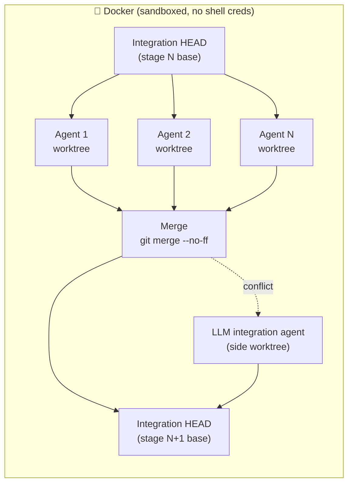
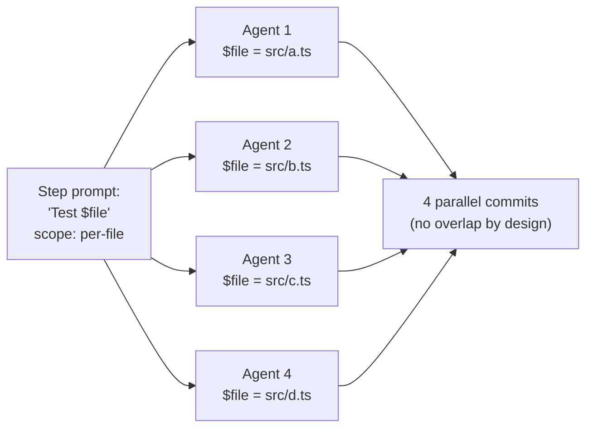
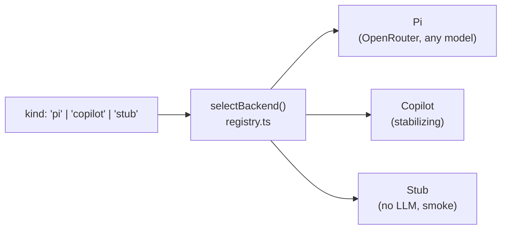

<p align="center">
  
</p>

<p align="center">
  <em>55 minutes of <code>huu</code> generating 100% unit-test coverage — sped up to 10 seconds.</em>
</p>

<h1 align="center">huu</h1>

<p align="center">
  <strong><code>huu</code> — <em>Humans Underwrite Undertakings</em>.</strong>
</p>

<p align="center">
  <a href="MANIFESTO.en.md">Manifesto</a> · <strong>English</strong> · <a href="README.md">Português (BR)</a>
</p>

<p align="center">
  <a href="#license"></a>
  <a href="CHANGELOG.md"></a>
  
  
  
  <a href="docs/README.md"></a>
</p>

---

## The four orchestration primitives

| | Primitive | What it does |
|---|---|---|
| 🗺️ | **Map** — `per-file`/`memory` fan-out | the same prompt becomes N parallel agents, one per file (`$file` + `$hint`), each in its own git worktree |
| 🔀 | **Switch** — check steps | an LLM judge with shell access emits a JSON verdict and the cursor follows the outcome (safe `default` + `maxRuns`) |
| ◇ | **Parallel + Join** — [`dependsOn`](docs/pipeline-json-guide.md) | heterogeneous branches run together in **deterministic waves**; the join sees every merge — same pipeline ⇒ same commit sequence, always |
| 🧠 | **Memory** — [`produces` → `filesFrom`](docs/memory-scope.md) | one step **discovers** the work and the next fans out over it — zero human file-picking; huu injects the format contract |

They compose freely: *discover → memory fan-out → parallel branches →
judged join → cascading rework* — all visible on the kanban, all
reproducible. Something broke? Every fatal error ships with **cause +
next step** ([troubleshooting](docs/troubleshooting.md)).

## What huu is

**huu designs pipelines that make thinking agents follow a
deterministic process.** It is not a tool for building new features:
the focus is audits, test generation, knowledge extraction and any
assembly-line process with real, predictable value — where the method
is fixed and the agent brings the intelligence, not the scope.

**A pipeline is a file of orders that the AI obeys.** You write a
`huu-pipeline-v1.json` listing the steps and the files each step
touches. The orchestrator turns each step into a fan-out of parallel
agents — one agent per file when you ask for it — runs them in
isolated git worktrees, and merges them back into a single integration
branch **between every stage**. The whole run is sandboxed in Docker
so the agent never sees your shell credentials.

That sentence has a few claims worth unpacking:

- **The human underwrites the scope.** No LLM planner decides what
  step 3 should do or which files it should touch. If a step is
  misdesigned, the result is predictably and auditably wrong — not
  surprisingly wrong.
- **In `per-file` mode, one agent gets one file.** The prompt is
  identical across the N agents — only `$file` is substituted. No
  context degradation between agents, no scope drift. The Pi coding
  agent (default backend) runs with `thinking=medium` so the model
  trades latency for quality on its single mission.
- **Pipelines are portable, not provider-locked.** A
  `huu-pipeline-v1.json` is a versioned artifact — commit it, share
  it as a gist, contribute it to the cookbook. The know-how of *how
  to decompose this class of task* lives in plain JSON.

### Stage → merge → stage



Each stage forks N agents off the integration HEAD, lets them work in
parallel in their own worktrees, and merges them back **before**
the next stage starts. The integration worktree is never rewound —
loops re-execute on top of the current HEAD, accumulating commits.
Conflicts hit a side LLM integration agent (skipped in `--stub` mode).

### Per-file scope: one agent, one mission



Same prompt, different `$file`. Agents read the whole worktree for
context but are instructed to write only to their assigned file —
disjoint writes mean clean merges. **This is the revolutionary bit:
your pipeline is the contract, and the contract scales horizontally.**

### Memory scope: the pipeline picks the files, not the human

`per-file` still needs someone to select the files. The `memory` scope
removes even that: an earlier step **writes a memory file**
(`huu-memory-v1`) listing the paths — with an optional per-file
`hint` — and the step with `scope: "memory"` + `filesFrom` fans out
**one agent per entry**, reading the list from the integration
worktree at run time. The producer's `hint` reaches the consumer's
prompt through the `$hint` token, alongside `$file`.

Scan → fix, recon → study, rank → refactor: the discovery step decides
the work and the fan-out obeys, with zero selection clicks. Full
guide: [`docs/memory-scope.md`](docs/memory-scope.md).

---

## Showcase: huu Test Suite

`huu Test Suite` is the default pipeline materialized on first run. It
demonstrates why mixing `project` and `per-file` scope is the recipe.

| # | Step | Scope | What it does |
|---|---|---|---|
| 1 | Analyze stack and write `huu-tests.md` | `project` | Detects language (Node / Python / Go / Rust / Java / .NET), verifies test runner, writes the **plan** every later step obeys. |
| 2 | Test 3 representative files | `project` | Picks 3 diverse business-logic files, writes tests, fixes failures, appends learnings to `huu-tests-faq.json`. |
| 3 | **Test `$file` (user-selected)** | `per-file` | **N parallel agents, each receives one file.** Each follows `huu-tests.md`, writes a test, accumulates FAQ. |
| 4 | Final cleanup + coverage badge | `project` | Runs the full suite, deletes only the failing **blocks** (never entire files), updates README badge. |

Step 1 writes a contract; step 3 makes 30 agents obey it in parallel;
step 4 validates. **Plan in `project`, execute in `per-file`, validate
in `project`** — the template for everything else.

Step-by-step walkthrough with prompts:
[`docs/onboarding.md#example-walkthrough`](docs/onboarding.md#example-walkthrough).

---

## What huu is for (and what it is not)

The **plan → fan-out → merge** shape shines in processes with real,
predictable value — where the method fits in a file and the result is
auditable:

- **Audits** (five bundled defaults: Security, Quality, Docs,
  Performance, Refactor Plan) — strict report-only, never touch your
  manifests or production source. Each one is anchored in published
  methodology (OWASP Top 10:2025, churn×complexity, Diátaxis, Core
  Web Vitals, Fowler/Mikado) and **ends with a judge agent** that
  validates the report and sends it back for rework if the numbers
  don't add up.
- **Test generation** (`huu Test Suite`, the default) — assertion
  rules that survive mutation testing and anti-flaky determinism
  rules baked into the prompts.
- **Knowledge extraction** (`huu Knowledge System`) — fully autonomous
  via the `memory` scope: recon picks the study files by itself (with
  a per-file hint), deep study converges into `.huu/knowledge/`,
  per-topic dossiers become **Agent Skills**
  ([spec](https://agentskills.io/specification)) under
  `.agents/skills/` with **one parallel agent per skill**, plus
  evolution meta-skills and a router-aware routing surface (extends
  your existing `catalog.md` when present) — sealed by a **blind
  routing eval** with a description-sharpening rework loop.
- **Mechanical mass processes.** *Migrate 40 Mocha tests to Vitest:*
  stage 1 audits patterns into `MIGRATION.md`, stage 2 fans out 40
  agents (one per file), stage 3 validates with `npm test`. The prompt
  is identical across all 40 — only `$file` changes. Predictable by
  construction.
- **Your process.** If you can write the method as an ordered list of
  steps with prompts and a `scope`, you can run it. The pipeline
  format is stable; the cookbook is open.

**What huu is NOT:** a tool for building new features. There is no
LLM planner inventing scope, and "build app X" is not a pipeline —
it's a bet. When the task demands open-ended design decisions at every
step, use an interactive coding agent; when the method is known and
the value lies in executing it with discipline over N files, use huu.

Bundled defaults: [`docs/onboarding.md#bundled-default-pipelines`](docs/onboarding.md#bundled-default-pipelines).

---

## Backends — any model, your choice



| Backend | Flag | Cost model | Status |
|---|---|---|---|
| **Pi** (default) | `--backend=pi` | Pay-per-token via `OPENROUTER_API_KEY` — **any OpenRouter model** | Recommended |
| GitHub Copilot | `--copilot` | Subscription via `COPILOT_GITHUB_TOKEN` | Stabilizing |
| Stub | `--stub` | Free, no LLM — smoke tests / demos | Stable |

The Pi factory enables `thinking=medium` by default for every model
that supports it — the model is allowed to draft, critique, and revise
internally before emitting a final answer. For per-file work (one
agent, one mission), this is the right trade-off. All three backends
share the same orchestrator, worktree lifecycle, and merge logic.

Adding a future backend (ACP, Claude Code, …) is a one-folder +
one-case-in-registry change under `src/orchestrator/backends/`.

Deep dive: [`docs/onboarding.md#backends-deep-dive`](docs/onboarding.md#backends-deep-dive).

---

## Dynamic concurrency (memory-aware, default on)

By default huu **adapts concurrency to the real memory headroom**: it
measures how much each agent actually consumes (moving average, seeded
at 250 MB) and admits new agents only while they fit in the available
memory minus a safety margin — cgroup-aware, so inside a container it
respects the container's limit, not the host's.

A **memory guard stays always on** (even with manual concurrency): if
RAM crosses ~95%, the **newest** agent — the one with the least work
done — is killed, its card **returns to the TODO column** with a `↻N`
counter, and the task restarts from zero once memory frees up. The
older agents' work is never lost.

Controls:

| Where | How |
|---|---|
| CLI | `--concurrency=N` pins manual at N · `--no-auto-scale` turns the dynamic mode off |
| TUI | `+`/`-` adjust (and pin manual) · `A` re-enables auto-scale |
| Web | concurrency control + auto-scale toggle in the run header |
| Headless | `"concurrency": N` in the config pins manual; omit it for the dynamic mode |

---

## Quick start

### Docker (recommended)

```bash
git clone https://github.com/frederico-kluser/huu
cd huu
docker build -t huu:local .
export OPENROUTER_API_KEY=sk-or-...
HUU_IMAGE=huu:local huu run example.pipeline.json
```

Pre-built images at `ghcr.io/frederico-kluser/huu:latest` — the wrapper
pulls automatically when no `HUU_IMAGE` is set. VPN-aware MTU, secret
mounting, signal forwarding, and orphan cleanup are all handled by
the wrapper.

### Native

```bash
npm install -g huu-pipe        # Node 20+ and a working `git`
huu --yolo                     # opens the TUI natively (no Docker)
```

Native runs expose your shell credentials to the LLM agent. Prefer
Docker for anything real on your laptop. (`--no-docker` is the
neutral-spelling alias of `--yolo`, meant for CI runners — see below.)
Full install matrix (macOS / Windows / Linux, OrbStack notes, WSL2
caveats): [`docs/onboarding.md#install`](docs/onboarding.md#install).

---

## Headless / one-command mode

For CI, cron, demos:

```bash
huu auto pipeline.json --config config.json
```

```json
{
  "modelId": "minimax/minimax-m2.7",
  "backend": "pi",
  "files": { "3. Test $file (user-selected)": ["src/index.ts"] },
  "concurrency": 4
}
```

- **stderr** — NDJSON progress events (one per state change).
- **stdout** — one final JSON object on completion (`runId`,
  `integrationBranch`, `totalCost`, …).
- **Exit code** — `0` if `status === 'done'`, `1` otherwise.

Build pipes on top: `huu auto … | jq .runId`. Full doc:
[`docs/onboarding.md#headless-mode`](docs/onboarding.md#headless-mode).

---

## Running in CI (GitHub Actions / GitLab — no Docker)

A CI runner is already an ephemeral container: huu's Docker wrapper
makes no sense there (and Docker-in-Docker rarely exists). Combine
`HUU_NO_DOCKER=1` (or `--no-docker`) with headless mode and huu
becomes a pipeline job on any runner with **Node.js ≥ 20 and git**:

```yaml
env:
  HUU_NO_DOCKER: '1'
  OPENROUTER_API_KEY: ${{ secrets.OPENROUTER_API_KEY }}
steps:
  - run: npm install -g huu-pipe
  - run: huu auto pipelines/huu-security-audit.pipeline.json --config huu-ci-config.json
  - uses: actions/upload-artifact@v4
    with: { name: huu-audits, path: .huu/audits/** }
```

The report-only audits are the natural fit: the job uploads
`.huu/audits/` as an artifact and the exit code (`0`/`1`) does the
gating. Full recipes (GitHub Actions and GitLab CI, dynamic config via
`git ls-files`, concurrency on small runners):
[`docs/ci.md`](docs/ci.md).

---

## Pipeline schema (compact)

```json
{
  "_format": "huu-pipeline-v1",
  "pipeline": {
    "name": "harden-and-document",
    "maxRetries": 1,
    "steps": [
      {
        "name": "Add JSDoc headers",
        "prompt": "Add a JSDoc header on top of $file with @author huu.",
        "files": ["src/cli.tsx", "src/app.tsx"],
        "scope": "per-file",
        "modelId": "anthropic/claude-sonnet-4-5"
      },
      {
        "name": "Refresh CHANGELOG",
        "prompt": "Update CHANGELOG.md summarizing the work above.",
        "files": [],
        "scope": "project"
      }
    ]
  }
}
```

`scope` controls decomposition: `project` = one whole-project task,
`per-file` = one task per file (the parallelism sweet spot),
`flexible` = user picks at edit time.

Full schema (timeouts, retries, conditional `check` steps, model
overrides, port allocation): [`docs/pipeline-json-guide.md`](docs/pipeline-json-guide.md).

---

## More

| Topic | Where |
|---|---|
| **Tutorial / first run / authoring** | [`docs/onboarding.md`](docs/onboarding.md) |
| **CI without Docker (GitHub Actions / GitLab)** | [`docs/ci.md`](docs/ci.md) |
| **Architecture & layered import rules** | [`docs/ARCHITECTURE.md`](docs/ARCHITECTURE.md) |
| **Operations (Docker, env vars, FAQ, roadmap)** | [`docs/operations.md`](docs/operations.md) |
| **Pipeline JSON schema** | [`docs/pipeline-json-guide.md`](docs/pipeline-json-guide.md) |
| **Port isolation internals** | [`docs/PORT-SHIM.md`](docs/PORT-SHIM.md) |
| **Keyboard reference** | [`docs/KEYBOARD.md`](docs/KEYBOARD.md) |
| **Agent skills catalog** | [`agent-skills.md`](agent-skills.md) |
| **Changelog** | [`CHANGELOG.md`](CHANGELOG.md) |

---

## License

`huu` (the runner) is licensed under the **Apache License 2.0**. See
[LICENSE](LICENSE) for the full text. You're free to use, modify, and
redistribute commercially and non-commercially, with attribution and a
copy of the license.

**Pipelines are not the runner.** The `huu-pipeline-v1` JSON format is
an open specification. Pipelines you author or pick up from the
community are *yours* (or the original author's): they are not
encumbered by the runner's license. The cookbook convention is MIT or
CC0 — use them at work, at home, anywhere.

---

## Author

**Frederico Guilherme Kluser de Oliveira**
[kluserhuu@gmail.com](mailto:kluserhuu@gmail.com)

`huu` builds on [`@mariozechner/pi-coding-agent`](https://www.npmjs.com/package/@mariozechner/pi-coding-agent)
— a lean, multi-provider coding-agent SDK by Mario Zechner. His
[post on the design](https://mariozechner.at/posts/2025-11-30-pi-coding-agent/)
is worth a read; the philosophical overlap is not coincidental.

The GitHub Copilot integration uses [`@github/copilot-sdk`](https://www.npmjs.com/package/@github/copilot-sdk)
(declared as an optional dependency) — providing subscription-based
access for users already on a GitHub Copilot plan.
