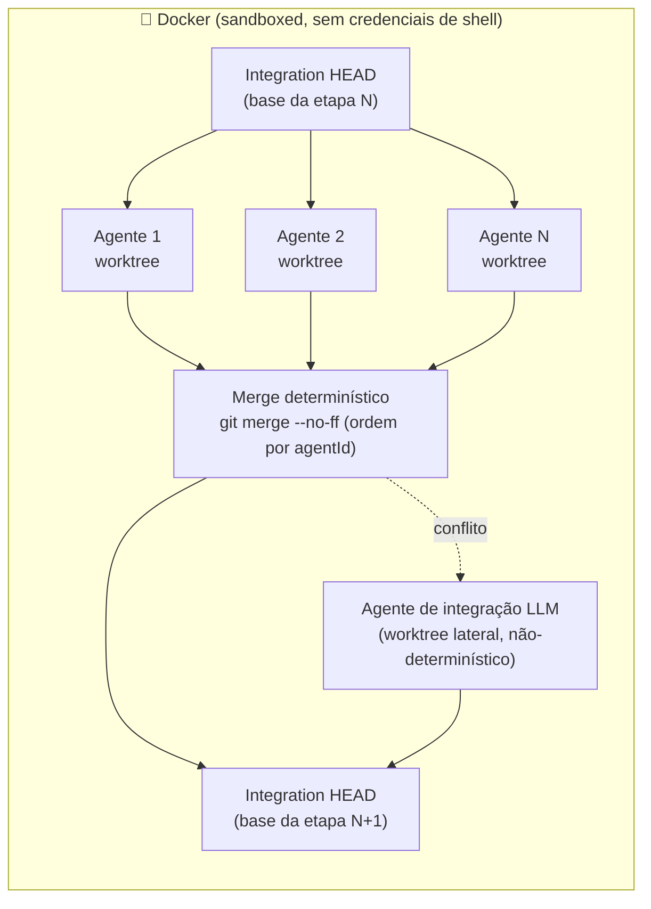
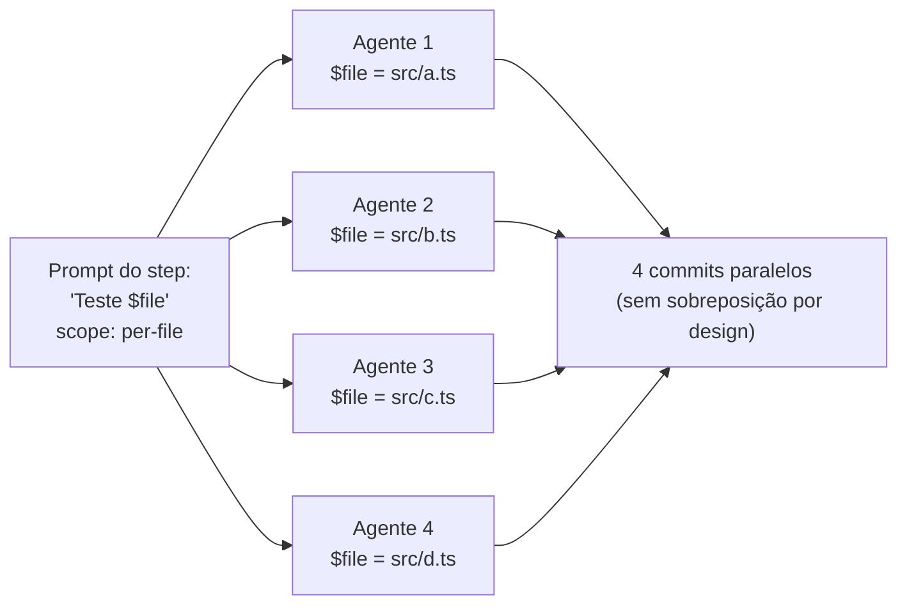
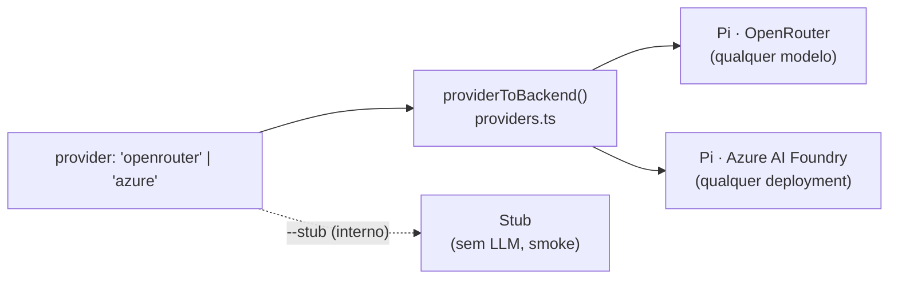

<p align="center">
  
</p>

<p align="center">
  <em>55 minutos do <code>huu</code> gerando uma suíte de testes unitários — acelerados pra 10 segundos.
  Execução real de exemplo (100% de cobertura de <strong>linha</strong> nesta run), <strong>não</strong> uma garantia de
  resultado — veja a ressalva sobre cobertura no <a href="#showcase-huu-test-suite">showcase</a>.</em>
</p>

<h1 align="center">huu</h1>

<p align="center">
  <strong><code>huu</code> — <em>Humans Underwrite Undertakings</em> (humanos subscrevem empreitadas).</strong>
</p>

<p align="center">
  <em>O orquestrador de agentes onde o <strong>método é seu</strong> e a <strong>inteligência é do modelo</strong>.</em>
</p>

<p align="center">
  Um pipeline em JSON vira agentes paralelos — <strong>um por arquivo</strong> — em git worktrees isolados,
  mesclados a cada etapa de forma <strong>determinística no método e na ordem de merge</strong>
  (<a href="MANIFESTO.md">não no resultado</a>), com suas credenciais protegidas em Docker.
</p>

<p align="center">
  <a href="MANIFESTO.md">Manifesto</a> · <a href="README.en.md">English</a> · <strong>Português (BR)</strong>
</p>

<p align="center">
  <a href="https://www.npmjs.com/package/huu-pipe"></a>
  <a href="#licença"></a>
  <a href="https://www.repostatus.org/#active"></a>
  
  
  
  <a href="docs/README.md"></a>
</p>

<p align="center">
  <sub>Projeto jovem, essencialmente de autor único e com desenvolvimento fortemente assistido por IA —
  veja <a href="#status--maturidade">Status &amp; maturidade</a> antes de levar pra produção crítica.</sub>
</p>

---

## Os quatro primitivos de orquestração

| | Primitivo | O que faz |
|---|---|---|
| 🗺️ | **Map** — fan-out `per-file`/`memory` | o mesmo prompt vira N agentes em paralelo, um por arquivo (`$file` + `$hint`), cada um em seu git worktree |
| 🔀 | **Switch** — check steps | um judge LLM com shell emite um veredito JSON e o cursor segue o outcome (com `default` seguro e `maxRuns`) |
| ◇ | **Parallel + Join** — [`dependsOn`](docs/pipeline-json-guide.md) | ramos heterogêneos rodam juntos em **ondas determinísticas**; a **ordem** das ondas e dos merges é a mesma em toda execução (o *conteúdo* de cada nó é do modelo — e um merge com conflito cai num resolvedor LLM) |
| 🧠 | **Memory** — [`produces` → `filesFrom`](docs/memory-scope.pt-BR.md) | uma etapa **descobre** o trabalho e a próxima fan-outa sobre ele — zero seleção humana de arquivos; o contrato de formato é injetado pelo huu |

Compõem livremente: *descoberta → fan-out por memória → ramos paralelos →
join julgado → rework em cascata* — tudo visível no kanban, tudo
reproduzível **na topologia**. Quebrou algo? Todo erro fatal vem com
**causa + próximo passo** ([troubleshooting](docs/troubleshooting.pt-BR.md)).

## O que é o huu

**O huu desenha pipelines que fazem agentes que pensam seguirem um
processo determinístico.** Ele não é uma ferramenta para desenvolver
features novas: o foco é auditoria, geração de testes e extração de
conhecimento — o método é fixo e o agente entra com a inteligência,
não com o escopo.

**Um pipeline é um arquivo de ordens que a IA obedece.** Você escreve
um `huu-pipeline-v1.json` listando os passos e os arquivos que cada
passo toca. O orchestrator transforma cada passo em um fan-out de
agentes paralelos — um agente por arquivo quando você pede assim —
roda eles em worktrees git isolados, e mescla tudo de volta num único
branch de integração **entre cada etapa**. A execução inteira é
sandboxed em Docker, então o agente nunca vê suas credenciais de shell.

Essa frase tem algumas afirmações que vale destacar:

- **O humano subscreve o escopo.** Nenhum planner LLM decide o que o
  passo 3 deve fazer ou quais arquivos ele deve tocar. Se um passo for
  mal projetado, o resultado vai ser previsivelmente e auditavelmente
  errado — não surpreendentemente errado.
- **Determinístico no método e na ordem de merge, não no resultado.** A
  topologia do pipeline, os escopos, os pontos de merge e a ordem
  (`git merge --no-ff`, branches ascendentes por agentId) são idênticos
  em toda execução. O que o modelo escreve *dentro* de cada nó é livre —
  e quando um merge conflita, a resolução cai num **agente de integração
  LLM** (não-determinístico, por construção). Duas runs do mesmo pipeline
  produzem diffs diferentes; é onde a criatividade do modelo paga o custo
  dela. O [MANIFESTO](MANIFESTO.md) desenvolve essa tese.
- **Em modo `per-file`, um agente recebe um arquivo.** O prompt é
  idêntico entre os N agentes — só `$file` é substituído. Sem
  degradação de contexto entre agentes, sem drift de escopo. O Pi
  coding agent (backend padrão) roda com `thinking=medium` em todo
  modelo que suporta, pra que o modelo troque latência por qualidade na
  sua missão única.
- **Pipelines são portáteis, não presos a um provider.** Um
  `huu-pipeline-v1.json` é um artefato versionado — comite, compartilhe
  como gist, contribua pro cookbook. O know-how de *como decompor essa
  classe de tarefa* mora em JSON puro.

---

## Para quem o huu serve (e o que ele NÃO é)

Decida em 30 segundos se isto é pra você:

- ✅ **Serve** se o seu método cabe numa lista ordenada de passos e o
  valor está em executá-lo com **disciplina e reprodutibilidade sobre N
  arquivos**: auditoria, geração de testes, extração de conhecimento,
  migração mecânica em massa. Você escreve o escopo uma vez; 30 agentes
  obedecem em paralelo.
- ❌ **Não serve** pra "conserte esse bug" ou "construa essa feature".
  Trabalho aberto, one-off, sem método repetível pede um agente
  interativo (Claude Code, Cursor) ou autônomo (OpenHands). Escrever um
  pipeline pra isso é overhead — e "construa o app X" não é um pipeline,
  é uma aposta.

A regra prática: **quando cada passo exige uma decisão aberta de design,
não é trabalho pro huu. Quando o método é conhecido e só falta
executá-lo com rigor, é exatamente o trabalho pro huu.**

---

## Início rápido

**Pré-requisitos:** Node.js ≥ 20, `git` e Docker (recomendado). Para o
backend padrão, exporte uma `OPENROUTER_API_KEY`
([openrouter.ai/keys](https://openrouter.ai/keys)).

### Docker (recomendado)

```bash
git clone https://github.com/frederico-kluser/huu
cd huu
docker build -t huu:local .
export OPENROUTER_API_KEY=sk-or-...
HUU_IMAGE=huu:local huu run pipelines/huu-test-suite.pipeline.json
```

> Abra **http://localhost:4888** no navegador — a **interface web é o
> padrão**. Dentro do Docker o servidor roda no container e a porta é
> publicada pro host automaticamente. Prefere o terminal? `huu --cli`.

> O huu materializa os pipelines default empacotados em `./pipelines/` no
> primeiro launch — escolha um na UI ou passe o caminho.

Imagens pré-buildadas em `ghcr.io/frederico-kluser/huu:latest` — o
wrapper puxa automaticamente quando nenhum `HUU_IMAGE` está setado.
MTU VPN-aware, mount de secrets, forwarding de sinais e limpeza de
órfãos são todos cuidados pelo wrapper.

### Nativo

```bash
npm install -g huu-pipe        # Node 20+ e um `git` funcional
huu --yolo                     # abre a UI web nativa (sem Docker)
huu --yolo --cli               # ou a TUI no terminal, sem Docker
```

Execuções nativas expõem suas credenciais de shell pro agente LLM.
Prefira Docker pra qualquer coisa real no seu laptop. (`--no-docker` é
o alias de grafia neutra do `--yolo`, pensado pra runners de CI — veja
abaixo.) Matriz completa de instalação (macOS / Windows / Linux, notas
do OrbStack, caveats do WSL2):
[`docs/onboarding.pt-BR.md#instalação`](docs/onboarding.pt-BR.md#instalação).

A UI (web por padrão, ou a TUI com `--cli`) abre num dashboard: comece
pelo `huu Test Suite` (o pipeline default já materializado) ou monte o
seu **sem escrever JSON na mão** — veja a próxima seção.

---

## Interface web (padrão)

Rodar `huu` abre uma **interface web** no navegador — design inspirado
na Apple (vidro líquido, claro/escuro), tempo real, sem delay. É o
mesmo Orchestrator da TUI; só muda a cara. A flag **`--cli`** volta pra
TUI no terminal.

- **Padrão e sem fricção.** `huu` → web. `huu --cli` → terminal.
  `huu --yolo` → web **sem Docker** (nativo). Toda combinação vale: o
  front-end (web/CLI) é ortogonal ao runtime (Docker/nativo).
- **Funciona com e sem Docker.** No container o servidor sobe lá dentro
  e a porta é publicada pro host (`-p`); nativo ele liga direto.
- **Na sua rede.** Por padrão escuta em `0.0.0.0` — abra do celular ou de
  outra máquina via `http://<ip-da-sua-máquina>:4888`. Tempo real por
  Server-Sent Events (reconecta sozinho), zero dependência nova (só
  `node:http`).
- **Tudo clicável.** Kanban de cards (agentes, merges, juízes) fluindo
  TODO → DOING → DONE; clique num card pra ver **tokens, custo, branch,
  arquivos e logs ao vivo** por agente. Console de log global, controle
  de concorrência (Auto · Manual · MAX) e botão de parar no topo.
- **Sua key, no navegador.** Cole sua `OPENROUTER_API_KEY` no formulário de
  launch — ela é **validada na hora** contra o provider e fica só na aba do
  navegador (`sessionStorage`), enviada a cada run e **nunca escrita em
  disco**. Uma `OPENROUTER_API_KEY` solta no shell não consegue sombrear.

> **Hoje a web roda pipelines existentes** (listar, escolher, executar,
> ajustar concorrência, parar). Os **construtores guiados** (Pipeline
> Assistant e o editor passo a passo) ainda vivem na **TUI** — use
> `huu --cli`. Autoria de pipeline pela web é roadmap.

> **Sobre "custo":** o custo e os tokens **por card/agente** são reais
> (acumulados dos eventos de uso do backend, quando o provider os
> reporta). O **total agregado da run** ainda não é somado — veja a
> ressalva no [modo headless](#modo-headless--um-comando).

```bash
huu                       # UI web (padrão) — http://localhost:4888
huu --port=8080           # porta custom (ou HUU_WEB_PORT=8080)
HUU_WEB_HOST=127.0.0.1 huu # só localhost (não expõe na LAN)
HUU_WEB_TOKEN=segredo huu # exige ?token=segredo pra dados/ações
huu --cli                 # TUI no terminal
```

| Variável | Faz |
|---|---|
| `HUU_WEB_PORT` / `--port=<n>` | Porta (default `4888`). |
| `HUU_WEB_HOST` | Endereço de bind (default `0.0.0.0`; `127.0.0.1` = só local). |
| `HUU_WEB_TOKEN` | Segredo compartilhado exigido nas rotas de dados/ações. |
| `HUU_CLI=1` | Default pra TUI (igual a `--cli`). |

---

## Monte um pipeline sem escrever JSON na mão

Você não precisa abrir um editor de JSON pra começar. A **TUI**
(`huu --cli`) tem duas formas guiadas de criar um pipeline, ambas a
partir da tela de boas-vindas:

<p align="center">
  
</p>

- **Construtor guiado — tecla `N`.** Abre um **seletor de padrões**
  (Discover → Act com par de memória pré-ligado · Per-file transform ·
  Audit with judge · Blank) que já monta os steps ligados; daí você edita
  etapa por etapa. Pra cada step você escolhe o **scope** (`project`,
  `per-file`, `memory` ou `flexible`), as **dependências** entre steps
  (`dependsOn` — formam ondas determinísticas: dá pra abrir um galho em
  ramos paralelos que se juntam num step seguinte) e os **check steps**
  (um juiz que aprova, volta pra um step anterior ou ramifica, com
  `maxRuns`). O rodapé sempre mostra as teclas do campo em foco.
- **Pipeline Assistant — tecla `A`** (em magenta, a cor reservada à UI
  movida a IA). Descreva sua demanda em linguagem natural e responda
  algumas perguntas de múltipla escolha. O huu faz um recon do projeto em
  paralelo, esboça a estrutura (o *Architect flow* compara rascunhos sob
  lentes diferentes) e entrega um pipeline **já validado** pelo schema e
  pela topologia reais — **que você então edita** no mesmo construtor.
  Você continua subscrevendo o escopo: a IA monta o rascunho, você revisa
  e aprova.

> Esses dois fluxos são **da TUI** (`huu --cli`). A interface web (padrão)
> hoje executa pipelines existentes; a autoria guiada pela web é roadmap.

Mapa de teclas completo: [`docs/KEYBOARD.md`](docs/KEYBOARD.md) ·
tutorial passo a passo:
[`docs/onboarding.pt-BR.md`](docs/onboarding.pt-BR.md).

---

## Etapa → merge → etapa



Cada etapa ramifica N agentes a partir do HEAD de integração, deixa
eles trabalharem em paralelo nos seus próprios worktrees, e mescla
tudo de volta **antes** da próxima etapa começar. A barreira é
`git merge --no-ff`, em ordem ascendente de agentId — um algoritmo de 20
anos, não um LLM coordenador. O worktree de integração nunca dá rewind —
loops re-executam em cima do HEAD atual, acumulando commits. **Conflito
real é o único ponto onde a IA entra no plano de controle:** cai num
agente de integração LLM lateral (pulado no modo `--stub`), e a
resolução dele *não* é determinística. É o fallback pra pipelines mal
projetadas, não o caminho principal.

### Scope per-file: um agente, uma missão



Mesmo prompt, `$file` diferente. Agentes leem o worktree inteiro pra
contexto mas são instruídos a escrever só no arquivo atribuído —
escritas disjuntas geram merges limpos. **Porque o pipeline é só um
contrato declarativo, o mesmo arquivo roda um agente ou trinta —
escalando horizontalmente sem mudar os passos.**

### Scope memory: o pipeline escolhe os arquivos, não o humano

`per-file` ainda exige que alguém selecione os arquivos. O scope
`memory` remove até isso: uma etapa anterior **escreve um arquivo de
memória** (`huu-memory-v1`) listando os paths — com um `hint` opcional
por arquivo — e a etapa com `scope: "memory"` + `filesFrom` fan-outa
**um agente por entrada**, lendo a lista do worktree de integração na
hora de executar. O `hint` do produtor chega ao prompt do consumidor
via token `$hint`, junto do `$file`. O contrato de formato é injetado
automaticamente pelo huu (`src/lib/memory-contract.ts`), então o prompt
do produtor fica limpo.

Scan → fix, recon → estudo, rank → refactor: o passo de descoberta
decide o trabalho e o fan-out obedece, sem nenhum clique de seleção.
**É assim que todos os pipelines default funcionam hoje — autônomos, sem
você apontar arquivo nenhum.** Guia completo:
[`docs/memory-scope.pt-BR.md`](docs/memory-scope.pt-BR.md).

---

<h2 id="showcase-huu-test-suite">Showcase: huu Test Suite</h2>

`huu Test Suite` é o pipeline default materializado na primeira
execução. Ele demonstra por que misturar `project`, descoberta por
memória e um juiz é a receita — **sem você escolher um único arquivo**.

| # | Step | Scope | O que faz |
|---|---|---|---|
| 1 | Analisa stack e escreve `huu-tests.md` | `project` | Detecta a linguagem (Node / Python / Go / Rust / Java / .NET), confere o test runner, escreve o **plano** que todos os passos seguintes obedecem. |
| 2 | Seleciona alvos de teste | `project` → `produces` | **Recon autônomo:** escreve a lista `huu-memory-v1` dos arquivos mais test-worthy (com um `hint` por arquivo). **Sem seleção manual.** |
| 3 | **Escreve testes pra `$file`** | `memory` (fan-out) | **N agentes em paralelo, um por arquivo da lista do passo 2.** Mesmo prompt, `$file`/`$hint` diferentes; cada um segue o `huu-tests.md`. |
| 4 | Limpeza + badge de cobertura | `project` | Roda a suíte completa, deleta só os **blocos** com falha (nunca arquivos inteiros), mede a cobertura de **linha** que emergir e atualiza o badge no README. |
| 5 | Suíte verde? | `check` (maxRuns 2) | Um juiz roda a suíte: `approved` → finaliza (default, caminho pra frente); `rework` → volta pro passo 4. |
| 6 | Finaliza | `project` | Stamp final e remove o arquivo de alvos transitório. |

Step 1 escreve um contrato; step 2 descobre o trabalho; step 3 faz N
agentes obedecerem em paralelo; o juiz do step 5 fecha o loop.
**Planeje em `project`, descubra e execute em `memory`, valide com um
juiz** — o template pra tudo o mais.

> **Ressalva honesta sobre cobertura.** O pipeline **não** mira nem
> garante 100%. O gate é "**a suíte passa**" (exit 0); a cobertura de
> linha é **medida e reportada**, não exigida — a run do GIF deu 100%,
> outra pode dar 70%. E cobertura de linha só prova que o código
> *rodou*, não que as asserções pegariam um bug: os prompts já miram
> **asserções que sobrevivem a mutation testing** e regras de
> determinismo anti-flaky, e o próprio `huu-tests.md` aponta mutation
> testing (Stryker/mutmut/PIT) como o follow-up que mede qualidade de
> verdade. Trate 100% de cobertura como **ponto de partida, não prova**.

Passo a passo com prompts:
[`docs/onboarding.pt-BR.md#exemplo-passo-a-passo`](docs/onboarding.pt-BR.md#exemplo-passo-a-passo).

---

## Para que o huu serve — os pipelines empacotados

O formato **planejar → descobrir → fan-out → mergear → julgar** brilha
em processos com previsibilidade real de valor. Sete pipelines já vêm
empacotadas (só `huu Test Suite` é marcada como o default; todas são
**autônomas** — descobrem os próprios alvos via recon + `scope: memory`,
sem você apontar arquivos):

- **Auditorias** (cinco defaults: Security, Quality, Docs, Performance,
  Refactor Plan) — **relatório-apenas** estrito: escrevem **só** em
  `.huu/audits/<tópico>.md`, `<tópico>-faq.json` e
  `<tópico>-targets.json` (mais arquivos de trabalho sob
  `.huu/audits/.tmp/`), e no máximo **um** ajuste de `.gitignore` pra
  que os relatórios sobrevivam ao merge. Nunca tocam `README.md`,
  `package.json`, lockfiles ou source de produção. Ferramentas
  auxiliares (gitleaks, semgrep, jscpd, lighthouse-ci…) rodam efêmeras
  via `npx --yes`/`pipx run` — nunca entram nos seus manifests. Cada uma
  é ancorada em metodologia publicada (OWASP Top 10:2025,
  churn×complexidade, Diátaxis, Core Web Vitals, Fowler/Mikado) e
  **termina com um agente juiz** que valida o relatório e devolve pra
  retrabalho (`rework`, `maxRuns 2`) se as contas não fecharem.
- **Geração de testes** (`huu Test Suite`, o default) — **muta o repo
  por construção** (escreve `huu-tests.md` na raiz e insere o badge de
  cobertura no `README.md`). Regras de asserção que sobrevivem a mutation
  testing e regras de determinismo anti-flaky embutidas nos prompts.
- **Extração de conhecimento** (`huu Knowledge System`) — também **muta o
  repo por construção** (`.agents/skills/**` + `.huu/knowledge/**`).
  Totalmente autônoma via scope `memory`: o recon escolhe sozinho os
  arquivos de estudo (com um hint por arquivo), o estudo profundo
  converge em `.huu/knowledge/`, dossiês por tópico viram **Agent
  Skills** ([spec](https://agentskills.io/specification)) sob
  `.agents/skills/` com **um agente paralelo por skill**, mais
  meta-skills de evolução e uma superfície de roteamento router-aware
  (estende seu `catalog.md` se já existir) — selada por um **eval cego
  de roteamento** com loop de retrabalho de descriptions.
- **Processos mecânicos em massa.** *Migrar 40 testes Mocha pra
  Vitest:* etapa 1 audita patterns em `MIGRATION.md`, etapa 2 descobre os
  40 arquivos, etapa 3 ramifica 40 agentes (um por arquivo), etapa 4
  valida com `npm test`. O prompt é idêntico nos 40 — só `$file` muda.
  Previsível por construção.
- **Seu processo.** Se você consegue escrever o método como uma lista
  ordenada de steps com prompts e um `scope`, você consegue rodar.
  O formato do pipeline é estável; o cookbook é aberto.

**O que o huu NÃO é:** uma ferramenta para desenvolver features novas.
Não existe planner LLM inventando escopo, e "construa o app X" não é
um pipeline — é uma aposta. Quando a tarefa exige decisões abertas de
design a cada passo, use um coding agent interativo; quando o método é
conhecido e o valor está em executá-lo com disciplina sobre N
arquivos, use o huu.

Defaults empacotados:
[`docs/onboarding.pt-BR.md#pipelines-default-empacotados`](docs/onboarding.pt-BR.md#pipelines-default-empacotados).

---

## Onde o huu se encaixa — e onde ele difere da concorrência

Pesquisamos ~20 ferramentas open-source de orquestração de agentes. Elas
se separam por **duas perguntas**: *quem decide o escopo* (o humano ou o
LLM?) e *como o trabalho é integrado de volta* (merge determinístico ou
manual?).

```
              MERGE DETERMINÍSTICO, etapa a etapa
                          ▲
            ┌───────────┐ │            ┌─────────┐
            │ Bernstein │ │            │   huu   │  ← decomposição HUMANA +
            └───────────┘ │            └─────────┘    fan-out por arquivo + --no-ff
   ESCOPO ◀───────────────┼───────────────────────▶ ESCOPO
  DO LLM                  │                          DO HUMANO
   OpenHands              │   Conductor · Crystal
   SWE-agent              │   Claude Squad · uzi · vibe-kanban
   Cursor · Amp           │   container-use · Sculptor
                          │   LangGraph · CrewAI · AutoGen
                          ▼   Dify · n8n · Flowise
              MERGE MANUAL (PR / cherry-pick por sessão)
```

O **vizinho mais próximo** é o
**[Bernstein](https://github.com/sipyourdrink-ltd/bernstein)**
(Apache-2.0, v2.7.0): um scheduler **Python determinístico** que roda
uma crew de coding agents CLI (Claude Code, Codex, Gemini CLI e +40) em
**git worktrees, um por tarefa**, com **fila de merge serializada**, um
**"janitor"** que faz gate com testes/lint/tipos antes de mergear, e um
**audit log encadeado por HMAC** (replayável, à prova de adulteração).
Ele compartilha quase tudo o que move o huu — **recusa a um planner LLM
no loop de coordenação** ("zero LLM in the coordination loop"),
isolamento por worktree, merge determinístico e gate de verificação.

**A linha que divide os dois é quem escreve a decomposição.** O Bernstein
faz **uma chamada LLM** pra quebrar o goal em tarefas e segue em Python
puro ("one LLM call, then plain Python from there"). O huu pede que o
**humano** escreva a decomposição — *nem uma chamada*. Daí o que sobra de
genuinamente distintivo no huu é: **fan-out por arquivo** (mesmo prompt
× N arquivos, paralelismo de dados, não de tarefas), os **métodos
prontos** (auditoria/teste/conhecimento) que terminam num juiz, e o
**sandbox Docker que esconde suas credenciais** por padrão.

| Ferramenta | Quem decide o escopo | Isolamento | Fan-out por arquivo | Integração / merge | Sandbox de credenciais | Foco |
|---|---|---|---|---|---|---|
| **huu** | **humano — JSON versionado** | **git worktree + Docker** | **✅ nativo** | **determinístico `--no-ff`, a cada etapa** (conflito → resolvedor LLM) | **✅ por padrão** | **auditoria · teste · conhecimento** |
| **Bernstein** | LLM — **1 chamada** decompõe o goal | git worktree (por tarefa) | ❌ (por tarefa) | fila de merge serializada (determinística) | — (roda agentes CLI no host) | construir features a partir de um goal (audit-grade) |
| Conductor · Crystal · Claude Squad · vibe-kanban · uzi | humano — ad-hoc, por sessão | git worktree | ❌ | manual (diff/PR/rebase por sessão) | ❌ (worktree no host) | construir features |
| container-use · Sculptor | humano — ad-hoc | container | ❌ | manual (`cu merge` · PR) | ✅ container | construir features |
| OpenHands · SWE-agent · Cursor · Amp | **LLM planeja tudo** | container / VM | ❌ | PR aberto pelo agente | ✅ (cloud/local) | construir features · resolver issues |
| LangGraph · CrewAI · AutoGen / MAF | dev — grafo em código | in-process | ❌ | estado compartilhado em memória | ❌ | construir agentes (SDK) |
| Dify · n8n · Flowise | humano — canvas visual | servidor persistente | ❌ | banco de dados | ❌ | apps & automação LLM |

No eixo do *determinismo de orquestração* também vale citar o
**[Conductor da Microsoft](https://github.com/microsoft/conductor)** (CLI
MIT, 2026): roteia entre agentes via templates (YAML/Jinja2, sem LLM no
loop de orquestração) e gasta **zero tokens** pra decidir o próximo
passo. A diferença é o escopo do produto: é um orquestrador **genérico**
de workflows; não isola cada agente num git worktree nem faz fan-out de
código por arquivo. (Não confundir com o *Conductor* da Melty no
quadrante acima — um app desktop de runners paralelos.)

### Onde a concorrência ganha (e quando NÃO usar o huu)

Honestidade primeiro: o huu é um nicho, e a vizinhança é forte. Os
concorrentes têm **ecossistemas muito maiores** (dezenas de milhares de
estrelas, apps desktop nativos, marketplaces de integração, clouds
gerenciadas, respaldo corporativo — a Microsoft uniu AutoGen + Semantic
Kernel no Agent Framework). E há coisas que eles fazem melhor por
construção:

- **Decompor o goal pra você.** O Bernstein quebra o objetivo em tarefas
  com uma chamada LLM e ainda traz **40+ adapters de agentes CLI** e um
  **audit log à prova de adulteração** — pra um goal one-off em que você
  não quer escrever a decomposição, ele tem menos overhead de autoria
  que o huu. O preço do huu (você escreve o pipeline) só compensa quando
  o método se repete.
- **"Só conserta esse bug" / "constrói essa feature".** Trabalho aberto,
  one-off, sem método repetível? Use um agente interativo (Claude Code,
  Cursor) ou autônomo (OpenHands). Escrever uma pipeline pra isso é
  overhead.
- **Comparar 3 soluções e escolher a melhor.** Crystal e uzi fazem
  *candidate-generation* (mesmo prompt × N → você fica com o vencedor)
  como fluxo de primeira classe. O huu não tem essa ergonomia nativa.
- **Esteerar o agente no meio da execução.** O Pairing Mode do Sculptor e
  o diff review por sessão do vibe-kanban são interativos; o huu roda o
  contrato até o fim e te entrega o resultado mergeado.

O huu ganha em **uma coisa**, de propósito: fazer agentes que pensam
seguirem um **processo determinístico e auditável** sobre N arquivos,
onde **o humano — não um LLM — escreve a decomposição**. Quando o método
é conhecido e o valor está em executá-lo com disciplina e
reprodutibilidade de método, poucos outros entregam o mesmo contrato.

---

## Provedores — qualquer modelo, sua escolha

huu roda sempre pelo **pi**. O que você escolhe é o *provedor* por baixo
dele: **OpenRouter** (padrão) ou **Azure AI Foundry**. (O backend Copilot
foi removido na v2.2.)



| Provedor | Flag | Modelo de custo | Status |
|---|---|---|---|
| **OpenRouter** (padrão) | `--provider=openrouter` | Por-token via `OPENROUTER_API_KEY` — **qualquer modelo OpenRouter** | Recomendado |
| Azure AI Foundry | `--provider=azure` | Por endpoint via `AZURE_OPENAI_API_KEY` + `AZURE_OPENAI_BASE_URL` — qualquer deployment ([guia](docs/azure-backend.md)) | Novo |
| Stub | `--stub` | Grátis, sem LLM — smoke tests / demos | Estável |

A factory do Pi habilita `thinking=medium` por padrão pra todo modelo
que suporta — o modelo pode rascunhar, criticar e revisar internamente
antes de emitir uma resposta final. Pra trabalho per-file (um agente,
uma missão), esse é o trade-off certo. Os dois provedores compartilham o
mesmo orchestrator, ciclo de vida de worktree e lógica de merge.

Escolha o provedor na tela de launch (web e TUI) ou trave pela linha de
comando com `--provider=`. A chave de cada provedor é carregada, editável
e persistida em Opções — e é a mesma chave que o pi usa no run.

A fundo: [`docs/onboarding.pt-BR.md#backends-a-fundo`](docs/onboarding.pt-BR.md#backends-a-fundo).

---

## Concorrência dinâmica (memória-aware, padrão)

Por padrão o huu **adapta a concorrência ao headroom real de memória**:
ele mede quanto cada agente consome de verdade (média móvel, semeada em
250 MiB e travada entre 128 MiB e 2 GiB) e admite novos agentes só
enquanto couberem na memória disponível menos uma margem de segurança
(o maior entre 10% e 512 MiB) — cgroup-aware, então dentro de um
container ele respeita o limite do container, não o do host.

Uma **guarda de memória fica sempre ativa** (mesmo com concorrência
manual ou MAX): se a RAM **ou** a CPU passam de ~95%, o agente **mais
novo** — o que tem menos trabalho feito (escolhido por `startedAt`) — é
morto, seu card **volta para a coluna TODO** com um contador `↻N`, e a
task é re-enfileirada na frente, recomeçando do zero quando a memória
liberar. O trabalho dos agentes mais antigos nunca é perdido.

Controles:

| Onde | Como |
|---|---|
| CLI | `--concurrency=N` pina manual em N · `--no-auto-scale` desliga o modo dinâmico |
| TUI | `+`/`-` ajustam (e pinam manual) · `A` religa o auto-scale · `M` modo MAX/greedy (inunda até o limite de memória) |
| Headless | `"concurrency": N` no config pina manual; omita para o modo dinâmico |

---

## Modo headless / um-comando

Pra CI, cron, demos:

```bash
huu auto pipeline.json --config config.json
```

```json
{
  "modelId": "minimax/minimax-m2.7",
  "backend": "pi",
  "files": { "3. Write tests for $file": ["src/index.ts"] },
  "concurrency": 4
}
```

- **stderr** — eventos de progresso em NDJSON (um por mudança de
  estado, throttle ~250 ms).
- **stdout** — um objeto JSON final no término: `ok`, `runId`,
  `integrationBranch`, `baseCommit`, `status`, `durationMs`,
  `filesModified`, `conflicts` e um array `agents[]` (por agente:
  `tokensIn`, `tokensOut`, `cost`, branch, commit, arquivos).
- **Exit code** — `0` se `status === 'done'`, `1` caso contrário.

> **Ressalva de custo (roadmap).** O JSON final também carrega um campo
> `totalCost`, mas o **agregado da run ainda não é somado** — ele sai
> sempre `0` (marcado `// M5 will populate` em
> `src/orchestrator/index.ts`). Tokens e custo **por agente** no array
> `agents[]` são reais (quando o provider reporta custo); o **total
> consolidado** é roadmap. Não construa billing em cima de `totalCost`
> ainda.

Construa pipes em cima: `huu auto … | jq .runId`. Doc completa:
[`docs/onboarding.pt-BR.md#modo-headless`](docs/onboarding.pt-BR.md#modo-headless).

---

## Rodando no CI (GitHub Actions / GitLab — sem Docker)

Um runner de CI já é um container efêmero: lá o wrapper Docker do huu
não faz sentido (e Docker-in-Docker raramente existe). Combine
`HUU_NO_DOCKER=1` (ou `--no-docker`) com o modo headless e o huu vira
um job de esteira em qualquer runner com **Node.js ≥ 20 e git**:

```yaml
env:
  HUU_NO_DOCKER: '1'
  OPENROUTER_API_KEY: ${{ secrets.OPENROUTER_API_KEY }}
steps:
  - run: npm install -g huu-pipe
  - run: huu auto pipelines/huu-security-audit.pipeline.json --config huu-ci-config.json
  - uses: actions/upload-artifact@v4
    with: { name: huu-audits, path: .huu/audits/** }
```

As auditorias relatório-apenas são o encaixe natural: o job sobe
`.huu/audits/` como artefato e o exit code (`0`/`1`) faz o gate.
Receitas completas (GitHub Actions e GitLab CI, config dinâmico por
`git ls-files`, concorrência em runner pequeno):
[`docs/ci.pt-BR.md`](docs/ci.pt-BR.md).

---

## Schema do pipeline (compacto)

```json
{
  "_format": "huu-pipeline-v1",
  "pipeline": {
    "name": "harden-and-document",
    "maxRetries": 1,
    "steps": [
      {
        "name": "Add JSDoc headers",
        "prompt": "Add a JSDoc header on top of $file with @author huu.",
        "files": ["src/cli.tsx", "src/app.tsx"],
        "scope": "per-file",
        "modelId": "anthropic/claude-sonnet-4-5"
      },
      {
        "name": "Refresh CHANGELOG",
        "prompt": "Update CHANGELOG.md summarizing the work above.",
        "files": [],
        "scope": "project"
      }
    ]
  }
}
```

`scope` controla a decomposição: `project` = uma tarefa pro projeto
inteiro, `per-file` = uma tarefa por arquivo (o sweet spot do
paralelismo), `memory` = o pipeline descobre os arquivos, `flexible` =
usuário escolhe na hora de editar.

Schema completo (timeouts, retries, steps `check` condicionais,
`dependsOn`/ondas determinísticas, overrides de modelo, alocação de
portas): [`docs/pipeline-json-guide.md`](docs/pipeline-json-guide.md).

---

## Status & maturidade

Honestidade sobre maturidade constrói credibilidade — então aqui está o
estado real, sem retoque:

- **Idade e autoria.** Projeto jovem, essencialmente de **autor único**
  (Frederico Kluser), com desenvolvimento **fortemente assistido por
  IA**: boa parte dos commits credita "Claude" como autor ou co-autor.
  Isso não é defeito — é contexto. Avalie como você avaliaria qualquer
  ferramenta nova de uma pessoa só.
- **Versão.** `2.1.0`, publicada no npm como
  [`huu-pipe`](https://www.npmjs.com/package/huu-pipe) e como imagem
  `ghcr.io/frederico-kluser/huu`. O [CHANGELOG](CHANGELOG.md) segue Keep
  a Changelog.
- **Testes, mas sem CI.** São ~710 casos de teste (Vitest) em 59
  arquivos colocados — mas **não há CI automatizado**. Rodar
  `npm run typecheck && npm test` antes de cada commit é **convenção do
  contribuidor**, reforçável localmente com o hook de pre-push
  (`git config core.hooksPath .githooks`).

### Implementado · Estabilizando · Roadmap

Pra ninguém confundir intenção com pronto:

| Estado | O quê |
|---|---|
| ✅ **Implementado** | Pipeline JSON v2 (work · check · memory · `dependsOn`/ondas); fan-out `per-file` e `memory`; merge determinístico `--no-ff` com fallback de conflito por agente LLM; sandbox Docker com secret-mounts; UI web (padrão) + TUI (`--cli`); modo headless `auto`; backends Pi · Azure · Stub; concorrência memória-aware + guarda de memória; isolamento de portas via shim nativo; 7 pipelines default autônomas; telemetria de tokens/custo **por agente**. |
| 🟡 **Estabilizando** | Backend GitHub Copilot (dependência opcional, SDK 0.3.x); backend Azure (novo); Pipeline Assistant / Architect flow (TUI). |
| 🧭 **Roadmap** | **Total de custo agregado da run** (`totalCost` hoje é `0`); **mutation score** como métrica de primeira classe (hoje os prompts miram asserções mutation-surviving, mas o pipeline não roda o mutador); **autoria de pipeline pela web** (hoje só TUI); mais backends (ACP, Claude Code). |

---

## Mais

| Tópico | Onde |
|---|---|
| **Tutorial / primeira execução / autoria** | [`docs/onboarding.pt-BR.md`](docs/onboarding.pt-BR.md) |
| **CI sem Docker (GitHub Actions / GitLab)** | [`docs/ci.pt-BR.md`](docs/ci.pt-BR.md) |
| **Arquitetura & regras de import em camadas** | [`docs/ARCHITECTURE.md`](docs/ARCHITECTURE.md) |
| **Operações (Docker, env vars, FAQ, roadmap)** | [`docs/operations.pt-BR.md`](docs/operations.pt-BR.md) |
| **Schema JSON do pipeline** | [`docs/pipeline-json-guide.md`](docs/pipeline-json-guide.md) |
| **Internals do isolamento de portas** | [`docs/PORT-SHIM.md`](docs/PORT-SHIM.md) |
| **Referência de teclado** | [`docs/KEYBOARD.md`](docs/KEYBOARD.md) |
| **Catálogo de skills de agente** | [`agent-skills.md`](agent-skills.md) |
| **Changelog** | [`CHANGELOG.md`](CHANGELOG.md) |

---

## Contribuindo

Contribuições são bem-vindas — o projeto é jovem e há bastante a fazer.
Abra uma issue em [github.com/frederico-kluser/huu/issues](https://github.com/frederico-kluser/huu/issues)
pra propor uma pipeline, reportar um bug ou discutir uma ideia. **Não há
CI automatizado:** antes de abrir um PR, rode
`npm run typecheck && npm test` localmente — a convenção é
responsabilidade do contribuidor (e o hook de pre-push em `.githooks`
ajuda a não esquecer). Detalhes de desenvolvimento e arquitetura em
[`docs/ARCHITECTURE.md`](docs/ARCHITECTURE.md).

---

## Licença

`huu` (o runner) é licenciado sob **Apache License 2.0**. Veja
[LICENSE](LICENSE) pro texto completo. Você é livre pra usar,
modificar e redistribuir comercialmente e não-comercialmente, com
atribuição e uma cópia da licença.

**Pipelines não são o runner.** O formato JSON `huu-pipeline-v1` é uma
especificação aberta. Pipelines que você escreve ou pega da
comunidade são *seus* (ou do autor original): eles não estão
amarrados à licença do runner. A convenção do cookbook é MIT ou
CC0 — use no trabalho, em casa, onde quiser.

---

## Autor

**Frederico Guilherme Kluser de Oliveira**
[kluserhuu@gmail.com](mailto:kluserhuu@gmail.com)

`huu` é construído em cima de [`@mariozechner/pi-coding-agent`](https://www.npmjs.com/package/@mariozechner/pi-coding-agent)
— um SDK de coding agent lean e multi-provider do Mario Zechner. O
[post dele sobre o design](https://mariozechner.at/posts/2025-11-30-pi-coding-agent/)
vale a leitura; a sobreposição filosófica não é coincidência. O mesmo SDK
serve tanto OpenRouter quanto Azure AI Foundry — os dois provedores que o
pi expõe.
