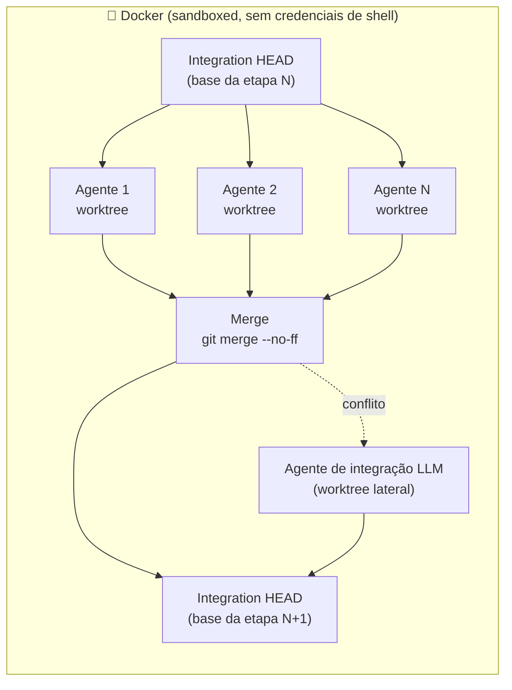
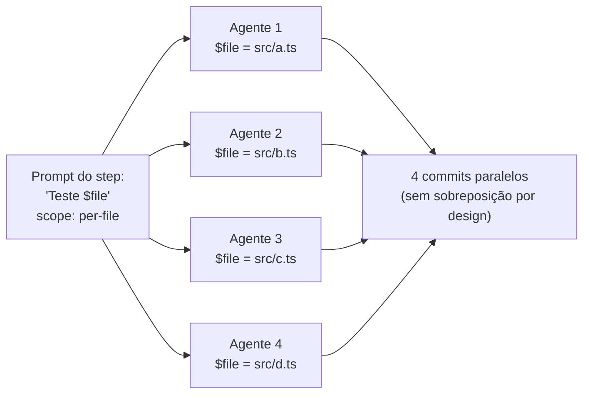
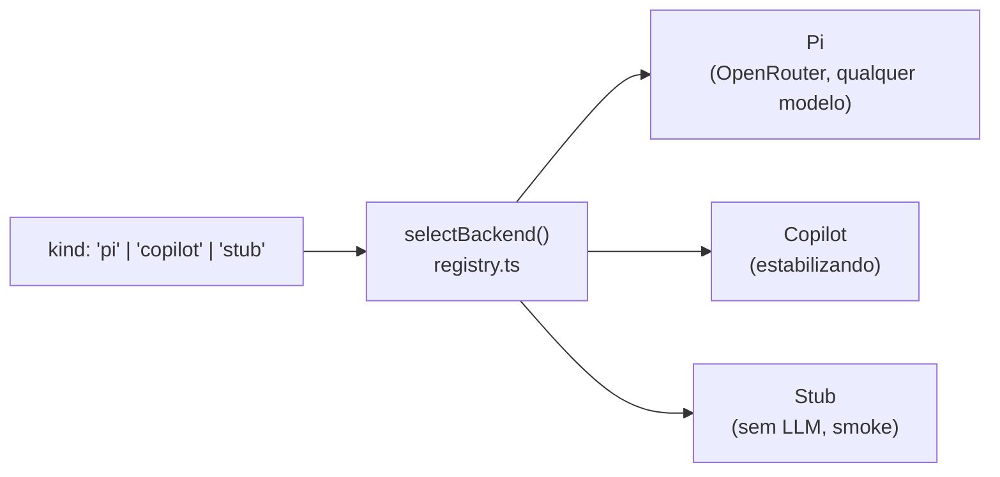

<p align="center">
  
</p>

<p align="center">
  <em>55 minutos do <code>huu</code> gerando 100% de cobertura de testes unitários — acelerados pra 10 segundos.</em>
</p>

<h1 align="center">huu</h1>

<p align="center">
  <strong><code>huu</code> — <em>Humans Underwrite Undertakings</em> (humanos subscrevem empreitadas).</strong>
</p>

<p align="center">
  <a href="MANIFESTO.md">Manifesto</a> · <a href="README.en.md">English</a> · <strong>Português (BR)</strong>
</p>

<p align="center">
  <a href="#licença"></a>
  <a href="CHANGELOG.md"></a>
  
  
  
  <a href="docs/README.md"></a>
</p>

---

## Os quatro primitivos de orquestração

| | Primitivo | O que faz |
|---|---|---|
| 🗺️ | **Map** — fan-out `per-file`/`memory` | o mesmo prompt vira N agentes em paralelo, um por arquivo (`$file` + `$hint`), cada um em seu git worktree |
| 🔀 | **Switch** — check steps | um judge LLM com shell emite um veredito JSON e o cursor segue o outcome (com `default` seguro e `maxRuns`) |
| ◇ | **Parallel + Join** — [`dependsOn`](docs/pipeline-json-guide.md) | ramos heterogêneos rodam juntos em **ondas determinísticas**; o join enxerga todos os merges — mesma pipeline ⇒ mesma sequência de commits, sempre |
| 🧠 | **Memory** — [`produces` → `filesFrom`](docs/memory-scope.pt-BR.md) | uma etapa **descobre** o trabalho e a próxima fan-outa sobre ele — zero seleção humana de arquivos; o contrato de formato é injetado pelo huu |

Compõem livremente: *descoberta → fan-out por memória → ramos paralelos →
join julgado → rework em cascata* — tudo visível no kanban, tudo
reproduzível. Quebrou algo? Todo erro fatal vem com **causa + próximo
passo** ([troubleshooting](docs/troubleshooting.pt-BR.md)).

## O que é o huu

**O huu desenha pipelines que fazem agentes que pensam seguirem um
processo determinístico.** Ele não é uma ferramenta para desenvolver
features novas: o foco é auditoria, geração de testes, extração de
conhecimento e qualquer processo em esteira com previsibilidade real
de valor — onde o método é fixo e o agente entra com a inteligência,
não com o escopo.

**Um pipeline é um arquivo de ordens que a IA obedece.** Você escreve
um `huu-pipeline-v1.json` listando os passos e os arquivos que cada
passo toca. O orchestrator transforma cada passo em um fan-out de
agentes paralelos — um agente por arquivo quando você pede assim —
roda eles em worktrees git isolados, e mescla tudo de volta num único
branch de integração **entre cada etapa**. A execução inteira é
sandboxed em Docker, então o agente nunca vê suas credenciais de shell.

Essa frase tem algumas afirmações que vale destacar:

- **O humano subscreve o escopo.** Nenhum planner LLM decide o que o
  passo 3 deve fazer ou quais arquivos ele deve tocar. Se um passo for
  mal projetado, o resultado vai ser previsivelmente e auditavelmente
  errado — não surpreendentemente errado.
- **Em modo `per-file`, um agente recebe um arquivo.** O prompt é
  idêntico entre os N agentes — só `$file` é substituído. Sem
  degradação de contexto entre agentes, sem drift de escopo. O Pi
  coding agent (backend padrão) roda com `thinking=medium` pra que o
  modelo troque latência por qualidade na sua missão única.
- **Pipelines são portáteis, não presos a um provider.** Um
  `huu-pipeline-v1.json` é um artefato versionado — comite, compartilhe
  como gist, contribua pro cookbook. O know-how de *como decompor essa
  classe de tarefa* mora em JSON puro.

### Etapa → merge → etapa



Cada etapa ramifica N agentes a partir do HEAD de integração, deixa
eles trabalharem em paralelo nos seus próprios worktrees, e mescla
tudo de volta **antes** da próxima etapa começar. O worktree de
integração nunca dá rewind — loops re-executam em cima do HEAD atual,
acumulando commits. Conflitos caem num agente de integração LLM
lateral (pulado no modo `--stub`).

### Scope per-file: um agente, uma missão



Mesmo prompt, `$file` diferente. Agentes leem o worktree inteiro pra
contexto mas são instruídos a escrever só no arquivo atribuído —
escritas disjuntas geram merges limpos. **Aqui está a sacada
revolucionária: seu pipeline é o contrato, e o contrato escala
horizontalmente.**

### Scope memory: o pipeline escolhe os arquivos, não o humano

`per-file` ainda exige que alguém selecione os arquivos. O scope
`memory` remove até isso: uma etapa anterior **escreve um arquivo de
memória** (`huu-memory-v1`) listando os paths — com um `hint` opcional
por arquivo — e a etapa com `scope: "memory"` + `filesFrom` fan-outa
**um agente por entrada**, lendo a lista do worktree de integração na
hora de executar. O `hint` do produtor chega ao prompt do consumidor
via token `$hint`, junto do `$file`.

Scan → fix, recon → estudo, rank → refactor: o passo de descoberta
decide o trabalho e o fan-out obedece, sem nenhum clique de seleção.
Guia completo: [`docs/memory-scope.pt-BR.md`](docs/memory-scope.pt-BR.md).

---

## Showcase: huu Test Suite

`huu Test Suite` é o pipeline default materializado na primeira
execução. Ele demonstra porque misturar scope `project` e `per-file` é
a receita.

| # | Step | Scope | O que faz |
|---|---|---|---|
| 1 | Analisa stack e escreve `huu-tests.md` | `project` | Detecta a linguagem (Node / Python / Go / Rust / Java / .NET), verifica o test runner, escreve o **plano** que todos os passos seguintes obedecem. |
| 2 | Testa 3 arquivos representativos | `project` | Escolhe 3 arquivos diversos de lógica de negócio, escreve testes, corrige falhas, adiciona aprendizados em `huu-tests-faq.json`. |
| 3 | **Testa `$file` (escolhido pelo usuário)** | `per-file` | **N agentes em paralelo, cada um recebe um arquivo.** Cada um segue o `huu-tests.md`, escreve um teste, acumula no FAQ. |
| 4 | Limpeza final + badge de cobertura | `project` | Roda a suíte completa, deleta só os **blocos** com falha (nunca arquivos inteiros), atualiza o badge no README. |

Step 1 escreve um contrato; step 3 faz 30 agentes obedecerem em
paralelo; step 4 valida. **Planeje em `project`, execute em
`per-file`, valide em `project`** — o template pra tudo o mais.

Passo a passo com prompts:
[`docs/onboarding.pt-BR.md#exemplo-passo-a-passo`](docs/onboarding.pt-BR.md#exemplo-passo-a-passo).

---

## Para que o huu serve (e o que ele não é)

O formato **planejar → fan-out → mergear** brilha em processos com
previsibilidade real de valor — onde o método cabe num arquivo e o
resultado é auditável:

- **Auditorias** (cinco defaults empacotados: Security, Quality,
  Docs, Performance, Refactor Plan) — relatório-apenas estrito, nunca
  tocam seus manifests ou source de produção. Cada uma é ancorada em
  metodologia publicada (OWASP Top 10:2025, churn×complexidade,
  Diátaxis, Core Web Vitals, Fowler/Mikado) e **termina com um agente
  juiz** que valida o relatório e devolve pra retrabalho se as contas
  não fecharem.
- **Geração de testes** (`huu Test Suite`, o default) — regras de
  asserção que sobrevivem a mutation testing e regras de determinismo
  anti-flaky embutidas nos prompts.
- **Extração de conhecimento** (`huu Knowledge System`) — totalmente
  autônoma via scope `memory`: o recon escolhe sozinho os arquivos de
  estudo (com um hint por arquivo), o estudo profundo converge em
  `.huu/knowledge/`, dossiês por tópico viram **Agent Skills**
  ([spec](https://agentskills.io/specification)) sob `.agents/skills/`
  com **um agente paralelo por skill**, mais meta-skills de evolução e
  uma superfície de roteamento router-aware (estende seu `catalog.md`
  se já existir) — selada por um **eval cego de roteamento** com loop
  de retrabalho de descriptions.
- **Processos mecânicos em massa.** *Migrar 40 testes Mocha pra
  Vitest:* etapa 1 audita patterns em `MIGRATION.md`, etapa 2 ramifica
  40 agentes (um por arquivo), etapa 3 valida com `npm test`. O prompt
  é idêntico nos 40 — só `$file` muda. Previsível por construção.
- **Seu processo.** Se você consegue escrever o método como uma lista
  ordenada de steps com prompts e um `scope`, você consegue rodar.
  O formato do pipeline é estável; o cookbook é aberto.

**O que o huu NÃO é:** uma ferramenta para desenvolver features novas.
Não existe planner LLM inventando escopo, e "construa o app X" não é
um pipeline — é uma aposta. Quando a tarefa exige decisões abertas de
design a cada passo, use um coding agent interativo; quando o método é
conhecido e o valor está em executá-lo com disciplina sobre N
arquivos, use o huu.

Defaults empacotados:
[`docs/onboarding.pt-BR.md#pipelines-default-empacotados`](docs/onboarding.pt-BR.md#pipelines-default-empacotados).

---

## Backends — qualquer modelo, sua escolha



| Backend | Flag | Modelo de custo | Status |
|---|---|---|---|
| **Pi** (padrão) | `--backend=pi` | Por-token via `OPENROUTER_API_KEY` — **qualquer modelo OpenRouter** | Recomendado |
| GitHub Copilot | `--copilot` | Assinatura via `COPILOT_GITHUB_TOKEN` | Estabilizando |
| Stub | `--stub` | Grátis, sem LLM — smoke tests / demos | Estável |

A factory do Pi habilita `thinking=medium` por padrão pra todo modelo
que suporta — o modelo pode rascunhar, criticar e revisar internamente
antes de emitir uma resposta final. Pra trabalho per-file (um agente,
uma missão), esse é o trade-off certo. Todos os três backends
compartilham o mesmo orchestrator, ciclo de vida de worktree e lógica
de merge.

Adicionar um backend futuro (ACP, Claude Code, …) é uma mudança de
uma pasta + um case no registry sob `src/orchestrator/backends/`.

A fundo: [`docs/onboarding.pt-BR.md#backends-a-fundo`](docs/onboarding.pt-BR.md#backends-a-fundo).

---

## Concorrência dinâmica (memória-aware, padrão)

Por padrão o huu **adapta a concorrência ao headroom real de memória**:
ele mede quanto cada agente consome de verdade (média móvel, semeada em
250 MB) e admite novos agentes só enquanto couberem na memória
disponível menos uma margem de segurança — cgroup-aware, então dentro
de um container ele respeita o limite do container, não o do host.

Uma **guarda de memória fica sempre ativa** (mesmo com concorrência
manual): se a RAM passa de ~95%, o agente **mais novo** — o que tem
menos trabalho feito — é morto, seu card **volta para a coluna TODO**
com um contador `↻N`, e a task recomeça do zero quando a memória
liberar. O trabalho dos agentes mais antigos nunca é perdido.

Controles:

| Onde | Como |
|---|---|
| CLI | `--concurrency=N` pina manual em N · `--no-auto-scale` desliga o modo dinâmico |
| TUI | `+`/`-` ajustam (e pinam manual) · `A` religa o auto-scale |
| Web | controle de concorrência + toggle de auto-scale no header do run |
| Headless | `"concurrency": N` no config pina manual; omita para o modo dinâmico |

---

## Início rápido

### Docker (recomendado)

```bash
git clone https://github.com/frederico-kluser/huu
cd huu
docker build -t huu:local .
export OPENROUTER_API_KEY=sk-or-...
HUU_IMAGE=huu:local huu run example.pipeline.json
```

Imagens pré-buildadas em `ghcr.io/frederico-kluser/huu:latest` — o
wrapper puxa automaticamente quando nenhum `HUU_IMAGE` está setado.
MTU VPN-aware, mount de secrets, forwarding de sinais e limpeza de
órfãos são todos cuidados pelo wrapper.

### Nativo

```bash
npm install -g huu-pipe        # Node 20+ e um `git` funcional
huu --yolo                     # abre a TUI nativa (sem Docker)
```

Execuções nativas expõem suas credenciais de shell pro agente LLM.
Prefira Docker pra qualquer coisa real no seu laptop. (`--no-docker` é
o alias de grafia neutra do `--yolo`, pensado pra runners de CI — veja
abaixo.) Matriz completa de instalação (macOS / Windows / Linux, notas
do OrbStack, caveats do WSL2):
[`docs/onboarding.pt-BR.md#instalação`](docs/onboarding.pt-BR.md#instalação).

---

## Modo headless / um-comando

Pra CI, cron, demos:

```bash
huu auto pipeline.json --config config.json
```

```json
{
  "modelId": "minimax/minimax-m2.7",
  "backend": "pi",
  "files": { "3. Test $file (user-selected)": ["src/index.ts"] },
  "concurrency": 4
}
```

- **stderr** — eventos de progresso em NDJSON (um por mudança de
  estado).
- **stdout** — um objeto JSON final no término (`runId`,
  `integrationBranch`, `totalCost`, …).
- **Exit code** — `0` se `status === 'done'`, `1` caso contrário.

Construa pipes em cima: `huu auto … | jq .runId`. Doc completa:
[`docs/onboarding.pt-BR.md#modo-headless`](docs/onboarding.pt-BR.md#modo-headless).

---

## Rodando no CI (GitHub Actions / GitLab — sem Docker)

Um runner de CI já é um container efêmero: lá o wrapper Docker do huu
não faz sentido (e Docker-in-Docker raramente existe). Combine
`HUU_NO_DOCKER=1` (ou `--no-docker`) com o modo headless e o huu vira
um job de esteira em qualquer runner com **Node.js ≥ 20 e git**:

```yaml
env:
  HUU_NO_DOCKER: '1'
  OPENROUTER_API_KEY: ${{ secrets.OPENROUTER_API_KEY }}
steps:
  - run: npm install -g huu-pipe
  - run: huu auto pipelines/huu-security-audit.pipeline.json --config huu-ci-config.json
  - uses: actions/upload-artifact@v4
    with: { name: huu-audits, path: .huu/audits/** }
```

As auditorias relatório-apenas são o encaixe natural: o job sobe
`.huu/audits/` como artefato e o exit code (`0`/`1`) faz o gate.
Receitas completas (GitHub Actions e GitLab CI, config dinâmico por
`git ls-files`, concorrência em runner pequeno):
[`docs/ci.pt-BR.md`](docs/ci.pt-BR.md).

---

## Schema do pipeline (compacto)

```json
{
  "_format": "huu-pipeline-v1",
  "pipeline": {
    "name": "harden-and-document",
    "maxRetries": 1,
    "steps": [
      {
        "name": "Add JSDoc headers",
        "prompt": "Add a JSDoc header on top of $file with @author huu.",
        "files": ["src/cli.tsx", "src/app.tsx"],
        "scope": "per-file",
        "modelId": "anthropic/claude-sonnet-4-5"
      },
      {
        "name": "Refresh CHANGELOG",
        "prompt": "Update CHANGELOG.md summarizing the work above.",
        "files": [],
        "scope": "project"
      }
    ]
  }
}
```

`scope` controla a decomposição: `project` = uma tarefa pro projeto
inteiro, `per-file` = uma tarefa por arquivo (o sweet spot do
paralelismo), `flexible` = usuário escolhe na hora de editar.

Schema completo (timeouts, retries, steps `check` condicionais,
overrides de modelo, alocação de portas):
[`docs/pipeline-json-guide.md`](docs/pipeline-json-guide.md).

---

## Mais

| Tópico | Onde |
|---|---|
| **Tutorial / primeira execução / autoria** | [`docs/onboarding.pt-BR.md`](docs/onboarding.pt-BR.md) |
| **CI sem Docker (GitHub Actions / GitLab)** | [`docs/ci.pt-BR.md`](docs/ci.pt-BR.md) |
| **Arquitetura & regras de import em camadas** | [`docs/ARCHITECTURE.md`](docs/ARCHITECTURE.md) |
| **Operações (Docker, env vars, FAQ, roadmap)** | [`docs/operations.pt-BR.md`](docs/operations.pt-BR.md) |
| **Modo Web UI (`huu --web`)** | [`docs/WEB-UI.md`](docs/WEB-UI.md) |
| **Schema JSON do pipeline** | [`docs/pipeline-json-guide.md`](docs/pipeline-json-guide.md) |
| **Internals do isolamento de portas** | [`docs/PORT-SHIM.md`](docs/PORT-SHIM.md) |
| **Referência de teclado** | [`docs/KEYBOARD.md`](docs/KEYBOARD.md) |
| **Catálogo de skills de agente** | [`agent-skills.md`](agent-skills.md) |
| **Changelog** | [`CHANGELOG.md`](CHANGELOG.md) |

---

## Licença

`huu` (o runner) é licenciado sob **Apache License 2.0**. Veja
[LICENSE](LICENSE) pro texto completo. Você é livre pra usar,
modificar e redistribuir comercialmente e não-comercialmente, com
atribuição e uma cópia da licença.

**Pipelines não são o runner.** O formato JSON `huu-pipeline-v1` é uma
especificação aberta. Pipelines que você escreve ou pega da
comunidade são *seus* (ou do autor original): eles não estão
amarrados à licença do runner. A convenção do cookbook é MIT ou
CC0 — use no trabalho, em casa, onde quiser.

---

## Autor

**Frederico Guilherme Kluser de Oliveira**
[kluserhuu@gmail.com](mailto:kluserhuu@gmail.com)

`huu` é construído em cima de [`@mariozechner/pi-coding-agent`](https://www.npmjs.com/package/@mariozechner/pi-coding-agent)
— um SDK de coding agent lean e multi-provider do Mario Zechner. O
[post dele sobre o design](https://mariozechner.at/posts/2025-11-30-pi-coding-agent/)
vale a leitura; a sobreposição filosófica não é coincidência.

A integração com GitHub Copilot usa
[`@github/copilot-sdk`](https://www.npmjs.com/package/@github/copilot-sdk)
(declarada como dependência opcional) — fornecendo acesso baseado em
assinatura pra usuários que já têm um plano GitHub Copilot.
