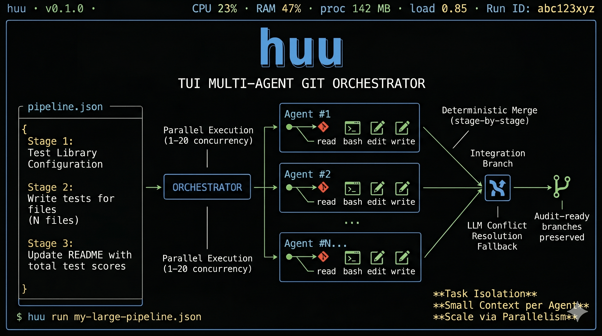

<p align="center">
  
</p>

<h1 align="center">huu</h1>

<p align="center">
  <strong><code>huu</code> — <em>Humans Underwrite Undertakings</em>.</strong>
</p>

<p align="center">
  AI pipelines you leave running overnight. Wake up to work that's done — the way you planned, on a clean integration branch you can audit. Share your pipelines, run others'. <strong>The intelligence lives in the plan, not the AI.</strong>
</p>

<p align="center">
  <strong>English</strong> · <a href="README.pt-BR.md">Português (BR)</a>
</p>

<p align="center">
  <a href="#license"></a>
  
  
  
</p>

---

## Why huu?

- **Run unsupervised, overnight.** Each agent works in its own git worktree with timeouts and retries. The run finishes itself, writes a chronological transcript to `.huu/`, and leaves you `git log` to audit in the morning. You underwrite the scope; the harness handles the execution.
- **Scope is frozen in JSON before kickoff.** No hallucinated scope creep. `huu` doesn't decide what to do — *you* did, when you wrote the pipeline. If a step is misdesigned, the result is predictably and auditably wrong, not surprisingly wrong.
- **Pipelines are portable, not provider-locked.** A `huu-pipeline-v1.json` is a versioned artifact: commit it, share it as a gist, contribute it to the cookbook. The know-how of *how to decompose this class of task* lives in plain JSON — not in someone's chat history with a closed-source provider.

---

## Table of contents

- [What it is](#what-it-is)
- [When to use it](#when-to-use-it) · [When NOT to use it](#when-not-to-use-it)
- [huu vs alternatives](#huu-vs-alternatives)
- [Run with Docker](#run-with-docker)
- [Quick start (native install)](#quick-start-native-install)
- [Pipeline schema](#pipeline-schema)
- [Pipelines as a shared artifact](#pipelines-as-a-shared-artifact)
- [Philosophy](#philosophy)
- [Parallel safety: per-agent port isolation](#parallel-safety-per-agent-port-isolation)
- [Cost predictability](#cost-predictability)
- [Configuration](#configuration)
- [FAQ](#faq)
- [Roadmap](#roadmap)
- [Contributing](#contributing)
- [License](#license)
- [Author](#author)

---

## What it is

`huu` is a single-binary TUI that runs ordered LLM pipelines across an existing git repository. You write *what* has to happen as a list of prompt steps; the orchestrator turns each step into a fan-out of parallel agents, isolates each agent inside its own git worktree, and merges their work back into a single integration branch before moving to the next step.

> 🎬 _A live asciinema of the kanban dashboard belongs here. Until it lands, picture: one card per agent, live token/cost counters, an integration log streaming below, every state transition persisted to `.huu/` for post-mortem._

A concrete example from the field — *migrate 40 Mocha tests to Vitest*:

1. **Stage 1** writes a single `MIGRATION.md` auditing all 40 tests and the patterns to apply.
2. **Stage 2** spawns 40 agents in parallel — each in its own worktree, each touching exactly one file.
3. **Stage 3** runs `npm test`, captures output, and updates `CHANGELOG.md`.

You review 40 independent commits and the merge log. The whole thing is one JSON file you keep in your repo and re-run on the next codebase that needs the same migration.

The boring kind of safety: every agent commits to a disposable branch, branches are merged in a serial ordered pass, and your working tree is never touched. If anything goes sideways, abort the run — your repo is exactly where you left it.

---

## When to use it

The concrete problem `huu` solves is more specific than "general coding tasks": **applying the same class of transformation to N independent files, with per-file auditability.** Canonical cases:

- Writing unit tests for 30 modules.
- Per-file security audit (OWASP), partial reports, consolidation in a final stage.
- High-repetition refactors: typing 80 JS files, migrating 40 Mocha tests to Vitest, adding JSDoc to 50 functions.
- Plan + parallel execution: stage 1 writes a `PLAN.md`, stage 2 applies it across N files.

## When NOT to use it

`huu` is **not** the right tool for:

- Bugs whose root cause is unknown — you need interactive exploration first.
- Architectural refactors that touch cross-cutting shared state.
- Feature work whose scope emerges from exploring the code.
- Monorepos with complex cross-package dependencies.
- Work where you want the system to surprise you with solutions.

For these cases, use Claude Code, Cursor, Aider, or Plandex. `huu` is deliberately the opposite: you know what you want, you know which files to touch, and you want parallelism plus auditability. **If you don't yet know what you want to do, it is too early to use this.**

---

## huu vs alternatives

| Tool family | Approach | Use when |
|---|---|---|
| Claude Code, Cursor, Aider | Chat-driven, exploratory | You don't yet know what to do. |
| Claude Code `/batch` | LLM-driven decomposition with a human approval gate | You want batched tasks but trust an LLM to slice them. |
| Plandex, Devin, OpenHands | LLM-driven decomposition, autonomous execution | You trust the system to decide scope. |
| Conductor, Claude Squad | Parallel workspaces, human merge per branch | You want parallelism with PR-level human review of each task. |
| **huu** | **Human-written plan, parallel execution, native git audit** | **You know the scope exactly and want a reusable, versioned pipeline.** |

The honest difference vs `/batch`: `huu` will not decide that step 3 should also touch a file you didn't list. The pipeline is the contract — the human underwrote it.

---

## Run with Docker

`huu` runs in Docker by default — your shell credentials, `~/.ssh`, and `~/.aws` are never visible to the LLM agent. The recommended path is **build the image from source** (zero registry dependency, full reproducibility):

```bash
git clone https://github.com/frederico-kluser/huu
cd huu
docker build -t huu:local .
HUU_IMAGE=huu:local huu run pipeline.json
# or: docker run --rm -it --user "$(id -u):$(id -g)" \
#       -v "$PWD:$PWD" -w "$PWD" -e OPENROUTER_API_KEY \
#       huu:local run pipeline.json
```

Pre-built images are **published manually by the maintainer** to `ghcr.io/frederico-kluser/huu:<version>` (no automated CI). If a tag is available you can skip the build:

```bash
export OPENROUTER_API_KEY=sk-or-...
huu run example.pipeline.json     # auto-uses ghcr.io/frederico-kluser/huu:latest
```

Behind the scenes the wrapper builds the equivalent of:

```bash
docker run --rm -it \
  --cidfile /tmp/huu-cids/cid-<pid>-<rand>.id \
  --user "$(id -u):$(id -g)" \
  -v "$PWD:$PWD" -w "$PWD" \
  -e OPENROUTER_API_KEY \
  ghcr.io/frederico-kluser/huu:latest run example.pipeline.json
```

**Lifetime is bound to your terminal.** Ctrl+C, closing the terminal (SIGHUP), and `kill` (SIGTERM) all stop the container reliably. The wrapper traps each signal in the host process and issues `docker kill --signal …` against the captured cidfile, which sidesteps the long-standing [moby#28872](https://github.com/moby/moby/issues/28872) where `docker run -it` sometimes drops signals on the way to the container. Inside the container, [tini](https://github.com/krallin/tini) (PID 1) forwards the signal to huu's Node process, the TUI's exit handlers run, and `--rm` removes the container.

If the wrapper itself is killed hard (`kill -9`, OOM), the next `huu` invocation prunes any orphan containers whose recorded parent PID is no longer alive — no manual `docker ps | xargs kill` needed. Use `huu prune --list` to inspect lingering huu containers, `huu prune --dry-run` to preview what cleanup would do, and `huu prune` to force kill them.

**Don't want Docker for a particular run?** `huu --yolo` (or `HUU_NO_DOCKER=1 huu …`) bypasses Docker and runs natively on the host. The flag composes with everything: `huu --yolo` opens the TUI, `huu --yolo run x.json` executes a pipeline, `huu --yolo --stub` runs the stub agent — all without isolation. Native runs require the local `npm install` of huu's deps, and the LLM agent will see your shell credentials (`~/.ssh`, `~/.aws`, etc.) — a one-line warning is printed to stderr each time. The non-TUI subcommands (`huu --help`, `huu init-docker`, `huu status`) always run native regardless — they operate on host filesystem state and a docker pull would be wasted work.

The container runs the entire pipeline (worktrees, agents, merge) and the resulting `huu/<runId>/integration` branch shows up in your repo's `git log` when it finishes — exactly as if you had run `huu` natively.

> **Why mount `$PWD:$PWD` (same path on both sides)?** git stores absolute paths inside `.git/worktrees/<name>/gitdir`. Mounting under a different prefix would leave host-visible worktree pointers that resolve to nowhere when the container exits.

**Prerequisites:**

| OS | Install |
|---|---|
| Linux | `sudo apt install docker.io docker-compose-v2` (or your distro's equivalent — see [docker.com/engine/install](https://docs.docker.com/engine/install/)) |
| macOS | [OrbStack](https://orbstack.dev/) (recommended, ~2× faster bind mounts than Docker Desktop) or [Docker Desktop](https://www.docker.com/products/docker-desktop/) |
| Windows | [WSL2](https://learn.microsoft.com/en-us/windows/wsl/install) + [Docker Desktop](https://www.docker.com/products/docker-desktop/) with WSL integration enabled |

> **Windows users:** clone your repo inside the WSL filesystem (`/home/...`) — not in `/mnt/c/...` — for native performance. Bind mounts that cross the Windows/WSL boundary are 10–20× slower for the many-small-files I/O that `git worktree add` does..

**Compose alternative:**

```bash
# uses the bundled compose.yaml (builds the image on first run)
export OPENROUTER_API_KEY=sk-or-...
docker compose run --rm huu run example.pipeline.json
```

**Convenience wrapper:** drop [`scripts/huu-docker`](scripts/huu-docker) on your `PATH` to abbreviate the above to `huu-docker run pipeline.json`.

**Isolated-volume mode** (max performance on macOS / Windows, full filesystem isolation): tell huu to put worktrees on a named volume instead of inside the bind-mounted repo. Branch operations stay on the repo (so the integration branch still lands in your local `git log`); only the per-agent scratch space goes to the fast volume.

```bash
docker volume create huu-worktrees
docker run --rm -it \
  --user "$(id -u):$(id -g)" \
  -v "$PWD:$PWD" -w "$PWD" \
  -v huu-worktrees:/var/huu-worktrees \
  -e HUU_WORKTREE_BASE=/var/huu-worktrees \
  -e OPENROUTER_API_KEY \
  ghcr.io/frederico-kluser/huu:latest run pipeline.json
```

`HUU_WORKTREE_BASE` accepts an absolute path (used verbatim) or a repo-relative path (resolved against the repo root). When set, `git worktree list` on the host won't show the active per-agent trees during the run — that's the trade-off for the speedup.

**Docker secrets** for `OPENROUTER_API_KEY`. The auto-Docker wrapper handles this for you: it writes the key to a `0600`-mode file under `/dev/shm` (Linux tmpfs — never hits disk; falls back to `os.tmpdir()` elsewhere) and bind-mounts it read-only at `/run/secrets/openrouter_api_key` inside the container. The key value never appears in `docker inspect`, never appears in `ps auxf` (the wrapper passes other env vars via the valueless `-e VAR` form, and `OPENROUTER_API_KEY` is delivered entirely via the file mount), and is unlinked from the host as soon as the wrapper exits. If the wrapper is hard-killed (`kill -9`, OOM), the next invocation prunes leftover secret files in the same sweep that prunes orphan containers.

For Compose-driven setups, the canonical pattern still works:

```yaml
# compose.yaml fragment
services:
  huu:
    secrets:
      - openrouter_api_key
secrets:
  openrouter_api_key:
    file: ./openrouter.key  # or external: true with `docker secret create`
```

The image checks `/run/secrets/openrouter_api_key` before falling back to `OPENROUTER_API_KEY_FILE` and finally the plain env var — same precedence the postgres image uses.

**Image variants:** `huu:latest` (~613MB) ships `openssh-client` for SSH-based git remotes. `huu:slim` (~604MB; build-arg `INCLUDE_SSH=false`) drops it for HTTPS-only setups.

**Bundled pipelines (cookbook):** the official image ships the repo's reference pipelines at `$HUU_COOKBOOK_DIR` (`/opt/huu/cookbook/`). Pull a curated pipeline into your repo without cloning anything:

```bash
docker run --rm ghcr.io/frederico-kluser/huu:latest \
  cat "$HUU_COOKBOOK_DIR/demo-rapida.pipeline.json" \
  > demo-rapida.pipeline.json
```

**Inspect a running pipeline (headless monitoring):** when a container is detached on a long overnight run, `huu status` parses the latest `.huu/debug-*.log` and reports the run's phase + last activity:

```bash
# from inside the container (via compose attach or docker exec)
docker compose -f compose.huu.yaml exec huu huu status

# or against your bind-mounted repo from the host (no container needed)
huu status
huu status --json | jq '.phase'
huu status --liveness && echo healthy   # exit 0 if running, 1 otherwise
```

Sample output:

```
huu status — /home/user/myproject
  log:           .huu/debug-2026-04-28T20-10-15Z.log (4.2 MiB)
  status:        running
  started:       12m 4s ago
  last event:    180ms ago
  last activity: 1.2s ago (orch.spawn_start)
  heartbeat:     180ms ago, lag=8ms
  counters:      stages=2 spawns=12 errors=0
```

Exit codes are pipeline-friendly: `0` for running or finished cleanly, `1` for stalled or crashed, `2` if no run log was found.

The image also wires `huu status --liveness` into a Docker `HEALTHCHECK` directive. The TUI launcher writes `/tmp/huu/active` with the active run's repo path; the probe sources that path and asks `huu status` whether the run is broken. An idle container (no active run, e.g. paused at the welcome screen) is reported healthy. Stalled or crashed runs flip the container's status to `unhealthy`, which orchestrators (Compose `restart`, Swarm, Kubernetes shims) can act on.

**Scaffold Docker into your own repo:** from any project where you want huu under Docker, run:

```bash
docker run --rm --user "$(id -u):$(id -g)" \
  -v "$PWD:$PWD" -w "$PWD" \
  ghcr.io/frederico-kluser/huu:latest \
  init-docker --with-wrapper --with-devcontainer
```

That writes `compose.huu.yaml`, `scripts/huu-docker`, and `.devcontainer/devcontainer.json` into your repo, all preconfigured to pull the published image. Subsequent runs are just `docker compose -f compose.huu.yaml run --rm huu run pipeline.json`.

For multi-mode setups (host-bind, isolated-volume, dev-container) and detailed performance/security guidance, see [`docker-roadmap.md`](docker-roadmap.md).

---

## Quick start (native install)

```bash
# 1. Install (Node 20+ and a working `git`)
npm install -g huu-pipe

# 2. Try the flow without spending tokens (stub agent, no LLM)
huu --stub

# 3. Run a real pipeline
export OPENROUTER_API_KEY=sk-or-...
huu run example.pipeline.json
```

`example.pipeline.json` (which ships with the repo) does exactly this:

```json
{
  "_format": "huu-pipeline-v1",
  "pipeline": {
    "name": "exemplo-padronizar-headers",
    "steps": [
      {
        "name": "Padronizar headers",
        "prompt": "Adicione um cabecalho JSDoc no topo de $file com @author huu.",
        "files": ["src/cli.tsx", "src/app.tsx"]
      },
      {
        "name": "Gerar CHANGELOG",
        "prompt": "Crie ou atualize o arquivo CHANGELOG.md ...",
        "files": []
      }
    ]
  }
}
```

> The bundled examples are written in Portuguese (the author's native language). The pipeline format is language-agnostic — write your prompts in any language the model understands.

What you'll see on a real run:

1. The model picker (catalog from OpenRouter, with your recents pinned to the top).
2. A live kanban with one card per agent — phase, tokens, cost, current file.
3. After all stages finish: a summary screen, plus per-agent transcripts under `.huu/<runId>-execution-...log`.
4. On disk: a new branch `huu/<runId>/integration` with the merged work, plus per-agent branches preserved for `git log` audits.

Bundled pipelines:

| File | What it does |
|---|---|
| `example.pipeline.json` (pt-BR) | Adds JSDoc headers and writes a CHANGELOG entry. |
| `pipelines/demo-rapida.pipeline.json` (pt-BR) | Sets up tests, writes one test per file, runs three audits (security, quality, performance). |
| `pipelines/testes-seguranca.pipeline.json` (pt-BR) | Security-focused regression suite. |
| `pipelines/refinamento-interativo.pipeline.json` (pt-BR) | Demo of `interactive: true`: a refinement chat (Kimi K2.6) shapes the first stage's prompt, then a second per-file stage applies the result. |

---

## Pipeline schema

Pipelines are persisted as `huu-pipeline-v1` JSON. The full shape:

```json
{
  "_format": "huu-pipeline-v1",
  "exportedAt": "2026-04-28T00:00:00.000Z",
  "pipeline": {
    "name": "harden-and-document",
    "cardTimeoutMs": 600000,
    "singleFileCardTimeoutMs": 300000,
    "maxRetries": 1,
    "steps": [
      {
        "name": "Add JSDoc headers",
        "prompt": "Add a JSDoc header on top of $file with @author huu.",
        "files": ["src/cli.tsx", "src/app.tsx"],
        "scope": "per-file",
        "modelId": "anthropic/claude-sonnet-4-5"
      },
      {
        "name": "Refresh the CHANGELOG",
        "prompt": "Update CHANGELOG.md with a new entry summarizing the work above.",
        "files": [],
        "scope": "project"
      }
    ]
  }
}
```

| Field | Type | Notes |
|---|---|---|
| `pipeline.name` | string | Used as a header in the TUI and run logs. |
| `steps[].name` | string | Step display name. |
| `steps[].prompt` | string | Accepts the `$file` placeholder when `files` is non-empty. |
| `steps[].files` | string[] | Repo-relative paths. Empty array runs a single whole-project task. |
| `steps[].scope` | `"project" \| "per-file" \| "flexible"`? | How the step decomposes into agents. `project` = one whole-project task (Files locked). `per-file` = one task per selected file (Files mandatory). `flexible` = user picks at edit time (legacy behavior). Omitted = `flexible`. |
| `steps[].modelId` | string? | Per-step model override; defaults to the run-level pick. Mix a strong reasoning model for planning with a cheaper one for mechanical edits. |
| `steps[].interactive` | boolean? | When `true`, the orchestrator pauses before this stage and opens a multi-turn refinement chat (LangChain.js + OpenRouter). The chat's synthesized output replaces `prompt` for this run only — the saved JSON is never mutated. Use it for steps where you want to iterate on the prompt with the model before fanning out into agents. |
| `steps[].refinementModel` | string? | Model used by the refinement chat. Defaults to `moonshotai/kimi-k2.6` when `interactive` is `true`. Ignored when `interactive` is unset/false. |
| `cardTimeoutMs` | number? | Per-card timeout for whole-project / multi-file cards. Default `600000` (10 min). |
| `singleFileCardTimeoutMs` | number? | Per-card timeout for single-file cards. Default `300000` (5 min). |
| `maxRetries` | number? | Retries per card on timeout/failure, in fresh worktrees off the current integration HEAD. Default `1`. |

> Timeouts apply **per card**, not to the run as a whole. Single-file work has very different latency from whole-project work, hence the two knobs.

The pipeline editor (`N` to create a step, `T` for timeouts, `M` for model picker) handles all of the above without leaving the TUI. Full keyboard reference: [`docs/KEYBOARD.md`](docs/KEYBOARD.md).

---

## Pipelines as a shared artifact

A pipeline is a reusable artifact. A `security-tests.pipeline.json` that works on one Node repo works on another. The know-how of "how to decompose this class of task" is captured in JSON — not in the head of whoever ran an interactive agent that afternoon.

That asymmetry is the whole tease:

- **Authoring a pipeline is the work.** It takes thought to slice a task into independent units, choose models per stage, and define what `done` looks like.
- **Running someone else's good pipeline is cheap.** Clone the JSON, point it at your repo, run it.

The intent is a community cookbook of pipelines: published as plain JSON in a public repo, typically under MIT or CC0, freely usable at work or at home. The runner is open-source (Apache 2.0); pipelines you author are *yours*. Drop them in a gist, in your repo, in a `huu/cookbook` PR — the human underwrote them, the format makes them portable.

> 🚧 The `huu/cookbook` registry is on the roadmap — until then, share pipelines via gists or your own repos, and the format is stable enough that they'll keep working.

---

## Philosophy

**The name is the product.** `huu` stands for **Humans Underwrite Undertakings**:

- **Humans** — the pipeline is written by a person, not generated by an LLM planner.
- **Underwrite** — in the financial sense: the human signs off, takes responsibility for, and guarantees the scope. The system does not get to negotiate it.
- **Undertakings** — discrete, well-scoped pieces of work, each with a clear outcome.

`huu` is *not an autonomous agent*. It is a harness that executes a plan you wrote. The intelligence lives in the pipeline — not in the system. If the pipeline is poorly designed, the result will be predictably and auditably bad. This is a feature.

Three premises:

1. The pipeline author owns the scope of every step.
2. Well-designed steps isolate edits per file, eliminating conflicts by design.
3. Predictability and auditability beat sophistication.

If you want an agent that *decides* what to do, use Devin, Plandex, or Claude Code. If you want a system that executes *exactly* what you underwrote, in parallel, with a native git audit trail, this is the product.

### Why we don't use MCP

MCP became a de-facto standard in 2026 and is an obvious temptation. We refuse the integration for a concrete economic reason: every tool definition is re-sent on every turn of every agent.

Concretely: a single MCP server (e.g., GitHub MCP) injects ~55k tokens of tool definitions per turn. With 10 parallel agents, that's **~550k tokens of overhead per turn**, before the first edit. For a product whose proposition is *cheap, auditable parallelism*, MCP inverts the trade-off.

The supported use cases (tests, audits, refactors) need to read files, run shell commands, and edit files. Pi SDK's default tools (read/bash/edit/write) cover all of that with no overhead. Integrations with Jira, Linear, or Slack are deliberately out of scope — `huu` is a code-transformation product, not a general-purpose productivity agent.

### Conflict resolution as a fallback

When the operator's decomposition accidentally puts overlapping work in the same stage, an integration agent backed by a real LLM spins up on a side worktree to resolve and commit. Pipelines that follow the "one file per task" rule never hit this path. Treat it as a safety net, not a feature you should rely on. Conflict resolution is disabled in `--stub` mode.

---

## Parallel safety: per-agent port isolation

`git worktree` isolates the **filesystem**. It does not isolate the **host network**: when ten agents simultaneously launch `npm run dev` (or `vite`, `next dev`, `pytest --serve`, an embedded Postgres, …) they all hit `bind(3000)` on the same kernel. Nine fail with `EADDRINUSE`, and the agents — correctly believing the customer code is fine — burn tokens "fixing" a non-bug.

`huu` defends in four layers, none of which require Docker:

1. **`PortAllocator`** assigns each agent a contiguous window of TCP ports (default `55100 + (agentId − 1) × 10`). Before committing, it probes each port with `net.createServer({ exclusive: true })` and slides the window forward if anything in the host (a long-running Postgres, an IDE language server, …) already owns part of the range.
2. **`.env.huu` per worktree** — a dedicated env file (never `.env` or `.env.local`, which are yours to control) exporting `PORT`, `HUU_PORT_HTTP`, `HUU_PORT_DB`, `HUU_PORT_WS`, `DATABASE_URL`, and seven extras. Frameworks that respect dotenv (Next, Vite, Nest, Astro, dotenv-flow, …) load it automatically when run from the worktree.
3. **Native `bind()` interceptor.** A ~150-line C shared library at [`native/port-shim/port-shim.c`](native/port-shim/port-shim.c). On the first run, the orchestrator compiles it with `cc` into `.huu-cache/native-shim/<os>-<arch>/huu-port-shim.{so,dylib}` and preloads it via `LD_PRELOAD` (Linux) or `DYLD_INSERT_LIBRARIES` (macOS). The shim reads `HUU_PORT_REMAP` (e.g. `3000:55110,5432:55111,*:55110`) and rewrites the port at the syscall boundary. **The customer code is never modified** — `app.listen(3000)` literal in source still ships exactly as written; the kernel just sees a per-agent port instead. (In the official Docker image the runtime has no `cc`; the builder pre-compiles the `.so` and `HUU_NATIVE_SHIM_PATH` skips compile-on-demand. See [PORT-SHIM.md §6.4](PORT-SHIM.md).)
4. **System prompt** — the agent is shown its allocated ports and reminded to prefix non-dotenv-aware commands with the `./.huu-bin/with-ports <command>` shell wrapper, which sources `.env.huu` and `exec`s the underlying binary so `LD_PRELOAD` survives across `bash -c` boundaries.

### What this covers — and what it doesn't

The interceptor only works for code that goes through the dynamic libc loader. Anything that bypasses libc — fully-static binaries, sandboxed runtimes — is invisible to `LD_PRELOAD` by design. The honest matrix:

| Scenario | Covered? |
|---|---|
| **Node / JS / TS** (Express, Next, Vite, Nest, Astro, Fastify, Hono) reading `process.env.PORT` | ✅ via dotenv |
| **Hardcoded `app.listen(3000)`** in any dynamically-linked language | ✅ via `bind()` interceptor |
| **Python** (CPython 3, Django, FastAPI, Flask, `python -m http.server`) | ✅ via interceptor |
| **Ruby** (MRI), **PHP**, **Perl**, **Lua** | ✅ via interceptor |
| **Go** built with cgo (default on most Linux distros) | ✅ via interceptor |
| **Rust** linking against system libc (the default `gnu` triple) | ✅ via interceptor |
| **JVM** processes (java, kotlin, scala) on Linux/macOS | ✅ via interceptor |
| **Statically-linked Go** (`CGO_ENABLED=0`) — common for distroless/scratch images | ❌ libc is bypassed entirely |
| **Rust** on `musl` static targets (Alpine, distroless) | ❌ libc is bypassed entirely |
| **Windows hosts** | ❌ no `LD_PRELOAD` equivalent; falls back to env-only mode |
| **Hosts without a C compiler** (`cc` missing from `PATH`) | ❌ shim won't build; falls back to env-only mode (warned in run log). The official Docker image sidesteps this by shipping a prebuilt `.so` — see PORT-SHIM.md §6.4. Custom derivative images that strip the prebuilt without installing `cc` lose layer 3. |
| **macOS** with SIP-protected binaries (system `/usr/bin/python3`) | ❌ DYLD vars are stripped; use a user-installed runtime |

For ❌ rows, the env-only path still applies — frameworks that respect `PORT` keep working, but hardcoded ports in those binaries will collide and one of the agents will lose. If your pipeline targets a stack from the ❌ rows, prefer steps that don't require a network bind, or run such steps with `concurrency = 1` until a network-namespace path lands on the roadmap.

### Disabling

Add `"portAllocation": { "enabled": false }` to the pipeline. Without it, agents share host ports and concurrent dev servers will collide. Disable it for pipelines that never bind a socket (pure refactors, static analysis, doc generation) — it's cheap, but free is cheaper.

---

## Cost predictability

A `huu` run's cost is bounded by the number of cards and the model chosen per stage. There is no agent loop that can decide to "also do X" — you get the run you paid for.

**Today's tools to keep cost in check:**

- `--stub` runs the entire flow without any LLM. Use it to validate pipeline structure and decomposition before spending a dollar.
- Per-step `modelId` lets you route mechanical stages to Haiku/Gemini Flash and reserve Sonnet/Opus for stages that actually need it.
- Tokens and cost are recorded per agent and surfaced in the run summary; full breakdown in `.huu/<runId>-execution-...log`.

**Roadmap:** `huu estimate <pipeline.json>` will dry-run the decomposition and produce a forecast like:

```
5 stages × 12 tasks × Sonnet 4.5: estimated $3.40, ~14 min wallclock.
```

Until that lands, the convention is: stub-validate first, then run with eyes on the kanban during the first stage to catch surprises early.

---

## Configuration

**Environment variables**

| Variable | Required | Purpose |
|---|---|---|
| `OPENROUTER_API_KEY` | yes (without `--stub`) | Sent to OpenRouter through the Pi SDK. If missing, the TUI prompts on first real run and persists nothing. |
| `OPENROUTER_API_KEY_FILE` | no | Path to a file containing the key. Wins over `OPENROUTER_API_KEY` when both are set; the canonical Docker-secret mount at `/run/secrets/openrouter_api_key` wins over both. |
| `HUU_WORKTREE_BASE` | no | Override the base directory for per-run worktrees. Absolute paths are used verbatim; relative paths are resolved against the repo root. Default: `<repo>/.huu-worktrees`. Used by the isolated-volume container mode. |
| `HUU_CHECK_PUSH` | no | When set, preflight verifies the configured remote is reachable before the run starts. |
| `HUU_IN_CONTAINER` | no | Set to `1` automatically by the official Docker image. Used by the wrapper to short-circuit the auto-Docker re-exec (so the same binary runs the TUI directly inside the container). |
| `HUU_IMAGE` | no | Override the container image used by the auto-Docker wrapper. Default: `ghcr.io/frederico-kluser/huu:latest`. Useful for pinning a release (e.g. `ghcr.io/frederico-kluser/huu:0.2.0`) or pointing at a private mirror. |
| `HUU_NO_DOCKER` | no | When set to `1` or `true`, skip the auto-Docker re-exec and run huu natively. Requires the local `npm install` of huu's deps. Mainly useful for huu development itself. |
| `HUU_DOCKER_PASS_ENV` | no | Whitespace-separated list of additional env var names to forward into the container. The wrapper always forwards `OPENROUTER_API_KEY`, `OPENROUTER_API_KEY_FILE`, `HUU_CHECK_PUSH`, `HUU_WORKTREE_BASE`, and `TERM` — use this to add custom names. |
| `HUU_UID` | no | Container UID for `docker compose` runs. Default: `1000` (matches the standard primary user on Debian/Ubuntu hosts and the `node` user in the base image). Override with `HUU_UID=$(id -u)` if your host UID isn't 1000, or use the `scripts/huu-compose` wrapper which sets it automatically. |
| `HUU_GID` | no | Container GID for `docker compose` runs. Same defaulting rules as `HUU_UID`. |

**Files written by the tool**

| Path | Scope | Purpose |
|---|---|---|
| `~/.huu/recents.json` | global | Recently-used models for the picker. |
| `<repo>/.huu-worktrees/<runId>/` | repo | One subdirectory per agent during a run; removed at the end (manifest preserved). |
| `<repo>/.huu/<stamp>-execution-<runId>.log` | repo | Full chronological transcript of a run. |
| `<repo>/.huu/<stamp>-execution-<runId>/agent-<id>.log` | repo | Per-agent transcript. |
| `<repo>/.huu/debug-<ISO>.log` | repo | NDJSON debug trace, one line per lifecycle event. |
| `<repo>/.huu-cache/native-shim/<os>-<arch>/` | repo | Compiled `bind()` interceptor (see [port isolation](#parallel-safety-per-agent-port-isolation)). Built once, reused across runs. |
| `<worktree>/.env.huu` | per-agent | Per-agent port assignments; auto-loaded by dotenv-aware tools. |
| `<worktree>/.huu-bin/with-ports` | per-agent | Shell wrapper that sources `.env.huu` and `exec`s a command — needed for binaries that ignore dotenv. |

When running under Docker (host-bind mode, the default), all of these paths are visible on the host filesystem after the container exits — same as a native run.

`huu` adds `.huu-worktrees/`, `.huu/`, `.huu-cache/`, `.env.huu`, and `.huu-bin/` to the repo's `.gitignore` automatically on the first run.

**Recommended models**

`recommended-models.json` ships a curated short-list shown at the top of the model picker. Edit to taste; `id` must match an OpenRouter model identifier.

**Architecture, design decisions, and layered import rules:** see [`docs/ARCHITECTURE.md`](docs/ARCHITECTURE.md). Skill-level guidance for contributors lives under `.agents/skills/`.

**Keyboard reference:** see [`docs/KEYBOARD.md`](docs/KEYBOARD.md).

---

## FAQ

**Can I run this unsupervised, overnight?**
Yes — it's the primary use case. Each agent has timeouts and retries; the run terminates itself with a persisted summary. Read `.huu/<runId>-execution-*.log` in the morning. To get notified on completion, wire the CLI exit code into a notifier (ntfy, webhook, Slack incoming-webhook, your habit of choice).

**Will the run touch my checked-out branch?**
No. Every agent works in its own worktree branched off your current HEAD. Your working tree is never modified during a run.

**Do I need to commit before running?**
Yes. Preflight refuses to start on a dirty working tree. Stash or commit first.

**What happens if an agent crashes mid-run?**
The orchestrator marks the card as failed, drops its worktree, and (depending on `maxRetries`) re-spawns the task in a fresh worktree on the same integration HEAD. If retries are exhausted, the run continues without that card and the failure is preserved in the summary.

**What if two agents touch the same file?**
This is a sign the pipeline was misdesigned: in a healthy pipeline, each task in a stage owns a disjoint file. If overlap happens anyway and git can't auto-merge, an integration agent backed by a real LLM resolves the conflict on a side worktree and continues. Conflict resolution is disabled in `--stub` mode. Treat this path as a safety net, not a feature.

**Can I abort a run safely?**
Yes. `Q` triggers a cooperative abort: in-flight agents finish their current step, branches with commits are kept as artifacts, the integration worktree is cleaned up. Press `Q` again to force-exit the dashboard.

**How much will I spend?**
Depends on pipeline shape and model. A 30-file pipeline on Sonnet 4.5 typically lands between $1 and $10. Use `--stub` to validate structure first; route mechanical stages to cheaper models via per-step `modelId`. The run summary breaks cost down per agent.

**Why two timeout values?**
Single-file cards usually finish faster than whole-project cards by an order of magnitude. Splitting the timeout means tight feedback on per-file work without prematurely killing a broader card that's still making progress.

**Where do I put my OpenRouter key?**
Either export `OPENROUTER_API_KEY` before launching, or paste it in the prompt the first time you start a run without it. The tool itself never persists the key.

**Why is the Docker container slower on macOS?**
Bind-mounted filesystems on macOS cross a VM boundary, adding ~3× latency for many-small-files operations like `git worktree add`. Use [OrbStack](https://orbstack.dev/) instead of Docker Desktop for ~2× faster file I/O on the same workload. For the maximum-performance path, see the dev-container mode in [`docker-roadmap.md`](docker-roadmap.md) — it clones the repo into a named volume and gets full native Linux speed.

**Can I run huu on Windows without WSL2?**
Not practically. Docker Desktop on Windows requires either WSL2 or Hyper-V, and bind-mounted Windows paths (`/mnt/c/...`) are 10–20× slower than ext4 inside WSL — enough to make `git worktree add` for a real pipeline take minutes per task. Install WSL2, clone your repo into `/home/<user>/` inside WSL, and use Docker Desktop with WSL integration enabled..

**Why does Ctrl+C in the container sometimes leave my terminal wedged?**
It shouldn't — the image runs `tini` as PID 1 to forward signals, and `huu`'s CLI installs a belt-and-suspenders raw-mode restorer for `SIGINT`/`SIGTERM`/`SIGHUP`/`uncaughtException`. If you ever see a stuck terminal, run `stty sane` to recover and please open an issue with the contents of `.huu/debug-<ISO>.log` from that run.

**Files in `.huu-worktrees/` are owned by root and I can't delete them.**
You're on a host where your primary user isn't UID 1000 (rare on Linux desktops, common on macOS or shared servers). The compose default assumes UID 1000; if yours differs, the container runs as 1000 and writes files the host user can't touch. Either:

1. Use the wrapper: `scripts/huu-compose run pipeline.json` — auto-detects your UID via `id(1)` and exports `HUU_UID`/`HUU_GID` before invoking compose.
2. Export once per shell: `export HUU_UID=$(id -u) HUU_GID=$(id -g)` and then use `docker compose run` normally.

---

## Roadmap

- `huu estimate <pipeline.json>` — dry-run cost and wallclock forecast.
- `huu lint <pipeline.json>` — detect overlapping `files` across stages, missing `$file` placeholders, undefined model IDs.
- `huu/cookbook` — community pipeline registry, with each entry tagged by domain (testing, audits, refactors, docs).
- GitHub Action wrapper — run a `huu` pipeline as part of CI on a labeled PR.
- JSON Schema + LSP for `huu-pipeline-v1.json` — autocomplete and validation in editors.

---

## Contributing

`huu` is open-source under [Apache 2.0](LICENSE). Issues and pull requests are welcome.

Ground rules:

- Read the relevant skill under `.agents/skills/` before changing a layer you're not familiar with.
- Prefer **Conventional Commits** (`feat:`, `fix:`, `refactor:`, `docs:`, ...).
- Never force-push to `main`.
- CI runs `npm run typecheck && npm test` on every PR. Run them locally before opening one.

```bash
npm run dev          # hot-reload TUI on src/cli.tsx
npm run build        # tsc → dist/
npm run typecheck    # tsc --noEmit
npm test             # vitest (orchestrator, run logger, file scanner, pipeline e2e)
```

---

## License

`huu` (the runner) is licensed under the **Apache License 2.0**. See [LICENSE](LICENSE) for the full text. You're free to use, modify, and redistribute it commercially and non-commercially, with attribution and a copy of the license.

**Pipelines are not the runner.** The `huu-pipeline-v1` JSON format is an open specification. Pipelines you author or pick up from the community are *yours* (or the original author's): they are not encumbered by the runner's license. The cookbook convention is MIT or CC0 — use them at work, at home, anywhere.

---

## Author

**Frederico Guilherme Kluser de Oliveira**
[kluserhuu@gmail.com](mailto:kluserhuu@gmail.com)

`huu` builds on [`@mariozechner/pi-coding-agent`](https://www.npmjs.com/package/@mariozechner/pi-coding-agent) — a lean, multi-provider coding-agent SDK by Mario Zechner. His [post on the design](https://mariozechner.at/posts/2025-11-30-pi-coding-agent/) is worth a read; the philosophical overlap is not coincidental.
