# ROADMAP — `huu`

> **Status:** vivo · **Última revisão:** 2026-04-29 · **Mantenedor:** Frederico Kluser
> **Escopo deste documento:** plano de portagem feature-por-feature de ideias do
> [Bernstein](https://github.com/chernistry/bernstein) (orquestrador Python ~v1.9.1)
> para o `huu` (orquestrador TypeScript/Ink), preservando a filosofia *humans
> underwrite undertakings*. Cada item aparece como nó num DAG com dependências
> explícitas, esforço estimado, schema/UX impactos, e critérios de aceite.
>
> **Este documento é estratégia, não compromisso.** Datas/efforts são
> ordem-de-grandeza para *um* dev sênior conhecedor da base. Multiplique por
> 1.5–2× para devs novos. Iremos abrir issues separadas para cada feature
> antes de começar a executá-la — o roadmap define a forma, não substitui
> design docs específicos.

---

## Sumário

1. [Sumário Executivo](#sumário-executivo)
2. [Como Ler Este Documento](#como-ler-este-documento)
3. [Estado Atual (`huu` v0.3.0)](#estado-atual-huu-v030)
4. [Princípios Inamovíveis e Não-Objetivos](#princípios-inamovíveis-e-não-objetivos)
5. [DAG de Dependências (Visão Geral)](#dag-de-dependências-visão-geral)
6. [Tier 0 — Foundational Layer (2 semanas)](#tier-0--foundational-layer-2-semanas)
7. [Tier 1 — Sprint de 4 Semanas (Máximo ROI)](#tier-1--sprint-de-4-semanas-máximo-roi)
8. [Tier 2 — Profissionalização (3 meses)](#tier-2--profissionalização-3-meses)
9. [Tier 3 — Plataforma (12 meses)](#tier-3--plataforma-12-meses)
10. [Não Vamos Construir (Filosofia)](#não-vamos-construir-filosofia)
11. [Cross-Cutting Concerns](#cross-cutting-concerns)
12. [Riscos e Hipóteses Não Validadas](#riscos-e-hipóteses-não-validadas)
13. [Apêndice A — Mapeamento Bernstein → `huu`](#apêndice-a--mapeamento-bernstein--huu)
14. [Apêndice B — Ordem de Merge Sugerida (PR-by-PR)](#apêndice-b--ordem-de-merge-sugerida-pr-by-pr)
15. [Apêndice C — Métricas de Sucesso por Tier](#apêndice-c--métricas-de-sucesso-por-tier)

---

## Sumário Executivo

O `huu` é hoje um orquestrador de pipelines paralelos com fundação sólida:
worktrees git, port allocation, Docker re-exec, refinement chat (`interactive: true`),
cost tracking por agente. O Bernstein adicionou ~62 mil linhas de Python para
cobrir um conjunto adjacente de problemas: gates determinísticos, audit
HMAC, MCP server, skill packs, dashboard, integrações GitHub.

**Tese deste roadmap:** roubar 4–5 ideias de altíssimo ROI do Bernstein em
4 semanas (F1–F4), profissionalizar em 3 meses (F5–F14), e construir uma
plataforma compartilhável em 12 meses (F23+). **Recusar** explicitamente
4 grandes apostas filosóficas do Bernstein que conflitam com *humans
underwrite* (autonomia LLM no scheduling, multi-adapter, cloud control plane,
self-evolution).

**Ordem de prioridade absoluta:**

1. **F0** (foundation) — refatorar schema da pipeline para `zod`, criar event bus,
   catálogo de preços. Sem isso, F1–F4 viram bagunça.
2. **F1–F4** (sprint de 4 semanas) — janitor, dry-run, MCP server, audit HMAC.
3. **F8 + F22 + F21 + F12** (3-mês cedo) — JSON Schema, init-wizard, doctor, hooks.
4. Demais features de Tier 2 conforme demanda real (não construir em
   antecipação a um usuário hipotético).

---

## Como Ler Este Documento

Cada feature segue o mesmo template:

```
### F{n} · Nome curto

**Status quo (`huu` hoje):** o que já existe e onde.
**Inspiração Bernstein:** referência exata (file:line).
**Por que isso importa para nós:** valor concreto.
**Design proposto:** módulos novos, schema delta, UX.
**Schema delta:** mudanças em `huu-pipeline-v1.json`.
**Dependências (DAG):** lista de IDs que precisam estar prontos antes.
**Esforço:** dias-dev sênior (cap min/max).
**Critérios de aceite:** o que precisa ser verdade pra "merged".
**Risco principal:** o que mais provavelmente vai dar errado.
**Decisão de incluir:** sim/talvez/não — e por quê.
```

Convenções:

- **`huu` file:line** = caminho relativo ao repo root deste worktree.
- **bernstein file:line** = caminho relativo a `/home/ondokai/Projects/bernstein`.
- **DAG edges**: "depende de" significa que a feature dependente *não pode mergear* antes da pré-condição.
- **Esforço** ignora documentação (que é cross-cutting, ver §11).

---

## Estado Atual (`huu` v0.3.0)

Verificado por inspeção direta da árvore em 2026-04-29.

### Já implementado

| Capacidade | Onde | Notas |
|---|---|---|
| Orquestrador com pool configurável (1–20 agentes) | `src/orchestrator/index.ts:42` | Polling 500ms; `withTimeout()` wrapper |
| Per-card timeouts + retries em fresh worktrees | `src/orchestrator/index.ts:70` | `cardTimeoutMs`, `singleFileCardTimeoutMs`, `maxRetries` |
| Per-agent port isolation | `src/orchestrator/port-allocator.ts:34`, `native/port-shim/port-shim.c` | Diferenciador único vs Bernstein |
| Git worktree management + merge determinístico | `src/git/worktree-manager.ts`, `src/git/integration-merge.ts` | Branch namer determinístico |
| Conflict resolution LLM-based (opcional) | `src/orchestrator/integration-agent.ts:44` | Fallback para merge determinístico |
| Refinement chat multi-turno | `src/lib/refinement-prompts.ts`, step `interactive: true` | Substitui `prompt` para o run; JSON salvo não muda |
| Cost tracking por agente | `src/lib/types.ts:163`, real-agent.ts | Tokens IN/OUT/cache + USD |
| NDJSON debug log | `src/lib/debug-logger.ts:52` | `.huu/debug-<ISO>.log` |
| Run log chronológico + per-agent split | `src/lib/run-logger.ts:61` | Best-effort split por agente |
| Docker re-exec auto + secret mount + HEALTHCHECK | `src/lib/docker-reexec.ts`, `Dockerfile`, `compose.yaml` | `HUU_IN_CONTAINER`, `HUU_NO_DOCKER` |
| Stub agent (zero-LLM) | flag `--stub` | Validação estrutural sem custo |
| Subcomandos não-TUI: `init-docker`, `status`, `prune` | `src/cli.tsx:189–199` | Operam em filesystem state, não fazem docker pull |
| Pipeline com per-step `modelId` + `scope` | `src/lib/types.ts:22–43` | Mistura modelos por estágio |

### Não implementado (alvos do roadmap)

| Faltante | Bernstein equivalente |
|---|---|
| MCP server mode | `src/bernstein/mcp/server.py` |
| Quality gates determinísticos | `src/bernstein/core/quality/` |
| HMAC audit log | `src/bernstein/core/security/audit.py` |
| `huu run --dry-run` cost forecast | `bernstein run --dry-run` + `bernstein cost --estimate` |
| `huu doctor` | `bernstein doctor` |
| Skill packs (progressive disclosure) | `src/bernstein/core/skills/`, `templates/skills/` |
| `huu pr` | `src/bernstein/cli/commands/pr_cmd.py` |
| `huu from-ticket` | `src/bernstein/github_app/mapper.py` |
| Web dashboard | `src/bernstein/cli/dashboard*.py` (Textual TUI) |
| Prometheus / OTel | `src/bernstein/core/telemetry.py` (parcial) |
| Lifecycle hooks (pluggy) | `src/bernstein/core/hook_protocol.py` |
| `huu autofix` daemon | `src/bernstein/core/autofix/daemon.py` |
| `huu fingerprint` | `src/bernstein/cli/commands/fingerprint_cmd.py` |
| JSON Schema + LSP | parcialmente em `src/bernstein/core/planning/plan_schema.py` |
| Cookbook registry | listado como roadmap em ambos |

---

## Princípios Inamovíveis e Não-Objetivos

Antes de portar qualquer coisa: estes princípios são **gates de design**,
não slogans. Toda PR que viole um deles deve ser fechada com prejuízo.

### 5 princípios que não negociamos

1. **Humans underwrite undertakings.** Toda execução fan-out é precedida por
   um plano JSON que um humano viu e (explícita ou implicitamente) aprovou.
   AI-assisted draft é OK; auto-execução de goal sem aprovação não é.
2. **Cost prevísivel ≫ sofisticação.** Se uma feature pode aumentar o custo
   de tokens em ≥10% sem o usuário escolher explicitamente, ela é candidata
   a default-off. Bandit completo (F6) cai por isso.
3. **JSON portátil.** A pipeline é o artefato compartilhável. Não inventar
   superset proprietário; toda nova feature precisa caber no schema versionado.
4. **Single binary local-first.** Cada nova dependência precisa justificar seu
   peso (tamanho de imagem Docker, cold start). Cloudflare Workers, Modal,
   Kubernetes — não.
5. **Anti-cliente MCP, pró-server MCP.** Consumir tools MCP custa tokens em
   cada turno × cada agente paralelo (~55k tokens × N — inviável). Expor-se
   *como* server MCP custa zero pro `huu` e abre distribuição massiva.

### 7 não-objetivos (não vamos construir, com motivo)

| Item | Motivo |
|---|---|
| Modo `-g goal` totalmente autônomo | Conflita com humans underwrite. AI-assisted draft + approval gate cobre o caso. |
| `internal_llm_provider` swappable (Gemini/Qwen/Ollama/Codex) | Diluiria o casamento deliberado com Pi/OpenRouter. Manutenção combinatória. |
| Cloudflare Workers / cloud control plane | Vendor lock-in; o `huu` é local-first por design. |
| 31 adapters multi-CLI agent | Cada adapter é manutenção contínua devida a APIs voláteis. |
| `--evolve` self-modifying | Self-modifying systems têm classe de bug intratável. |
| Migração para Python | Não deveria ser uma discussão. |
| MCP cliente (consumir servers MCP) | Custo de tokens × paralelismo destruiria a economia. |

---

## DAG de Dependências (Visão Geral)

```mermaid
graph TD
    %% Tier 0 - Foundation
    F0_1[F0.1 zod schema]
    F0_2[F0.2 OpenRouter price catalog]
    F0_3[F0.3 history.json]
    F0_4[F0.4 event bus]

    %% Tier 1
    F1[F1 Janitor / Quality Gates]
    F2[F2 dry-run + cost forecast]
    F3[F3 MCP server mode]
    F4[F4 HMAC audit log]

    %% Tier 2
    F8[F8 JSON Schema + LSP]
    F22[F22 init-wizard]
    F21[F21 doctor]
    F12[F12 Lifecycle hooks]
    F9[F9 huu pr]
    F5[F5 Skill packs]
    F11[F11 from-ticket]
    F13[F13 Web dashboard]
    F14[F14 Prometheus / OTel]
    F7[F7 Token budget + circuit breaker]
    F6L[F6-lite History advisor]
    FQ[Quick mode draft]

    %% Tier 3
    F23[F23 cookbook registry]
    F10[F10 autofix daemon]
    F20[F20 fingerprint]
    F25[F25 Sandbox abstraction]
    F26[F26 record / replay]
    F16[F16 ACP bridge]
    F19[F19 chaos]

    %% Edges Tier0 -> Tier1
    F0_1 --> F1
    F0_1 --> F2
    F0_1 --> F3
    F0_2 --> F2
    F0_4 --> F4
    F0_4 --> F1

    %% Edges Tier1 -> Tier2
    F0_1 --> F8
    F1 --> F22
    F0_1 --> F21
    F0_4 --> F12
    F1 --> F9
    F2 --> F9
    F4 --> F9
    F0_1 --> F5
    F3 --> F5
    F0_1 --> F11
    F4 --> F13
    F1 --> F13
    F12 --> F14
    F0_3 --> F6L
    F1 --> F6L
    F7 --> F6L
    F0_1 --> F7
    F12 --> F7

    %% Edges Tier2 -> Tier3
    F8 --> F23
    F5 --> F23
    F11 --> F23
    F1 --> F10
    F2 --> F10
    F9 --> F10
    F12 --> F10
    F4 --> F26
    F3 --> F16
    F12 --> F19

    %% Foundation cluster
    classDef tier0 fill:#1f3a5f,stroke:#5b8dbf,color:#fff
    classDef tier1 fill:#2d5016,stroke:#7cb342,color:#fff
    classDef tier2 fill:#5d4037,stroke:#a1887f,color:#fff
    classDef tier3 fill:#311b92,stroke:#7e57c2,color:#fff

    class F0_1,F0_2,F0_3,F0_4 tier0
    class F1,F2,F3,F4 tier1
    class F8,F22,F21,F12,F9,F5,F11,F13,F14,F7,F6L,FQ tier2
    class F23,F10,F20,F25,F26,F16,F19 tier3
```



**Como ler:** uma seta `A → B` significa "B não pode mergear antes de A
estar em main". Ausência de seta = ordem livre.

**Pontos críticos do grafo:**

- **F0.1 (zod schema)** é o gargalo de quase tudo. Sem ele, F1/F2/F3/F8 viram
  duplicação de validação ad-hoc. Build-loose, fail-loose.
- **F4 (HMAC audit)** desbloqueia F13 (dashboard tem que mostrar audit
  trail) e F26 (replay precisa do log canônico).
- **F12 (hooks)** é multiplicador: F14 (telemetry), F19 (chaos), F10
  (autofix) ficam triviais quando o orquestrador emite eventos via hook bus.
- **F23 (cookbook)** é o ponto mais alto: precisa de schema (F8) +
  skill packs (F5) + import (F11). É o "huu como plataforma".

---

## Tier 0 — Foundational Layer (2 semanas)

Estes itens **não são features visíveis** ao usuário, mas pagam dívida
técnica que vai bloquear toda a Tier 1 se ignorada. Faça primeiro.

### F0.1 · Pipeline Schema canônico (zod) como única fonte de verdade

**Status quo (`huu` hoje):** schema vive em `src/lib/types.ts:22–78` como
TypeScript interfaces puros. Validação de pipelines carregadas vive em
`src/lib/pipeline-io.ts` como checagens manuais ad-hoc. JSON Schema
para editores externos: não existe.

**Inspiração Bernstein:** `src/bernstein/core/planning/plan_schema.py` usa
JSON Schema draft 2020-12 como única fonte. Loader, validator, e IDE
autocomplete consomem o mesmo arquivo.

**Por que isso importa para nós:** F1 precisa adicionar `qualityGates` ao
step. F3 precisa expor um tool MCP que valida pipelines submetidos
externamente. F8 precisa publicar JSON Schema. Sem fonte única, vamos
manter 4 representações divergentes do mesmo schema — e as divergências
vão virar bugs em produção.

**Design proposto:**

- Adicionar dependência `zod` (~50KB minified, peso aceitável).
- Reescrever `src/lib/types.ts` como zod schemas; tipos TS são derivados via
  `z.infer`.
- `pipelineSchema.parse(json)` substitui validação manual de
  `pipeline-io.ts`.
- Util `pipelineSchema → JSON Schema` via `zod-to-json-schema` (publicado
  em F8).
- Versionar como `huu-pipeline-v1` literal — quando rompermos, será
  `v2` e teremos migrator explícito.

**Schema delta:** zero novos campos para o usuário; refactoring puro.

**Dependências (DAG):** nenhuma.

**Esforço:** 3–4 dias.

**Critérios de aceite:**
- [ ] `pipelineSchema.parse()` rejeita pipelines hoje aceitas com erro
      diagnóstico (= bugs descobertos? consertar antes de mergear).
- [ ] Todos os testes existentes (`pipeline-io.test.ts` etc) passam.
- [ ] `npm run typecheck` zero diff em consumidores upstream.
- [ ] Mensagens de erro citam path no JSON (`pipeline.steps[3].files: expected array`).

**Risco principal:** zod tem breaking changes históricos entre majors. Pinar
versão exata; revisar antes de upgrade.

**Decisão de incluir:** **sim, obrigatório**. Sem isso, Tier 1 vira pesadelo.

---

### F0.2 · Catálogo de preços OpenRouter (com cache)

**Status quo (`huu` hoje):** sem catálogo de preços. Cost por agente é
calculada *post-hoc* a partir do que a Pi SDK retorna em `usage.cost`.

**Inspiração Bernstein:** `src/bernstein/core/cost/` calcula cost por
modelo com tabela embutida + override por config.

**Por que isso importa para nós:** F2 (`huu run --dry-run`) precisa estimar
custo *antes* de qualquer chamada LLM. Sem catálogo de preços, "estimativa"
fica reduzida a "peça pro usuário inserir o preço" — UX fraca.

**Design proposto:**

- Novo módulo `src/lib/price-catalog.ts`:
  - `fetchOpenRouterPrices(): Promise<PriceTable>` baixa de
    `https://openrouter.ai/api/v1/models` (público, sem auth).
  - Cache em `~/.huu/prices.json` com TTL 24h.
  - Fallback embutido: lista hard-coded com preços conhecidos (Sonnet 4.6,
    Haiku 4.5, Opus 4.7, Kimi K2.6, Gemini Flash) — atualizada manualmente
    em cada release.
- Comando interno: `huu prices refresh` (não documentar no `--help`
  principal, é troubleshooting).
- Utilitário: `estimateCost(modelId, tokensIn, tokensOut): { usd, ci95 }`.

**Schema delta:** zero.

**Dependências (DAG):** nenhuma; pode rodar em paralelo com F0.1.

**Esforço:** 2 dias.

**Critérios de aceite:**
- [ ] Funciona offline (fallback hard-coded).
- [ ] Cache hit em <10ms.
- [ ] Testes mockam a HTTP fetch; nenhum teste real bate em OpenRouter.
- [ ] CLI `huu prices --json` para debugging.

**Risco principal:** OpenRouter pode mudar API ou desativar o endpoint.
Fallback embutido protege contra isso.

**Decisão de incluir:** **sim**. F2 sem isso é F2 ruim.

---

### F0.3 · Histórico empírico (`.huu/history.json`)

**Status quo (`huu` hoje):** cada run escreve seu próprio log; não há
agregação cross-run. Não conseguimos responder "o step X já falhou
12/20 vezes com Gemini Flash".

**Inspiração Bernstein:** `src/bernstein/core/routing/bandit_state.json`
persiste recompensas por `(model, task_type)` para alimentar bandit. Aqui
queremos só o histórico, sem bandit (F6 está banido).

**Por que isso importa para nós:** F6-lite (advisor), F2 (estimativa
empírica refina prior), F1 (gate failure rates). Todos consomem mesmo
histórico.

**Design proposto:**

- Schema `HistoryEntry`: `{ runId, ts, stepName, modelId, files, success, cost, durationMs, gateFailures? }`.
- `src/lib/history.ts`:
  - `appendHistory(entry)` — chamada do orchestrator no completion de cada agente.
  - `queryHistory(filter): HistoryEntry[]`.
  - File: `<repo>/.huu/history.jsonl` (NDJSON, append-only, rotação por
    tamanho 10MB → `.huu/history.jsonl.1.gz`).

**Schema delta:** zero (não é parte da pipeline; é state interno).

**Dependências (DAG):** nenhuma.

**Esforço:** 1–2 dias.

**Critérios de aceite:**
- [ ] Append concurrent-safe (multiple agents escrevendo simultaneamente).
- [ ] Rotação automática.
- [ ] `query()` lê em <100ms para 10k entries.

**Risco principal:** acabar sobrescrito num crash. Usar `O_APPEND` flag.

**Decisão de incluir:** **sim**, baixo custo, alto desbloqueio.

---

### F0.4 · Event bus interno (`OrchestratorEventBus`)

**Status quo (`huu` hoje):** orchestrator emite estado via callback
direto pra UI. Telemetry, audit log, hooks externos seriam acoplamento
1:1 hoje.

**Inspiração Bernstein:** `src/bernstein/core/hook_protocol.py` usa
`pluggy`. Mesmo padrão de "subscribers reagem a eventos do core" sem o
core saber quem está ouvindo.

**Por que isso importa para nós:** F1 (gate runner ouve eventos
`agent_finished` para rodar gates), F4 (audit log ouve *tudo*),
F12 (hooks são wrappers expostos do bus), F14 (telemetry consome bus).

**Design proposto:**

- Novo módulo `src/orchestrator/event-bus.ts`:
  - Tipos: `OrchEvent` (discriminated union) com variantes
    `run_started`, `agent_spawned`, `agent_phase_changed`,
    `agent_finished`, `stage_completed`, `gate_started`, `gate_finished`,
    `run_finished`.
  - `EventBus.subscribe(handler)` retorna `unsubscribe()`.
  - Síncrono (handlers podem retornar `Promise` que o bus aguarda em série
    para `pre_*` hooks; `post_*` hooks são fire-and-forget).
- Refatorar `src/orchestrator/index.ts` para emitir via bus *em vez de* só
  callback de UI.
- UI vira primeiro subscriber.

**Schema delta:** zero.

**Dependências (DAG):** nenhuma; benefícioso fazer junto com F0.1.

**Esforço:** 3 dias (incluindo migração do callback existente).

**Critérios de aceite:**
- [ ] Zero regressão em comportamento de UI.
- [ ] Cobertura: cada evento testado em isolamento.
- [ ] Subscriber lento bloqueia bus em modo `pre_*` mas não em `post_*`.
- [ ] Erros em handlers post-* são logados, nunca mata o orquestrador.

**Risco principal:** ordem de eventos mal-definida → race conditions sutis.
Documentar invariantes na API: `agent_finished` sempre depois de
`agent_phase_changed → done`.

**Decisão de incluir:** **sim**, fundação para 4 features Tier 2.

---

## Tier 1 — Sprint de 4 Semanas (Máximo ROI)

Quatro features. Em ordem: **F2 → F1 → F4 → F3** (cada uma é independente
após Tier 0; mas F2 é a mais barata e mais visível pra usuário, então é
nosso "first ship" de PR).

Esforço total: ~12–18 dias-dev + buffer = ~4 semanas calendário.

---

### F2 · `huu run --dry-run` + Cost Forecast

**Status quo (`huu` hoje):** `--stub` valida estrutura sem LLM, mas não
estima custo. Roadmap (`README.md:566`) lista `huu estimate` como TODO.

**Inspiração Bernstein:** `bernstein run --dry-run plan.yaml` (verificado
em `src/bernstein/cli/commands/run.py`) + `bernstein cost --estimate`.
Output:
```
5 stages × 12 tasks × Sonnet 4.5: estimated $3.40, ~14 min wallclock.
```

**Por que isso importa para nós:** "Vai me custar $25 ou $1.50?" é a
pergunta que paralisa adoção em pipelines paralelos. Resolver ela
**desbloqueia adoção**, mais que qualquer outra feature.

**Design proposto:**

Funde `huu run --dry-run` e `huu estimate` (eram dois itens no roadmap
do README; um único subcomando + flag basta).

- Novo flag em `huu run`: `--dry-run` (preserva atual `--stub`; ortogonal).
- `--dry-run` faz:
  1. Carrega pipeline e valida via F0.1 schema.
  2. Resolve `modelId` por step (com fallback para AppConfig.modelId).
  3. Para cada step, calcula `tasksCount` (1 se whole-project, len(files) se
     per-file).
  4. Estima tokens por task: `inputBaseline + len(prompt) + sum(file_size)
     + 2 × outputTokensMaxTypical(modelId)`. Usar histórico empírico de
     F0.3 quando disponível para refinar prior.
  5. Multiplica por price catalog (F0.2).
  6. Calcula wall-clock: `ceil(tasksCount / concurrency) × stepDurationP50`.
  7. Renderiza tabela:
     ```
     Plan: 50 tasks across 3 stages
     Estimated cost:    $1.45  (± $0.30, 95% CI)
     Estimated wall:     8 min  (concurrency=8)
     Per model:
       sonnet     $1.20  50 tasks
       haiku      $0.25  50 tasks (review)
     Cache opportunities: 22 % of input may hit prompt cache
     ```
- TUI mostra mesma tabela em ecrã pré-execução; usuário pode `[a]ccept`
  ou `[c]ancel`.

**Schema delta:** zero novos campos; consome existing modelId/files.

**Dependências (DAG):** F0.1 (schema), F0.2 (price catalog). F0.3 é nice-to-have
mas não bloqueante.

**Esforço:** 3 dias.

**Critérios de aceite:**
- [ ] `huu run --dry-run example.pipeline.json` completa em <1s.
- [ ] Variação real vs estimativa em primeiras 10 runs registradas: erro
      mediano <30%.
- [ ] Modelos sem preço conhecido emitem warning, não erro fatal.
- [ ] Output JSON disponível (`--json`) para pipelining (`huu run
      --dry-run x.json --json | jq '.totalCost'`).

**Risco principal:** estimativa muito errada cria falsa confiança. Mitigação:
sempre exibir intervalo de confiança e a fonte (catalog vs história).

**Decisão de incluir:** **sim, prioridade #1**. Maior ROI absoluto do roadmap.

---

### F1 · Janitor Determinístico (Quality Gates)

**Status quo (`huu` hoje):** verificação pós-merge é opcional via integration
agent LLM (`src/orchestrator/integration-agent.ts:44`), que é caro e flaky.
Sem gates lint/types/tests determinísticos.

**Inspiração Bernstein:** `src/bernstein/core/quality/quality_gates.py`
+ `gate_runner.py`. Gates determinísticos: lint (ruff), types (pyright),
tests (pytest), PII (regex). Cross-model review é o único gate LLM.
Falha de gate → retry/escalate.

**Por que isso importa para nós:**

1. **Mata custo do integration agent LLM.** Hoje conflitos disparam um
   agente LLM em side worktree. Gates determinísticos cobrem ~80% do
   trabalho de "este diff é OK?" sem custo de tokens.
2. **Aumenta confiabilidade.** `tsc` é determinístico. LLM-as-judge não.
3. **Caracteriza o "humans underwrite".** Humano define os gates no plano;
   sistema executa. Quem define o que é "done" é a pessoa, não o modelo.

**Design proposto:**

- Novo módulo `src/janitor/`:
  - `src/janitor/gates/` — uma classe por gate (`LintGate`, `TypecheckGate`,
    `TestGate`, `PIIGate`).
  - `src/janitor/runner.ts` — orquestra gates em ordem, agrega resultado.
  - `GateResult`: `{ name, passed, durationMs, output, exitCode }`.
- Gates default por linguagem detectada:
  - **Node/TS** (default huu): `npm run lint`, `npm run typecheck`,
    `npm run test:affected`.
  - **Python**: `ruff check`, `pyright`, `pytest -q`.
  - Outros: usuário declara.
- Execução: depois do merge para integration branch (não por agente).
  Falha → marca run como "merged-with-gate-failures"; usuário decide se
  segue ou volta. **Não rolling-back automático no MVP.**
- `--strict` flag: gate failure → run failure; sem flag, é warning.
- PII gate: regex para `(?:[\w.+-]+@[\w-]+\.[\w.-]+|sk-[A-Za-z0-9]{20,}|ghp_[A-Za-z0-9]{36}|...)` em diffs. Pode usar npm `pii-detector`; se peso for issue, escrever inline 30 linhas.

**Schema delta (`huu-pipeline-v1`):**

```json
"qualityGates": {
  "lint":  { "command": "npm run lint",       "required": true },
  "types": { "command": "npm run typecheck",  "required": true },
  "tests": { "command": "npm run test:affected", "required": false },
  "pii":   { "enabled": true, "patterns": ["custom-regex"] },
  "custom": [{ "name": "license-check", "command": "./scripts/license.sh", "required": true }]
},
"qualityGatesMode": "warn" | "strict"
```

Default: ausente significa "huu doctor sugere defaults na primeira run".

**Dependências (DAG):** F0.1 (schema), F0.4 (event bus para emitir
gate_started/gate_finished events). F22 (init-wizard) reusa detectores de
linguagem deste módulo, mas pode mergear depois.

**Esforço:** 4–5 dias.

**Critérios de aceite:**
- [ ] Gate runner roda lint/types/tests em pipeline real e reporta resultado
      em <5s além do tempo dos commands.
- [ ] Falha em gate aparece na TUI em vermelho, com link clicável (path
      do log).
- [ ] PII gate detecta API keys de teste no diff.
- [ ] Gate timeout configurável; default 5min.
- [ ] Modo strict + falha = exit code != 0.

**Risco principal:**

1. **Comandos demoram.** `npm test` em projeto grande é minutos. Mitigação:
   `test:affected` (vitest tem isso nativo); fallback para gate opcional
   `required: false`.
2. **Detecção errada de stack** (Python vs Node). Mitigação: F22 wizard
   permite ao usuário sobrescrever.

**Decisão de incluir:** **sim, prioridade #2**. Substitui parcialmente
o integration agent LLM (mantém esse como fallback opcional).

---

### F4 · HMAC-Chained Audit Log

**Status quo (`huu` hoje):** debug log NDJSON (`.huu/debug-<ISO>.log`) e
run log chronológico. Nenhum dos dois é tamper-evident; um atacante
com write access pode editar entradas sem deteção.

**Inspiração Bernstein:** `src/bernstein/core/security/audit.py:1–150`.
Cadeia HMAC-SHA256 sobre eventos JSON; chave em `$XDG_STATE_HOME/bernstein/audit.key`
(0600); genesis `"0" * 64`. Verifier separado em
`src/bernstein/core/security/audit_integrity.py`.

**Por que isso importa para nós:**

- **Compliance / regulated industries:** finance, health, gov. Bernstein
  vende isso. `huu` pode vender também — *com gate humano explícito*.
- **Forensics:** "o agente realmente fez exatamente isso?" — replay
  bit-identical.
- **Diferenciador legítimo:** Bernstein faz, mas com filosofia "let the
  LLM decide". `huu` faz com "humano assinou o plano + audit trail
  HMAC". Combo que não existe.

**Design proposto:**

- Novo módulo `src/audit/`:
  - `src/audit/hmac-chain.ts` — pure functions: `appendEvent(prevHmac, event, key) → newHmac`,
    `verifyChain(events, key) → boolean | { brokenAt }`.
  - `src/audit/audit-log.ts` — wrapper subscriber do event bus (F0.4).
- Layout em disco:
  - `<repo>/.huu/audit/<runId>.jsonl` — eventos (NDJSON).
  - `<repo>/.huu/audit/<runId>.hmac` — corrente paralela, mesma quantidade
    de linhas.
  - `~/.huu/audit.key` — secret de 32 bytes random; chmod 0600 (validar
    em startup; refusar se permissões frouxas).
  - Override: `HUU_AUDIT_KEY_PATH=...`.
- Eventos auditados (todos do bus):
  - `run_started` { runId, baseBranch, baseCommit, planHash }
  - `agent_spawned` { runId, agentId, modelId, files, worktree }
  - `agent_finished` { runId, agentId, exitCode, commitSha, tokensIn, tokensOut, costUsd, durationMs }
  - `gate_finished` { runId, gateName, passed, exitCode }
  - `run_finished` { runId, status, totalCostUsd, integrationCommit }
- Subcomandos:
  - `huu audit verify <runId>` — recomputa cadeia, compara, retorna 0/1.
  - `huu audit export <runId> [--out tarball.tgz]` — empacota log + hmac
    + plan.json para enviar a auditor externo.
  - `huu audit list` — runs com status verify.

**Schema delta:** zero (audit é state interno; não vai pra `pipeline.json`).

**Dependências (DAG):** F0.4 (event bus).

**Esforço:** 2–3 dias.

**Critérios de aceite:**
- [ ] Adulterar 1 byte no `.jsonl` faz `huu audit verify` retornar `failed at line N`.
- [ ] Perda da chave torna o log inverificável (documentar isso prominentemente).
- [ ] Cadeia HMAC nunca cresce sem bound; arquivo cresce ~150 bytes/evento (estimar 10k eventos = 1.5MB).
- [ ] Verify de 10k eventos em <500ms.
- [ ] Subcomando `huu audit export` produz tarball assinado com manifesto.

**Risco principal:**

1. **Chave perdida = log inverificável.** Documentar; não tentar derivar
   da senha do user. Backup é responsabilidade do user.
2. **Performance write-amplification.** Cada evento = 2 writes (log + hmac).
   Aceitar; HMAC é commodity.

**Decisão de incluir:** **sim, prioridade #4**. Baixo custo, diferenciador
real para regulated.

---

### F3 · MCP Server Mode

**Status quo (`huu` hoje):** zero MCP. README explicitamente recusa MCP
*cliente*: "every tool definition is re-sent on every turn of every
agent" (`README.md:402–408`). Recusa correta.

**Inspiração Bernstein:** `src/bernstein/mcp/server.py:74–200`. Tools
expostas via FastMCP: `bernstein_run`, `bernstein_status`, `bernstein_tasks`,
`bernstein_cost`, `bernstein_stop`, `bernstein_approve`, `bernstein_health`,
`load_skill`. Transports: stdio + SSE.

**Por que isso importa para nós (paradoxo MCP):**

1. **Custo é assimétrico.** Server MCP custa zero ao `huu`. Quem paga é o
   cliente que invoca. Filosofia preservada.
2. **Distribuição massiva quase de graça.** Cursor, Claude Desktop, Zed,
   Continue, Gemini CLI todos consomem MCP. 1 click "Run pipeline X"
   dentro do Claude Desktop dispara `huu` no projeto local.
3. **Diferenciador contra Bernstein.** Bernstein server expõe "decida
   você"; `huu` server expõe "humano aprova antes de executar". Empresas
   regulated preferem.

**Design proposto:**

- Adicionar dependência `@modelcontextprotocol/sdk` (TypeScript oficial).
- Novo subcomando: `huu mcp serve [--stdio | --http :3001]`.
  - `--stdio` é o default (usado por Claude Desktop, Cursor).
  - `--http` para uso remoto / debugging; **bind padrão em `127.0.0.1`**;
    `--bind 0.0.0.0` exige `--auth-token` (Bearer).
- Tools expostas (verbos do domínio do `huu`, **nunca** shell exec
  arbitrário):

| Tool | Args | Returns | Gate humano |
|---|---|---|---|
| `huu_run_pipeline` | `pipeline: object \| pipelinePath: string`, `dryRun?: bool`, `autoApprove?: bool` | `{ runId, status }` | Default exige TUI confirm; `autoApprove=true` requer secret env `HUU_MCP_AUTOAPPROVE=1` (audit log marca run como auto-approved) |
| `huu_list_runs` | `limit?: number` | `Run[]` | nenhum (read-only) |
| `huu_run_status` | `runId: string` | `RunStatus` | nenhum |
| `huu_cookbook_list` | — | `PipelineMetadata[]` | nenhum (depende de F23) |
| `huu_cookbook_get` | `name: string` | `Pipeline JSON` | nenhum |
| `huu_pipeline_validate` | `json: object` | `{ valid: bool, errors: [] }` | nenhum (depende de F0.1) |
| `huu_estimate` | `pipeline: object \| path: string` | `CostForecast` | nenhum (depende de F2) |
| `huu_audit_verify` | `runId: string` | `{ valid: bool, brokenAt? }` | nenhum (depende de F4) |

- **Política de aprovação:** Default = exige `--auto-approve` na CLI ou
  env explícita. Tool MCP `huu_run_pipeline` retorna `{ runId, status:
  "awaiting_approval", approvalUrl: "huu-cli://approve/<runId>" }` se não
  for auto-aprovado; usuário roda `huu approve <runId>` num terminal.
- Registry públicos: registrar em [Glama](https://glama.ai/mcp/servers)
  (Bernstein já está lá), MCP Registry, `awesome-mcp` lists.
- `init-docker` ganha `--with-mcp` para gerar `claude_desktop_config.json`
  fragment pronto.

**Schema delta:** zero na pipeline; novo arquivo `~/.huu/mcp-config.json`
para servidor (auth token, allowed origins).

**Dependências (DAG):** F0.1 (validação tools), F2 (`huu_estimate` tool),
F4 (`huu_audit_verify` tool). F2 e F4 podem mergar depois — tools são
adicionados incrementalmente.

**Esforço:** 5–7 dias.

**Critérios de aceite:**
- [ ] `huu mcp serve --stdio` discoverable por Claude Desktop com config provided.
- [ ] Chamada `huu_run_pipeline` sem `autoApprove` retorna `awaiting_approval`.
- [ ] Auth token obrigatório em `--bind 0.0.0.0`.
- [ ] Cobertura de teste: cada tool com handler + erro path.
- [ ] Listado em pelo menos 1 registry público (Glama).

**Risco principal:**

1. **Misuse de auto-approve.** Mitigação: env explícita + audit log marca
   `auto_approved: true`; verify shows red flag.
2. **MCP cliente futuro pode consumir o próprio huu server e criar loop.**
   Mitigação: tool `huu_run_pipeline` rejeita pipelines que recursivamente
   referenciam o próprio server (heuristic-based).

**Decisão de incluir:** **sim, prioridade #3**. Distribuição é tudo em 2026.

---

## Tier 2 — Profissionalização (3 meses)

12 features pequenas-médias depois do Sprint. Ordem é flexível;
priorizar por demanda real (issue counts).

---

### F8 · JSON Schema + LSP

**Status quo (`huu` hoje):** README documenta schema em prosa; sem JSON
Schema publicado; sem autocomplete em editores.

**Inspiração Bernstein:** `src/bernstein/core/planning/plan_schema.py` é
JSON Schema draft 2020-12. Bernstein não publica oficialmente em
SchemaStore; oportunidade.

**Design proposto:**

- Export de F0.1 zod via `zod-to-json-schema`.
- Publicar em `https://huu.dev/schema/v1.json` (assumindo domínio
  futuro) ou GitHub raw permanente
  `https://raw.githubusercontent.com/frederico-kluser/huu/main/schema/v1.json`.
- Submeter PR em [SchemaStore.org](https://www.schemastore.org/) para
  pattern `*.huu-pipeline.json` ou `huu-pipeline-v*.json`.
- LSP simples (TypeScript) reusando zod-to-json-schema + vscode-langservers
  base. Hover docs derivados dos `.describe()` no zod.
- Extensão VS Code futura é nice-to-have, não MVP — basta SchemaStore +
  $schema URL.

**Schema delta:** adicionar campo opcional `"$schema": "https://huu.dev/schema/v1.json"`
nos arquivos exportados pela TUI.

**Dependências (DAG):** F0.1.

**Esforço:** 5–8 dias (LSP é o trabalho longo; SchemaStore é 1 dia).

**Critérios de aceite:**
- [ ] VS Code com `$schema` no JSON: autocomplete + hover + diagnostics.
- [ ] Schema disponível por URL pública e versionada.
- [ ] PR em SchemaStore aceito.

**Risco principal:** SchemaStore PRs demoram. Aceitável.

**Decisão de incluir:** **sim**, mas LSP custom pode ser deferido se
SchemaStore + `$schema` cobrir o caso.

---

### F22 · `huu init-wizard`

**Status quo (`huu` hoje):** sem wizard. `huu init-docker` existe (gera
compose.yaml etc.) mas não toca pipeline.

**Inspiração Bernstein:** `bernstein init-wizard` detecta stack do projeto
e gera bernstein.yaml + plan template.

**Design proposto:**

- Novo subcomando `huu init` (sem hyphen, distinct de `init-docker`).
- Detectar:
  - Lê `package.json` → infere `lint`, `test`, `typecheck` scripts.
  - Lê presence de `tsconfig.json` → enable types gate.
  - Lê `requirements.txt` ou `pyproject.toml` → suggest Python gates.
- Gera:
  - `.huu/config.json` com defaults para `qualityGates`, `concurrency`.
  - `pipelines/example.huu-pipeline.json` template baseado na stack.
  - `.gitignore` patches (já feitos automaticamente pelo huu, mas wizard
    deixa explícito).
- TUI interativo (Ink) com `[Y/n]` confirms.

**Schema delta:** zero na pipeline; gera `.huu/config.json` que é stash
de defaults locais (precedência: pipeline > .huu/config > built-in).

**Dependências (DAG):** F0.1 (gera schema válido), F1 (sabe quais gates
existem).

**Esforço:** 3–4 dias.

**Critérios de aceite:**
- [ ] `huu init` em projeto Node detecta scripts e gera template
      funcional.
- [ ] Em projeto vazio, gera template documentado em comentários JSON.
- [ ] Re-run não destrói config existente sem `--force`.

**Risco principal:** detecção heurística pode errar. Sempre permitir
`[e]dit manually` no wizard.

**Decisão de incluir:** **sim**, baixo custo, alto onboarding.

---

### F21 · `huu doctor`

**Status quo (`huu` hoje):** sem doctor. `huu status` existe mas
inspeciona run, não ambiente.

**Inspiração Bernstein:** `bernstein doctor` em
`src/bernstein/cli/commands/doctor_cmd.py` (presumido — não verificado
diretamente, mas listado como subcomando).

**Design proposto:**

Verifica e reporta:
- Node version ≥ 18.
- Docker running (se não `--yolo`).
- `git --version` ≥ 2.20 (worktree support razoável).
- `OPENROUTER_API_KEY` set ou `OPENROUTER_API_KEY_FILE` válido.
- Disco livre em `<repo>/.huu-worktrees/`: ≥ 2GB sugerido.
- Portas livres no range `55100..55300`.
- `cc` no PATH (para native shim build); ausente = warning, não erro.
- `tini` instalado se rodando container.

Output:
```
huu doctor — checking environment
  ✓ node v20.10.0
  ✓ docker running (orbstack 1.x)
  ✓ git 2.42.0
  ✓ OPENROUTER_API_KEY set
  ⚠ free disk: 1.4GB (recommended ≥2GB)
  ✓ ports 55100–55300 free
  ✗ cc not in PATH (port shim will fall back to env-only mode)

Result: 1 warning, 1 error. See PORT-SHIM.md §6.4 to install cc.
```

Exit code: 0 OK, 1 warnings only, 2 errors.

**Schema delta:** zero.

**Dependências (DAG):** F0.1 (validar pipeline em path se passado;
`huu doctor pipeline.json`).

**Esforço:** 1–2 dias.

**Critérios de aceite:**
- [ ] Cada check tem teste unitário (mockando filesystem/spawn).
- [ ] Exit codes consistentes para CI consumption.
- [ ] `--json` mode para integração.

**Decisão de incluir:** **sim**, baixíssimo custo.

---

### F12 · Lifecycle Hooks

**Status quo (`huu` hoje):** sem hooks. Refinement chat é o único ponto
de extensibilidade (e é built-in).

**Inspiração Bernstein:** `pluggy`-based em
`src/bernstein/core/hook_protocol.py`.

**Design proposto:**

- Hooks via shell scripts em `.huu/hooks/`:
  - `pre_run.sh`, `post_run.sh`
  - `pre_stage.sh`, `post_stage.sh`
  - `pre_task.sh`, `post_task.sh`
  - `pre_merge.sh`, `post_merge.sh`
- Env vars passadas:
  - `HUU_RUN_ID`, `HUU_STAGE_INDEX`, `HUU_TASK_ID`, `HUU_AGENT_ID`,
    `HUU_WORKTREE_PATH`, `HUU_EXIT_CODE` (post-only), `HUU_FILES_JSON`,
    `HUU_COST_USD` (post-only), `HUU_TOKENS_IN`, `HUU_TOKENS_OUT`.
- Implementação: subscriber do event bus (F0.4) que invoca o script
  correspondente síncronamente para `pre_*`, async para `post_*`.
- `pre_*` hook exit != 0 = abort (com mensagem).
- Timeout configurável: default 30s.

**Schema delta:** opcional `hooks: { pre_run: "./scripts/foo.sh" }`
no pipeline para overrides explícitos. Sem isso, é convenção de pasta.

**Dependências (DAG):** F0.4.

**Esforço:** 2–3 dias.

**Critérios de aceite:**
- [ ] Hook que escreve em arquivo é executado e o arquivo existe após o run.
- [ ] `pre_*` falhando aborta corretamente com código != 0.
- [ ] `post_*` falhando logga warning, não interrompe.
- [ ] Documentado: env vars disponíveis, exemplos.

**Risco principal:** hooks podem mascarar bugs internos. Documentar
prominentemente que hooks rodam sob a UID do user (não root) e são
*opt-in*.

**Decisão de incluir:** **sim**, multiplica F14, F19, F10.

---

### F9 · `huu pr`

**Status quo (`huu` hoje):** integração com GitHub é manual (usuário roda
`gh pr create` depois).

**Inspiração Bernstein:** `src/bernstein/cli/commands/pr_cmd.py` chama
`gh pr create` com body composto: gate verdict + cost breakdown + diff stat.

**Design proposto:**

Subcomando `huu pr [<runId>]`:
- Default: usa run mais recente bem-sucedido.
- Cria branch (ou push) se ainda não existir.
- Body do PR:
  ```markdown
  ## huu run summary
  Pipeline: `pipelines/typecheck-50.huu-pipeline.json`
  Stages: 3 · Tasks: 50 · Duration: 8m
  Cost: $1.42 (sonnet $1.20 · haiku $0.22)

  ## Quality gates
  ✓ lint    (npm run lint)        2.1s
  ✓ types   (npm run typecheck)   8.4s
  ✗ tests   (npm run test)        0/50 failures, 12s

  ## Audit
  Run ID: `2026-04-29T15-32-08-abc123`
  Audit: ✓ HMAC chain valid (verify with `huu audit verify <runId>`)

  🤖 Generated by [huu](https://github.com/frederico-kluser/huu)
  ```
- Flag `--draft` para rascunho.
- Flag `--reviewer @user` opcional.
- Lê `gh` CLI; fallback para `GITHUB_TOKEN` + raw API se `gh` ausente.

**Schema delta:** zero.

**Dependências (DAG):** F1 (gate results), F2 (cost), F4 (audit link).

**Esforço:** 2–3 dias.

**Critérios de aceite:**
- [ ] Run dry-run + real → `huu pr` cria PR no fork.
- [ ] Body bem formatado em GitHub markdown.
- [ ] Falha graciosa se sem `gh` e sem `GITHUB_TOKEN`.

**Decisão de incluir:** **sim**.

---

### F5 · Skill Packs (Progressive Disclosure)

**Status quo (`huu` hoje):** prompts vivem em `src/prompts/` como strings
TS hard-coded. Cada agent recebe o mesmo system prompt completo.

**Inspiração Bernstein:** `templates/skills/{role}/SKILL.md` com YAML
frontmatter; loader em `src/bernstein/core/skills/loader.py`. Tool MCP
`load_skill(name)` permite ao agente carregar body sob demanda.

**Por que isso importa para nós:** se rodamos 50 agentes paralelos com
17 skills × 5KB = 4.25MB de tokens *só de prompt baseline*. Progressive
disclosure: só `name+description` (~1.7K tokens total) no baseline; full
body sob demanda.

**Design proposto:**

- Diretório `~/.huu/skills/` (global) e `<repo>/.huu/skills/` (project,
  override).
- Schema do SKILL.md:
  ```markdown
  ---
  name: refactor-mocha-to-vitest
  description: Migra testes Mocha para Vitest preservando comportamento.
  triggers: [test migration, mocha, vitest]
  references: [migration-patterns.md]
  ---

  ## Quando usar
  ...

  ## Como aplicar
  ...
  ```
- System prompt do agente injeta apenas `name: description` de cada skill
  disponível.
- **Sem MCP cliente.** Wrapper interno (não MCP server) intercepta padrão
  no output do agente: `LOAD_SKILL: <name>`. Quando detecta, faz lookup
  + injeta body no contexto + reinicia turn.
  - Padrão similar ao `bind()` interceptor: o `huu` é a casa desse tipo
    de hook.
- Entry-point npm packages futuros: `huu-skill-pack-foo` registra via
  `package.json` field `"huuSkillPack": "./skills"`. (Fase posterior.)

**Schema delta:**
- Pipeline opcional: `step.skills: [name1, name2]` para limitar quais
  skills um step específico expõe.

**Dependências (DAG):** F0.1 (schema), F3 (long-term: tool MCP
`load_skill` para clientes externos).

**Esforço:** 5–7 dias.

**Critérios de aceite:**
- [ ] Pipeline com skill `refactor-mocha-to-vitest` carrega body sob demanda.
- [ ] Token count baseline reduz em ≥3× vs full-prompt baseline.
- [ ] Skills index cacheado em `<repo>/.huu/skills-index.json`.

**Risco principal:** detection do `LOAD_SKILL: ...` no output pode falhar
em modelos novos. Cobrir com fixtures + alt patterns; emitir tool call
explícito em modelos com tool use nativo (Pi SDK suporta).

**Decisão de incluir:** **sim**, alavanca economia central de tokens.

---

### F11 · `huu from-ticket`

**Status quo (`huu` hoje):** sem integração com tracker.

**Inspiração Bernstein:** `src/bernstein/github_app/mapper.py` mapeia
GitHub Issue → Task. Linear/Jira: hooks/plugins, não confirmado in-tree.

**Design proposto:**

- Subcomando `huu from-ticket <url>`:
  - Parser de URL: `github.com/owner/repo/issues/N`, `linear.app/.../issue/...`,
    `jira.atlassian.net/browse/PROJ-N`.
  - Fetch via API (token de env: `GITHUB_TOKEN`, `LINEAR_API_KEY`, `JIRA_TOKEN`).
  - Extrai title, body, labels, assignee.
  - Invoca AI-assisted draft (já existente, `interactive: true`) com
    contexto do ticket pré-injetado.
  - Output: rascunho de `huu-pipeline-v1.json`; humano edita/aprova; salva.
- Plugin model futuro: `huu-importer-<source>` packages (post-MVP).
- MVP: GitHub Issues only.

**Schema delta:** zero.

**Dependências (DAG):** F0.1 (schema do output), `interactive: true` (já
existe). F3 opcional (expor como tool MCP).

**Esforço:** 4–6 dias por integração; MVP (GitHub) 4 dias.

**Critérios de aceite:**
- [ ] `huu from-ticket https://github.com/foo/bar/issues/42` produz JSON
      válido contendo files referenciados no ticket (best-effort).
- [ ] Sem token = mensagem útil + link para criar.
- [ ] Output passa `huu doctor pipeline.json`.

**Decisão de incluir:** **sim** para GitHub MVP; outros sob demanda.

---

### F13 · Web Dashboard read-only

**Status quo (`huu` hoje):** TUI Ink only. `huu status --json` para scripts.

**Inspiração Bernstein:** `bernstein dashboard` levanta web UI
separada da TUI; mostra histórico, custo, traces.

**Design proposto:**

- Subcomando `huu dashboard [--port 3737]`:
  - Servidor HTTP local (sem auth padrão; `127.0.0.1` only).
  - Lê `<repo>/.huu/audit/`, `<repo>/.huu/history.jsonl`, run logs.
  - Páginas:
    - `/` — Timeline de runs (últimos 30).
    - `/runs/<runId>` — Detail: stages, agents, gates, custo, audit verify status.
    - `/pipelines/<name>` — Pipeline JSON viewer.
    - `/audit/<runId>` — HMAC chain status.
- Stack: htmx + tailwind via CDN (zero-build).
- **Read-only.** Sem botões de ação. Aprovações continuam só na TUI.

**Schema delta:** zero.

**Dependências (DAG):** F4 (audit log), F1 (gate results), F0.3 (history).

**Esforço:** 6–10 dias.

**Critérios de aceite:**
- [ ] Dashboard renderiza com 100 runs históricos em <300ms.
- [ ] Mobile-friendly (desenvolvedor consulta no celular).
- [ ] Read-only enforced em backend (PUT/POST retornam 405).

**Risco principal:** scope creep em features de write. Manter reverso disciplinado.

**Decisão de incluir:** **sim**, ajuda stakeholders não-dev acompanharem.

---

### F14 · Prometheus / OTel

**Status quo (`huu` hoje):** zero metrics. Logs only.

**Design proposto:**

- Subcomando `huu run --metrics-port 9091` expõe `/metrics` Prometheus.
- Métricas (mínimas, não exaustivas):
  - `huu_run_total{status}` counter
  - `huu_task_duration_seconds{step,model}` histogram
  - `huu_tokens_total{direction,model}` counter (in/out/cache_read/cache_write)
  - `huu_cost_usd_total{model}` counter
  - `huu_gate_failures_total{gate}` counter
  - `huu_concurrency` gauge
- OTel via `@opentelemetry/sdk-node` + OTLP exporter; spans para each
  agent run + gate.

**Schema delta:** zero.

**Dependências (DAG):** F12 (hooks) — metrics são subscribers do event bus.

**Esforço:** 3 dias.

**Critérios de aceite:**
- [ ] Prometheus scrape funciona.
- [ ] Grafana dashboard sample shipping em `dashboards/grafana-huu.json`.
- [ ] OTLP exporter testado contra Jaeger local.

**Decisão de incluir:** **sim**.

---

### F7 · Token Budget + Circuit Breaker

**Status quo (`huu` hoje):** timeouts + retries existem por step. Sem
budget de tokens; sem circuit breaker contra agentes runaway.

**Inspiração Bernstein:** `src/bernstein/evolution/circuit.py` (mas é
para evolution proposals, não tokens). Token-growth monitor é citado
mas não localizado in-tree.

**Design proposto:**

- Schema:
  ```json
  "step.tokenBudget": { "softUsd": 0.50, "hardUsd": 1.00 }
  "step.circuitBreaker": { "consecutiveFailuresMax": 3 }
  ```
- Soft warning à TUI; hard mata processo + marca step failed.
- Circuit breaker per-(step, modelId): N falhas seguidas → marca
  unhealthy → próximas tasks com mesmo (step, modelId) skipam até
  reset manual ou nova run.

**Dependências (DAG):** F0.1, F12.

**Esforço:** 3 dias.

**Critérios de aceite:**
- [ ] Hard budget mata agente em <2s após hit.
- [ ] Circuit breaker state persiste em `.huu/circuit.json`.

**Decisão de incluir:** **sim**.

---

### F6-lite · History Advisor (não bandit)

**Status quo (`huu` hoje):** zero memória cross-run.

**Inspiração Bernstein:** bandit completo (F6 — não copiamos). Aqui
apenas o lado advisory.

**Design proposto:**

- Subcomando `huu lint <pipeline.json>` (já no roadmap do README:567).
- Análise:
  - Histórico (F0.3): "step `migrate-tests` falhou 12/20 vezes com
    Gemini Flash; considere Haiku 4.5 (success 18/20)".
  - Schema: detecta overlap de `files` entre stages (Bernstein faz isso),
    `$file` placeholder ausente quando `files: []`, modelos undefined.
  - Custo: estima e flagga "este pipeline gastará >$10".
- Output JSON ou texto colorido.

**Dependências (DAG):** F0.1, F0.3, F1, F7.

**Esforço:** 1–2 dias (a parte de análise; histórico é F0.3).

**Critérios de aceite:**
- [ ] `huu lint` em pipeline com overlap detecta em <100ms.
- [ ] Sugere model alternativo baseado em histórico, não em hard-coded ranking.

**Decisão de incluir:** **sim**.

---

### Quick Mode Draft (`huu draft --quick "goal"`)

**Status quo (`huu` hoje):** AI-assisted draft existe via `interactive:
true` (multi-turn). Sem one-shot quick mode.

**Inspiração Bernstein:** `bernstein -g "goal"` é one-shot autônomo.

**Design proposto:**

- Subcomando `huu draft --quick "Migrate 40 Mocha tests to Vitest"`:
  - 1 chamada LLM (default Sonnet 4.6 via OpenRouter).
  - System prompt curto: "decompose this goal into a huu-pipeline-v1.json
    with files filled per-task; output ONLY valid JSON".
  - Output: JSON em stdout; usuário redireciona.
- Subcomando complementar: `huu draft --interactive "goal"` (default
  atual já implícito via UI; expor como CLI).
- **Em ambos: gate humano mantido.** Quick mode imprime JSON e exige
  aprovação antes de `huu run`.

**Schema delta:** zero (output é pipeline existing schema).

**Dependências (DAG):** F0.1.

**Esforço:** 3 dias.

**Critérios de aceite:**
- [ ] Quick mode produz JSON válido em <30s para goal de tamanho médio.
- [ ] JSON passa `pipelineSchema.parse()`.
- [ ] Documentação: "this is faster than --interactive but lower quality
      for ambiguous goals".

**Decisão de incluir:** **sim**, fechado o gap de "Bernstein é mais
rápido que `huu` no draft".

---

## Tier 3 — Plataforma (12 meses)

Features arquiteturalmente profundas. Não construir em antecipação;
priorizar conforme demanda.

---

### F23 · `huu/cookbook` Registry

**Status quo (`huu` hoje):** roadmap (`README.md:568`); pipelines bundled
em `pipelines/` (pt-BR).

**Inspiração Bernstein:** entry-point group `bernstein.skill_sources` para
skills 3rd-party; `templates/skills/` packs internos.

**Design proposto (alto nível, refinar quando começar):**

- Repo separado `frederico-kluser/huu-cookbook` com:
  - `pipelines/<category>/<name>.huu-pipeline.json`.
  - Cada pipeline com `README.md`, `LICENSE` (default MIT/CC0).
  - Manifesto `index.json` versionado.
- CLI:
  - `huu cookbook search <term>`.
  - `huu cookbook install <name>` → copia JSON pra `<repo>/pipelines/`.
  - `huu cookbook publish <pipeline.json>` → abre PR no cookbook (depende
    de F9).
- Signing futuro: cosign / sigstore.

**Dependências (DAG):** F0.1 (validate), F8 (schema), F5 (skill packs
podem ser cookbook entries), F11 (importer pode listar cookbook
matches).

**Esforço:** 10–15 dias (infra + UX + signing futuro).

**Decisão de incluir:** **sim**, entry-point para community building.

---

### F10 · `huu autofix` Daemon

**Status quo (`huu` hoje):** zero.

**Inspiração Bernstein:** `src/bernstein/core/autofix/daemon.py` polla CI,
spawna fixer agent.

**Design proposto:**

- `huu watch <pr-url>` (interactive) ou `huu autofix --poll 5m` (daemon).
- Lê CI log via `gh run view`.
- Identifica failures conhecidas (lint/type/test patterns).
- Spawna pipeline de fix `huu` específico.
- **Crítico:** segunda falha consecutiva = parar e alertar humano (Slack/email).

**Dependências (DAG):** F1 (gate awareness), F2 (cost), F9 (PR), F12 (hooks).

**Esforço:** 5 dias.

**Decisão de incluir:** **sim, sob demanda real**.

---

### F20 · `huu fingerprint`

**Status quo (`huu` hoje):** zero.

**Inspiração Bernstein:** `src/bernstein/cli/commands/fingerprint_cmd.py`
constrói índice MinHash/SimHash de OSS corpus.

**Design proposto:**

- `huu fingerprint build --corpus ~/oss-corpus` constrói índice
  MinHash/SimHash de N-gramas.
- `huu fingerprint check src/file.ts` reporta similaridade vs corpus.
- Caso de uso: prevenir AI code laundering em projetos regulated/legal.

**Dependências (DAG):** zero (standalone).

**Esforço:** 8–12 dias.

**Decisão de incluir:** **sim, sob demanda**. Diferenciador legal-grade.

---

### F25 · Sandbox Abstraction Pluggable

**Status quo (`huu` hoje):** sandbox = git worktree, hard-coded em
`src/git/worktree-manager.ts`. Docker é o ambiente, não sandbox per-task.

**Inspiração Bernstein:** entry-point `bernstein.sandbox_backends`. Built-in:
worktree + docker-container; plugins: e2b, modal, ssh.

**Design proposto:**

- Refactor `src/git/worktree-manager.ts` em interface:
  ```ts
  interface Sandbox {
    create(taskId, files): Promise<SandboxHandle>;
    exec(handle, command): Promise<ExecResult>;
    diff(handle): Promise<string>;
    destroy(handle): Promise<void>;
  }
  ```
- Built-ins: `WorktreeSandbox` (atual).
- Plugin model: npm packages `@huu/sandbox-e2b`, `@huu/sandbox-modal`
  registrados via `package.json` field.
- Pipeline schema: `sandbox: "worktree" | "e2b" | "modal" | "<pluginName>"`.

**Dependências (DAG):** F0.1.

**Esforço:** 5 dias core + N dias por backend.

**Decisão de incluir:** **sim, sob demanda**. Não pré-implementar
backends.

---

### F26 · `huu record` / `huu replay`

**Status quo (`huu` hoje):** zero.

**Inspiração Bernstein:** `bernstein gateway` proxy MCP + record/replay.

**Design proposto:**

- `huu record` (default em runs futuros): salva interações em
  `<repo>/.huu/fixtures/<runId>/`.
- `huu replay <runId>` re-executa pipeline contra fixtures (custo $0).
- Útil para CI dos próprios cookbooks.

**Dependências (DAG):** F4 (audit é canônico).

**Esforço:** 6–8 dias.

**Decisão de incluir:** **talvez**, dependendo de uso de F23.

---

### F16 · ACP Bridge

**Status quo (`huu` hoje):** zero.

**Inspiração Bernstein:** `bernstein acp serve --stdio` para Zed.

**Design proposto:** se F3 (MCP server) está pronto, ACP é o mesmo
plumbing com flag `--protocol acp`. Custo marginal.

**Dependências (DAG):** F3.

**Esforço:** 1–2 dias depois de F3.

**Decisão de incluir:** **sim, low-cost**.

---

### F19 · `huu chaos`

**Status quo (`huu` hoje):** zero.

**Inspiração Bernstein:** `bernstein chaos agent-kill / rate-limit /
file-remove` para fault injection.

**Design proposto:**

- Flag `huu run --chaos agent-kill@0.1` (10% prob por agent).
- Útil em `huu test` (deve aparecer pra qa do próprio orchestrator).
- Modos: `agent-kill`, `latency-injection`, `disk-full` (futuro).

**Dependências (DAG):** F12 (hooks).

**Esforço:** 2 dias.

**Decisão de incluir:** **sim, low-cost** depois de F12.

---

## Não Vamos Construir (Filosofia)

Cada uma destas seções existe para ser citada quando alguém propuser
copiar a feature. Diga "leia §10 do ROADMAP".

### Não-objetivo 1 · `--evolve` self-modifying

**O que é no Bernstein:** loop que gera proposals (config/code changes)
via LLM, aplica em circuit-breaker-guarded steps, rollback em caso de
regressão. Marcado como experimental.

**Por que não:** conflita frontalmente com humans underwrite. Self-modifying
systems têm classe de bug intratável; Bernstein consegue só porque tem
janitor pesado e PR review process. `huu` é deliberadamente leve.

**Se um usuário pedir:** apontar para esta seção; abrir issue de "rejected
features" como referência futura.

---

### Não-objetivo 2 · Cloud Control Plane (Cloudflare Workers)

**O que é no Bernstein:** `bernstein cloud login/deploy/run` executa em
Cloudflare Workers / Durable Objects + R2.

**Por que não:**

1. Vendor lock-in.
2. `huu` é local-first por design (single binary + Docker).
3. Latência de cold start é problema mínimo; LLM cost domina e infra
   custo é desprezível.

**Se um usuário pedir:** sugerir `docker run` em VM remota (Fly, Railway,
EC2). Adoptar primitivos genéricos em vez de SaaS.

---

### Não-objetivo 3 · 31 Adapters Multi-CLI Agent

**O que é no Bernstein:** suporte a Claude Code, Codex, Gemini CLI, Goose,
Aider, Cline, OpenHands, Roo Code, etc. Roteamento por bandit.

**Por que não:**

1. Cada adapter é manutenção contínua devida a APIs voláteis.
2. `huu` está deliberadamente casado com Pi/OpenRouter — uma decisão,
   um stack. Foco.
3. **Se um adapter específico tiver pull real (issue com 100 reactions),
   reconsiderar caso-a-caso**, não em bloco.

---

### Não-objetivo 4 · A2A Bridge

**O que é no Bernstein:** Agent-to-Agent protocol: publica agent card,
recebe tasks, faz stream entre orchestrators.

**Por que não (agora):** padrão emergente, baixo lock-in valor em 2026.
Custo de manutenção alto. **Reavaliar em 6–12 meses**; se A2A virar
de facto standard, então copiamos.

---

### Não-objetivo 5 · Bandit Routing Completo

**O que é no Bernstein:** LinUCB contextual + UCB1 effort, ε-greedy, state
em `.sdd/routing/`. ~400 LOC.

**Por que não:**

1. Bandit precisa muitas runs pra convergir; em projetos pequenos ε%
   explore explode custo.
2. `huu` já oferece per-step `modelId`. Humano escolhe Haiku para
   mecânico, Sonnet para decisão. Captura 80% do valor.
3. **F6-lite (advisor)** cobre o resto sem complexidade.

**Se um usuário pedir:** "F6-lite resolve seu caso de uso?"

---

### Não-objetivo 6 · `internal_llm_provider` Swappable

**O que é no Bernstein:** `internal_llm_provider: gemini|qwen|ollama|codex|...`.

**Por que não:** dilui o casamento com Pi/OpenRouter. Pi SDK já abstrai
modelos; OpenRouter já faz proxy multi-provider. Adicionar outra camada
seria duplicação.

---

### Não-objetivo 7 · Migração para Python

**O que é:** óbvio.

**Por que não:** o `huu` é casado com Ink (React for terminals,
TypeScript). Ecosistema TS/Node é onde dev tooling vive. Não há
benefício técnico em virar Python; benefício em compartilhamento de
código com Bernstein é zero (filosofias incompatíveis).

---

## Cross-Cutting Concerns

Estes não são features individuais; são requisitos sobre todas elas.

### CC1 · Test Strategy

- **Unit:** vitest, contínuo. Cobertura mínima 80% para módulos novos.
- **Integration:** smoke tests existentes (`scripts/smoke-image.sh`,
  `scripts/smoke-pipeline.sh`) precisam continuar passando após cada PR
  de Tier 1.
- **E2E LLM:** rodar `--stub` mode em CI; rodar `--real` em release
  manual antes de cada tag.
- **Schema invariants:** todos PRs que tocam `pipeline-v1` precisam
  gerar JSON Schema diff e bater contra `pipelineSchema.parse()` de
  fixture corpus.

### CC2 · Documentation Burden

- Cada feature merged precisa atualizar:
  - `README.md` (ou `README.pt-BR.md`) se for user-facing.
  - `docs/ARCHITECTURE.md` se for layer change.
  - `.agents/skills/<relevant>/SKILL.md` se for área coberta por skill.
- ADRs (Architecture Decision Records): novos sob `docs/adr/NNNN-*.md`.

### CC3 · Performance Budget

- Cold start `huu --help`: <300ms (sem `npm install` runtime hits).
- `huu doctor`: <2s.
- Imagem Docker `huu:latest`: <650MB (atual ~613MB; orçamento +37MB).
- `huu run --dry-run` em pipeline 50-task: <1s.

### CC4 · Security Review

- F4 (HMAC), F3 (MCP server HTTP mode), F23 (cookbook signing) precisam
  passar por security review interno via skill `security-review`.
- API keys nunca em logs (validar em F4 audit log: campo `costUsd`
  visível, mas `OPENROUTER_API_KEY` redacted).

### CC5 · Backwards Compatibility

- `huu-pipeline-v1` é frozen. Novas features que precisam break = `v2`
  com migrator (`huu pipeline migrate v1.json → v2.json`).
- Subcomandos novos não conflitam com nomes user-facing existentes.
- Env vars novas usam prefixo `HUU_*` consistente.

---

## Riscos e Hipóteses Não Validadas

Estas são as questões que podem invalidar partes do roadmap.

### Risco R1 · MCP server pode não ser tão útil quanto presumimos

**Hipótese:** clientes MCP (Claude Desktop, Cursor, etc.) trazem
distribuição massiva.

**Evidência fraca:** Bernstein listou em registries; usage data público
é zero. Pode ser que o uso real seja "instalei e não uso".

**Como validar (cheap):** depois de F3, instrumentar telemetry opt-in
(F14) para count `mcp_tool_invocation`. Se <10/dia em 100 instalações,
hipótese errada.

**Plano B:** se MCP for irrelevante, F3 vira HTTP API simples
(reusing 70% do código).

### Risco R2 · Estimativa de custo (F2) pode ter erro alto

**Hipótese:** prior teórico (token count × price) é razoavelmente
preciso até histórico (F0.3) calibrar.

**Evidência:** Bernstein não publica métrica de erro; OpenRouter cost
API tem 5–15% drift baseline.

**Como validar:** rodar 50 pipelines reais, comparar predição vs real.
Mediana <30%? OK. Maior? Recalibrar prior + emitir warning.

**Plano B:** se erro é >50% sistemático, mostrar apenas range bruto
(`$1–$5`) em vez de número específico.

### Risco R3 · Janitor lento bloqueia merge

**Hipótese:** lint+types+tests+pii roda em <2min para projeto típico.

**Evidência:** projetos grandes (>50k LOC) podem ter test suite de 10+ min.

**Plano B:** flag `--gates-async` que faz gates rodarem em background;
PR é criado mas marcado `pending gates`.

### Risco R4 · Skill packs `LOAD_SKILL` pattern fragiliza

**Hipótese:** modelos preservam padrão output suficientemente para
detection regex.

**Evidência:** Anthropic skills funcionam; OpenAI tool calling funciona.
Modelos open-source via OpenRouter podem variar.

**Plano B:** usar Pi SDK tool-call API em vez de regex output (Pi
suporta nativamente; mais robusto mas requer modelo com tool-use).

### Risco R5 · Bernstein evoluiu durante implementação

**Hipótese:** features descritas em §F1–F26 são estáveis.

**Evidência:** Bernstein tem release cadence agressiva (79 releases).
Features podem ter mudado entre análise (29/abr/2026) e implementação.

**Plano B:** antes de começar cada feature, re-checar Bernstein
ref-implementation; ajustar design.

---

## Apêndice A — Mapeamento Bernstein → `huu`

Tabela de referência cruzada para futuros maintainers. Caminhos relativos
a `/home/ondokai/Projects/bernstein` e a este worktree do `huu`.

| Bernstein | `huu` (atual) | `huu` (futuro) | Item |
|---|---|---|---|
| `src/bernstein/cli/main.py:134–840` | `src/cli.tsx:1` | — | CLI dispatch |
| `src/bernstein/core/orchestration/orchestrator.py` | `src/orchestrator/index.ts` | — | Orquestrador |
| `src/bernstein/core/quality/quality_gates.py` | — | `src/janitor/runner.ts` | F1 |
| `src/bernstein/core/security/audit.py:1–150` | — | `src/audit/hmac-chain.ts` | F4 |
| `src/bernstein/mcp/server.py:74–200` | — | `src/mcp/server.ts` | F3 |
| `src/bernstein/core/skills/load_skill_tool.py` | `src/prompts/` | `src/skills/` | F5 |
| `src/bernstein/core/planning/plan_schema.py:59–150` | `src/lib/types.ts:22–78` | `src/schema/pipeline-v1.ts` (zod) | F0.1 |
| `src/bernstein/core/routing/bandit_router.py` | — | — | **NÃO COPIAR** |
| `src/bernstein/evolution/circuit.py` | — | `src/circuit/breaker.ts` (parcial) | F7 |
| `src/bernstein/core/security/sandbox.py` | `src/git/worktree-manager.ts` | `src/sandbox/` | F25 |
| `src/bernstein/core/hook_protocol.py` | — | `src/orchestrator/event-bus.ts` + `src/hooks/` | F0.4 + F12 |
| `src/bernstein/cli/commands/pr_cmd.py` | — | `src/cli/commands/pr.ts` | F9 |
| `src/bernstein/cli/commands/fingerprint_cmd.py` | — | `src/cli/commands/fingerprint.ts` | F20 |
| `src/bernstein/cli/commands/evolve_cmd.py` | — | — | **NÃO COPIAR** |
| `src/bernstein/cli/dashboard_app.py` (Textual) | `src/ui/` (Ink TUI) | + `src/web-dashboard/` | F13 |
| `src/bernstein/core/autofix/daemon.py` | — | `src/cli/commands/autofix.ts` | F10 |
| `src/bernstein/github_app/mapper.py` | — | `src/cli/commands/from-ticket.ts` | F11 |
| `src/bernstein/core/cost/` | `src/lib/run-logger.ts` (cost record) | `src/lib/price-catalog.ts` | F0.2 + F2 |

---

## Apêndice B — Ordem de Merge Sugerida (PR-by-PR)

Sequência operacional. Cada item é uma PR self-contained; ordem
inflexível dentro do mesmo Tier; flexível entre Tiers.

### Tier 0 (paralelo OK)
1. `F0.1` — zod schema refactor.
2. `F0.2` — price catalog.
3. `F0.3` — history.json.
4. `F0.4` — event bus.

### Tier 1 (sequencial recomendado)
5. `F2` — `huu run --dry-run` (depende de F0.1, F0.2).
6. `F1` — janitor (depende de F0.1, F0.4).
7. `F4` — HMAC audit log (depende de F0.4).
8. `F3` — MCP server (depende de F0.1; F4 e F2 viram tools incrementais).

### Tier 2 (priorizar por demanda real)
9. `F8` — JSON Schema + LSP.
10. `F22` — init-wizard.
11. `F21` — doctor.
12. `F12` — hooks.
13. `F9` — `huu pr`.
14. `F5` — skill packs.
15. `F11` — from-ticket.
16. `F13` — dashboard.
17. `F14` — Prometheus / OTel.
18. `F7` — token budget.
19. `F6-lite` — history advisor / `huu lint`.
20. `Quick mode draft`.

### Tier 3 (sob demanda)
21. `F16` — ACP bridge (cheap depois de F3).
22. `F19` — chaos (cheap depois de F12).
23. `F23` — cookbook registry.
24. `F10` — autofix daemon.
25. `F26` — record/replay.
26. `F20` — fingerprint.
27. `F25` — sandbox abstraction.

---

## Apêndice C — Métricas de Sucesso por Tier

Como saber que cada Tier "funcionou".

### Tier 0 (foundation)
- ✅ `npm run typecheck` zero errors após F0.1.
- ✅ Zero regressão em smoke tests existentes.
- ✅ Event bus subscribers count: ≥3 (UI + audit + telemetry stub).

### Tier 1 (sprint 4 semanas)
- ✅ `huu run --dry-run example.pipeline.json` retorna estimativa em
  <1s.
- ✅ Janitor roda lint+types+tests num projeto Node real.
- ✅ HMAC verify de 1k eventos em <500ms.
- ✅ MCP server discoverable em Claude Desktop com config.
- ✅ Pelo menos 1 release tag (`v0.4.0`) que combina Tier 0 + Tier 1.

### Tier 2 (3 meses)
- ✅ Schema publicado em SchemaStore (PR aceito).
- ✅ Wizard onboarding `huu init` funciona em 3 stacks (Node, Python,
  Go).
- ✅ Hook system tem ≥1 contribuição community em wild (issue/PR).
- ✅ Pelo menos 1 release tag (`v0.5.0`).

### Tier 3 (12 meses)
- ✅ `huu cookbook` tem ≥10 pipelines aceitos via PR.
- ✅ Autofix daemon roda em 1 repo público (dogfood próprio).
- ✅ Fingerprint detecta plágio em test corpus.
- ✅ `v1.0.0` cut.

---

## Encerramento

Este roadmap é deliberadamente longo porque substitui muitos pequenos
debates futuros. Quando alguém propuser "vamos copiar X do Bernstein",
a resposta é: "vou ler o que o roadmap diz sobre F<n>".

**O que mais importa, em ordem:**

1. **Fazer Tier 0 antes de Tier 1.** Sem zod schema e event bus, o resto
   vira spaghetti.
2. **Tier 1 em 4 semanas, com release tag.** Demonstrável, vendável,
   audit-able.
3. **Tier 2 conforme demanda real**, não em antecipação. Cada feature
   precisa de issue com ≥3 reactions de usuários distintos antes de
   começar.
4. **Filosofia >> features.** Toda PR é gateada por princípios §4. Quem
   propõe `--evolve` lê §10 e fecha a PR.

Última nota: este documento é vivo. Atualize-o quando uma feature for
mergeada (`✅ merged in vX.Y.Z`), reordenada, ou descartada. Ele é a
memória do que o `huu` quer ser nos próximos 12 meses.

— *Frederico Kluser, mantenedor*
